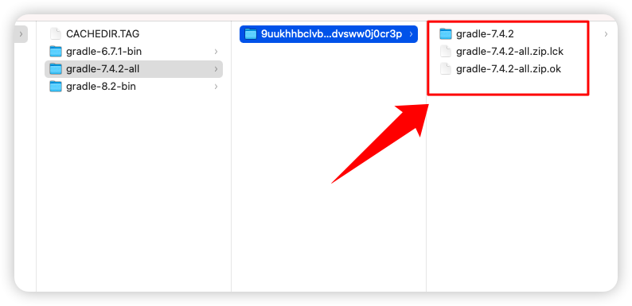

# flutter run build apk 一直卡在Running Gradle task解决方法

1.找到项目的 android/build.gradle 文件，然后打开

路径如：/Users/z/vscode/flutter_demo/android/build.gradle

修改该 build.gradle，将 google()、mavenCentral()注释掉，然后添加阿里云的镜像，如下：
```gradle
allprojects {
    repositories {
        // google() // 注释掉
        // mavenCentral() // 注释掉
        maven { url 'https://maven.aliyun.com/repository/google' }
        maven { url 'https://maven.aliyun.com/repository/jcenter' }
        maven {
             url 'http://maven.aliyun.com/nexus/content/groups/public' 
             allowInsecureProtocol = true
        }
    }
}
```

2.找到 gradle-wrapper.properties 文件，并打开，

路径如：/Users/z/vscode/flutter_demo/android/gradle/wrapper/gradle-wrapper.properties

打开后修改 distributionUrl 的值
```properties
distributionBase=GRADLE_USER_HOME
distributionPath=wrapper/dists
zipStoreBase=GRADLE_USER_HOME
zipStorePath=wrapper/dists
distributionUrl=https\://services.gradle.org/distributions/gradle-7.4.2-all.zip
```

我本地已经有 gradle-7.4.2-all.zip 版本了，所以这个问题比较容易解决，如果没有的话可以考虑修改成其他公司镜像的链接，如果不改这个可以正常使用的话，那就直接用，如果 gradle-7.4.2-all.zip 一直因为网络原因下载不下来，那么建议科学。怎么判断 gradle-7.4.2-all.zip 是否已经下载下来了呢，在 /Users/z/.gradle/wrapper/dists/gradle-7.4.2-all 目录下可以找到一些解压好的文件，就说明已经下载好了，如下图：


