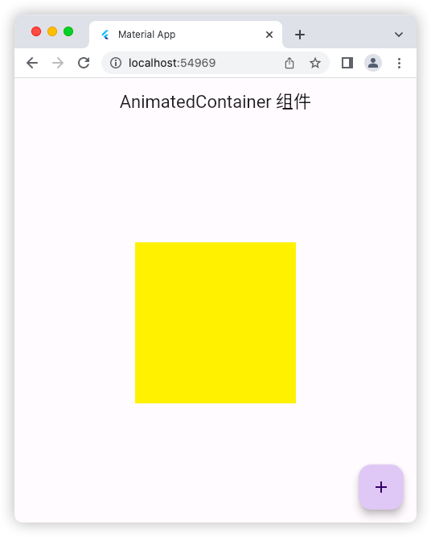
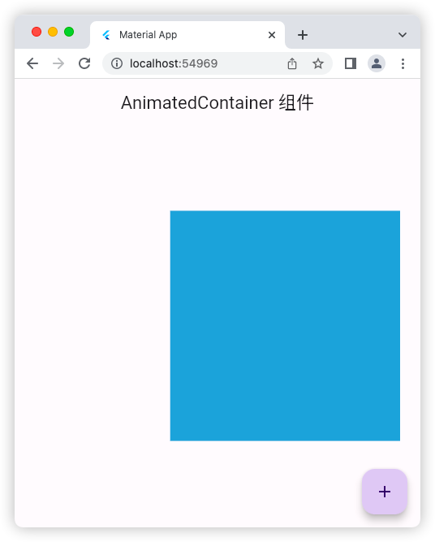
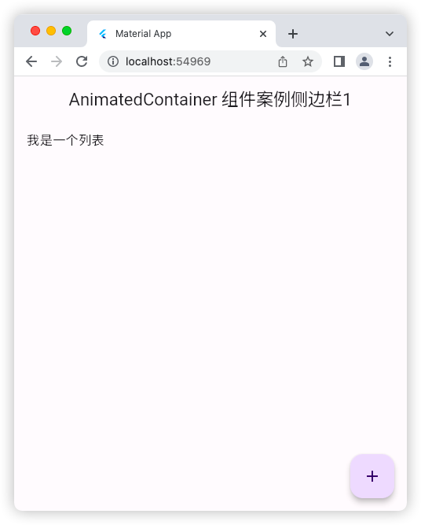
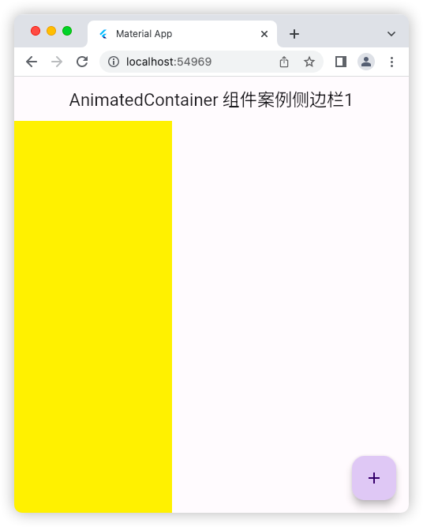
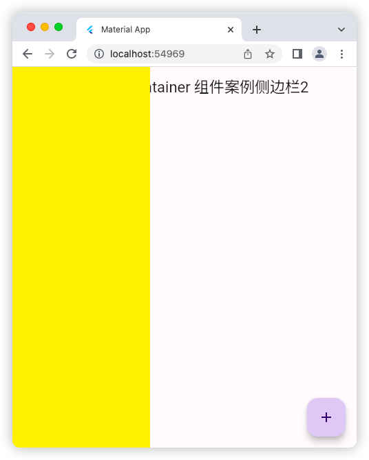

# AnimatedContainer 组件

## 基础用法

### 源码

```dart
import 'package:flutter/material.dart';

void main() => runApp(const MyApp());

class MyApp extends StatelessWidget {
  const MyApp({super.key});

  @override
  Widget build(BuildContext context) {
    return const MaterialApp(
      debugShowCheckedModeBanner: false,
      title: 'Material App',
      home: HomePage(),
    );
  }
}

class HomePage extends StatefulWidget {
  const HomePage({super.key});

  @override
  State<HomePage> createState() => _HomePageState();
}

class _HomePageState extends State<HomePage> {
  bool flag = true;
  @override
  Widget build(BuildContext context) {
    return Scaffold(
      appBar: AppBar(
        title: const Text('AnimatedContainer 组件'),
      ),
      body: Center(
        child: AnimatedContainer(
          duration: const Duration(milliseconds: 500),
          transform: Matrix4.translationValues(flag ? 0 : 100, 0, 0),
          height: flag ? 200 : 300,
          width: flag ? 200 : 300,
          color: flag ? Colors.yellow : Colors.blue,
        ),
      ),
      floatingActionButton: FloatingActionButton(
        onPressed: () {
          setState(() {
            flag = !flag;
          });
        },
        child: const Icon(Icons.add),
      ),
    );
  }
}
```

### 运行示意图




## AnimatedContainer 组件案例侧边栏1

### 源码

```dart
import 'package:flutter/material.dart';

void main() => runApp(const MyApp());

class MyApp extends StatelessWidget {
  const MyApp({super.key});

  @override
  Widget build(BuildContext context) {
    return const MaterialApp(
      debugShowCheckedModeBanner: false,
      title: 'Material App',
      home: HomePage(),
    );
  }
}

class HomePage extends StatefulWidget {
  const HomePage({super.key});

  @override
  State<HomePage> createState() => _HomePageState();
}

class _HomePageState extends State<HomePage> {
  bool flag = true;
  @override
  Widget build(BuildContext context) {
    return Scaffold(
      appBar: AppBar(
        title: const Text('AnimatedContainer 组件案例侧边栏1'),
      ),
      body: Stack(
        children: [
          ListView(
            children: const [
              ListTile(
                title: Text('我是一个列表'),
              )
            ],
          ),
          Positioned(
            left: 0,
            top: 0,
            bottom: 0, // left: 0,top: 0, bottom: 0, 表示竖屏上占满整个屏幕
            child: Center(
              child: AnimatedContainer(
                duration: const Duration(milliseconds: 500),
                transform: Matrix4.translationValues(flag ? -200 : 0, 0, 0),
                height: double.infinity,
                width: 200,
                color: Colors.yellow,
              ),
            ),
          ),
        ],
      ),
      floatingActionButton: FloatingActionButton(
        onPressed: () {
          setState(() {
            flag = !flag;
          });
        },
        child: const Icon(Icons.add),
      ),
    );
  }
}
```

### 运行示意图




## AnimatedContainer 组件案例侧边栏2

### 源码

```dart
import 'package:flutter/material.dart';

void main() => runApp(const MyApp());

class MyApp extends StatelessWidget {
  const MyApp({super.key});

  @override
  Widget build(BuildContext context) {
    return const MaterialApp(
      debugShowCheckedModeBanner: false,
      title: 'Material App',
      home: HomePage(),
    );
  }
}

class HomePage extends StatefulWidget {
  const HomePage({super.key});

  @override
  State<HomePage> createState() => _HomePageState();
}

class _HomePageState extends State<HomePage> {
  bool flag = true;
  @override
  Widget build(BuildContext context) {
    return Stack(
      children: [
        Scaffold(
          appBar: AppBar(
            title: const Text('AnimatedContainer 组件案例侧边栏2'),
          ),
          body: Stack(
            children: [
              ListView(
                children: const [
                  ListTile(
                    title: Text('我是一个列表'),
                  )
                ],
              ),
            ],
          ),
          floatingActionButton: FloatingActionButton(
            onPressed: () {
              setState(() {
                flag = !flag;
              });
            },
            child: const Icon(Icons.add),
          ),
        ),
        Positioned(
          left: 0,
          top: 0,
          bottom: 0, // left: 0,top: 0, bottom: 0, 表示竖屏上占满整个屏幕
          child: Center(
            child: AnimatedContainer(
              duration: const Duration(milliseconds: 500),
              transform: Matrix4.translationValues(flag ? -200 : 0, 0, 0),
              height: double.infinity,
              width: 200,
              color: Colors.yellow,
            ),
          ),
        ),
      ],
    );
  }
}
```

### 运行示意图



