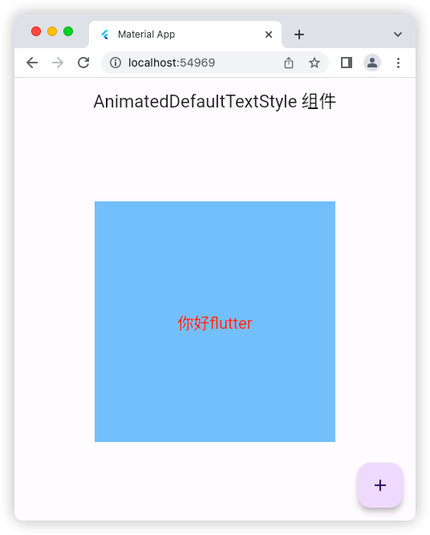
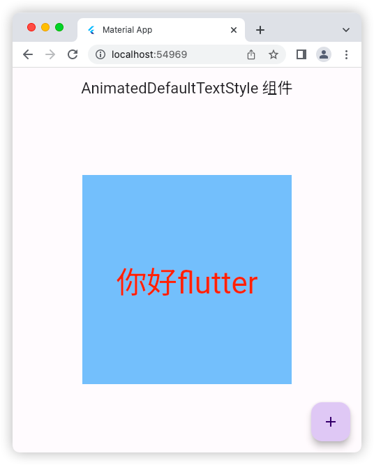

# AnimatedDefaultTextStyle 组件

## 源码

```dart
import 'package:flutter/material.dart';

void main() => runApp(const MyApp());

class MyApp extends StatelessWidget {
  const MyApp({super.key});

  @override
  Widget build(BuildContext context) {
    return const MaterialApp(
      debugShowCheckedModeBanner: false,
      title: 'Material App',
      home: HomePage(),
    );
  }
}

class HomePage extends StatefulWidget {
  const HomePage({super.key});

  @override
  State<HomePage> createState() => _HomePageState();
}

class _HomePageState extends State<HomePage> {
  bool flag = true;
  @override
  Widget build(BuildContext context) {
    return Scaffold(
      appBar: AppBar(
        title: const Text('AnimatedDefaultTextStyle 组件'),
      ),
      floatingActionButton: FloatingActionButton(
        onPressed: () {
          setState(() {
            flag = !flag;
          });
        },
        child: const Icon(Icons.add),
      ),
      body: Center(
        child: Container(
          alignment: Alignment.center,
          height: 300,
          width: 300,
          color: const Color.fromARGB(255, 128, 193, 246),
          child:  AnimatedDefaultTextStyle(
            style: TextStyle(
              fontSize:flag? 20:50,
              color: Colors.red,
            ),
            duration:const Duration(milliseconds: 800),
            child:const Text(
              '你好flutter',
            ),
          ),
        ),
      ),
    );
  }
}
```

## 运行示意图



