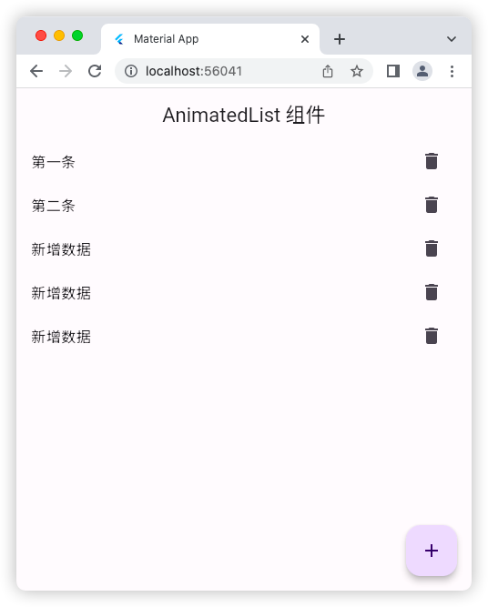

# AnimatedList 组件

## 源码
```dart
import 'dart:async';

import 'package:flutter/material.dart';

void main() => runApp(const MyApp());

class MyApp extends StatelessWidget {
  const MyApp({super.key});

  @override
  Widget build(BuildContext context) {
    return const MaterialApp(
      debugShowCheckedModeBanner: false,
      title: 'Material App',
      home: HomePage(),
    );
  }
}

class HomePage extends StatefulWidget {
  const HomePage({super.key});

  @override
  State<HomePage> createState() => _HomePageState();
}

class _HomePageState extends State<HomePage> {
  // 有两种写法，注意看：
  // final GlobalKey<AnimatedListState> _globalKey = GlobalKey();
  final _globalKey = GlobalKey<AnimatedListState>();

  List<String> list = ['第一条', '第二条'];

  bool flag = true; // 用于标记是否可以执行删除，默认可以

  Widget _buildItem(index) {
    return ListTile(
      title: Text(list[index]),
      trailing: IconButton(
        onPressed: () => _deleteItem(index),
        icon: const Icon(Icons.delete),
      ),
    );
  }

  void _deleteItem(index) {
    //
    //
    //

    /*
      删除元素时，因为动画效果，如果快速点击删除多个元素，
      会产生索引异常，需要借助一个变量来处理，这里借助的变量是 flag
      试过了，加了 flag 检查依旧还是会出问题。。。。
      快速点击中间的元素删除时还是会出异常。
    */
    /* if (flag == true) {
      flag = false;
      setState(() {
        _globalKey.currentState!.removeItem(index, (context, animation) {
          // animation 的值是 从 1~0
          var removeItem = _buildItem(index);
          list.removeAt(index); // 数组中删除元素
          return FadeTransition(
            opacity: animation, // 动画
            child: removeItem,
          );
        });
      });
      Timer.periodic(const Duration(microseconds: 500), (timer) {
        flag = true;
        timer.cancel();
      });
    } */

    // 换成 ScaleTransition 就不会产生异常了
    if (flag == true) {
      flag = false;
      setState(() {
        _globalKey.currentState!.removeItem(index, (context, animation) {
          // animation 的值是 从 1~0
          var removeItem = _buildItem(index);
          list.removeAt(index); // 数组中删除元素
          return ScaleTransition(
            scale: animation, // 动画
            child: removeItem,
          );
        });
      });
      Timer.periodic(const Duration(microseconds: 500), (timer) {
        flag = true;
        timer.cancel();
      });
    }
  }

  @override
  Widget build(BuildContext context) {
    return Scaffold(
      appBar: AppBar(
        title: const Text('AnimatedList 组件'),
      ),
      floatingActionButton: FloatingActionButton(
        onPressed: () {
          setState(() {
            list.add('新增数据');
            _globalKey.currentState!.insertItem(list.length - 1);
          });
        },
        child: const Icon(Icons.add),
      ),
      body: AnimatedList(
        key: _globalKey, // 这里要用上声明的 GlobalKey
        initialItemCount: list.length,
        itemBuilder: (context, index, animation) {
          // animation 的值 是从 0~1
          return FadeTransition(
            opacity: animation,
            child: _buildItem(index),
          );
        },
      ),
    );
  }
}
```

## 运行示意图

