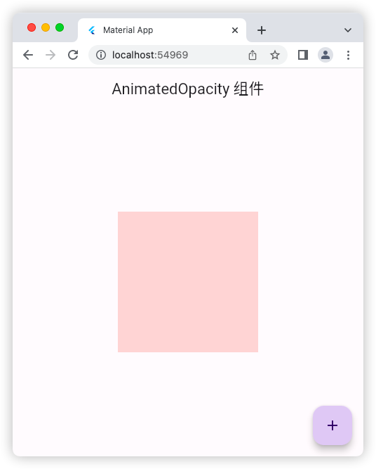
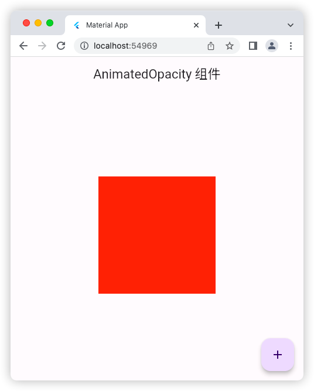

# AnimatedOpacity 组件

## 源码

```dart
import 'package:flutter/material.dart';

void main() => runApp(const MyApp());

class MyApp extends StatelessWidget {
  const MyApp({super.key});

  @override
  Widget build(BuildContext context) {
    return const MaterialApp(
      debugShowCheckedModeBanner: false,
      title: 'Material App',
      home: HomePage(),
    );
  }
}

class HomePage extends StatefulWidget {
  const HomePage({super.key});

  @override
  State<HomePage> createState() => _HomePageState();
}

class _HomePageState extends State<HomePage> {
  bool flag = true;
  @override
  Widget build(BuildContext context) {
    return Scaffold(
      appBar: AppBar(
        title: const Text('AnimatedOpacity 组件'),
      ),
      floatingActionButton: FloatingActionButton(
        onPressed: () {
          setState(() {
            flag = !flag;
          });
        },
        child: const Icon(Icons.add),
      ),
      body: Center(
        child: AnimatedOpacity(
          duration: const Duration(milliseconds: 1200),
          // curve: Curves.linear, // 默认 线性r动画
          curve: Curves.bounceIn,
          opacity: flag ? 0.2 : 1.0,
          child: Container(
            height: 200,
            width: 200,
            color: Colors.red,
          ),
        ),
      ),
    );
  }
}
```

## 运行示意图



