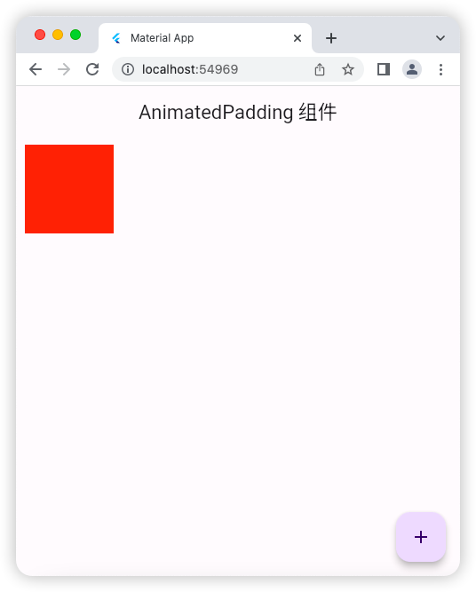
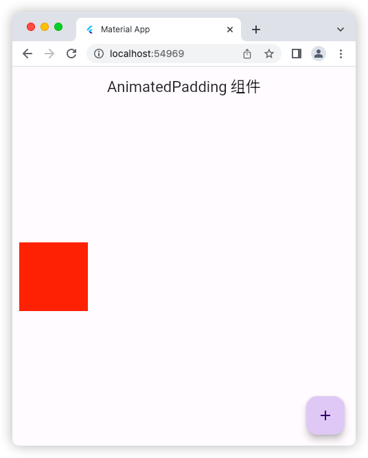

# AnimatedPadding 组件

## 源码

```dart
import 'package:flutter/material.dart';

void main() => runApp(const MyApp());

class MyApp extends StatelessWidget {
  const MyApp({super.key});

  @override
  Widget build(BuildContext context) {
    return const MaterialApp(
      debugShowCheckedModeBanner: false,
      title: 'Material App',
      home: HomePage(),
    );
  }
}

class HomePage extends StatefulWidget {
  const HomePage({super.key});

  @override
  State<HomePage> createState() => _HomePageState();
}

class _HomePageState extends State<HomePage> {
  bool flag = true;
  @override
  Widget build(BuildContext context) {
    return Scaffold(
      appBar: AppBar(
        title: const Text('AnimatedPadding 组件'),
      ),
      floatingActionButton: FloatingActionButton(
        onPressed: () {
          setState(() {
            flag = !flag;
          });
        },
        child: const Icon(Icons.add),
      ),
      body: AnimatedPadding(
        // curve: Curves.linear, // 线性动画(默认)
        curve: Curves.easeInBack, // 
        // duration: const Duration(seconds: 1),
        duration: const Duration(milliseconds: 500),
        padding: EdgeInsets.fromLTRB(10, flag ? 10 : 200, 0, 0),
        child: Container(
          height: 100,
          width: 100,
          color: Colors.red,
        ),
      ),
    );
  }
}
```

## 运行示意图


