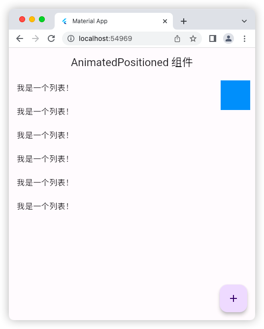
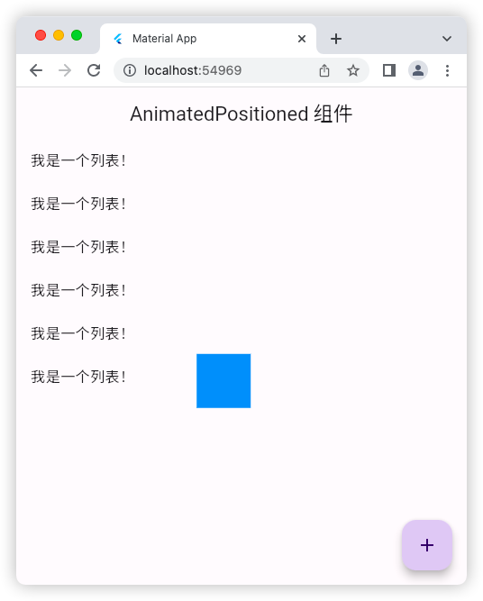

# AnimatedPositioned 组件

## 源码

```dart
import 'package:flutter/material.dart';

void main() => runApp(const MyApp());

class MyApp extends StatelessWidget {
  const MyApp({super.key});

  @override
  Widget build(BuildContext context) {
    return const MaterialApp(
      debugShowCheckedModeBanner: false,
      title: 'Material App',
      home: HomePage(),
    );
  }
}

class HomePage extends StatefulWidget {
  const HomePage({super.key});

  @override
  State<HomePage> createState() => _HomePageState();
}

class _HomePageState extends State<HomePage> {
  bool flag = true;
  @override
  Widget build(BuildContext context) {
    return Scaffold(
      appBar: AppBar(
        title: const Text('AnimatedPositioned 组件'),
      ),
      floatingActionButton: FloatingActionButton(
        onPressed: () {
          setState(() {
            flag = !flag;
          });
        },
        child: const Icon(Icons.add),
      ),
      body: Stack(
        children: [
          ListView(
            children: const [
              ListTile(
                title: Text('我是一个列表！'),
              ),
              ListTile(
                title: Text('我是一个列表！'),
              ),
              ListTile(
                title: Text('我是一个列表！'),
              ),
              ListTile(
                title: Text('我是一个列表！'),
              ),
              ListTile(
                title: Text('我是一个列表！'),
              ),
              ListTile(
                title: Text('我是一个列表！'),
              ),
            ],
          ),
          AnimatedPositioned(
            duration: const Duration(milliseconds: 800),
            curve: Curves.linear,
            top: flag ? 10 : 300,
            right: flag ? 10 : 300,
            child: Container(
              height: 60,
              width: 60,
              color: Colors.blue,
            ),
          )
        ],
      ),
    );
  }
}
```

## 运行示意图



