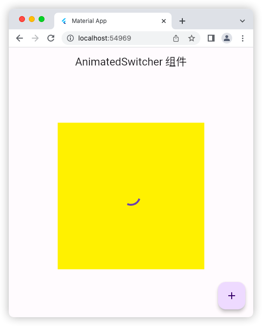
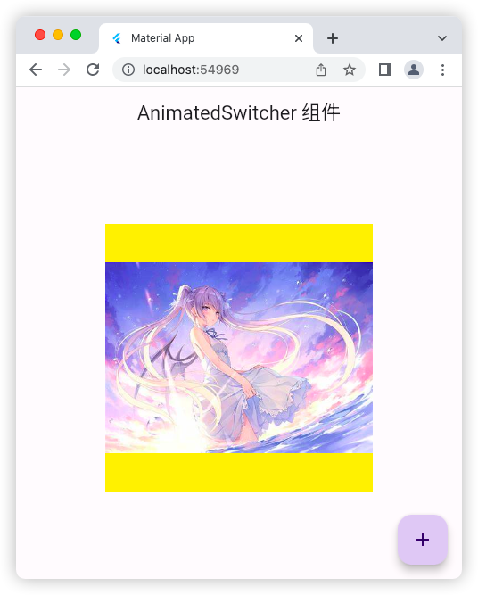
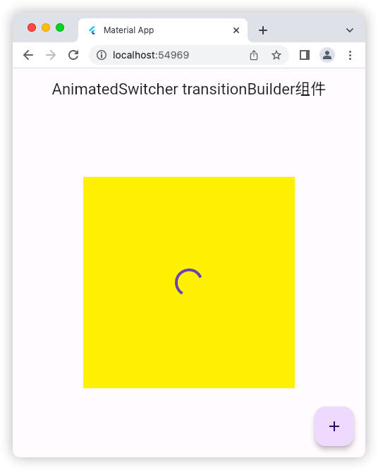
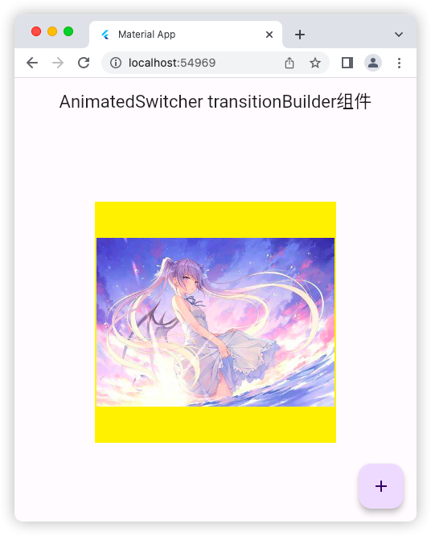
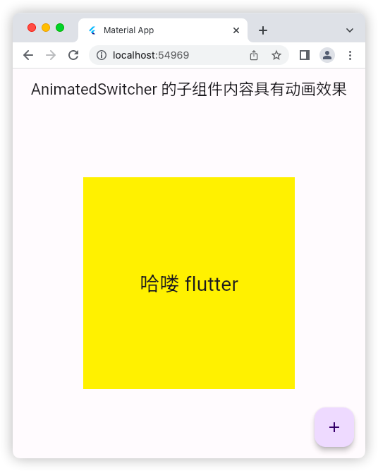
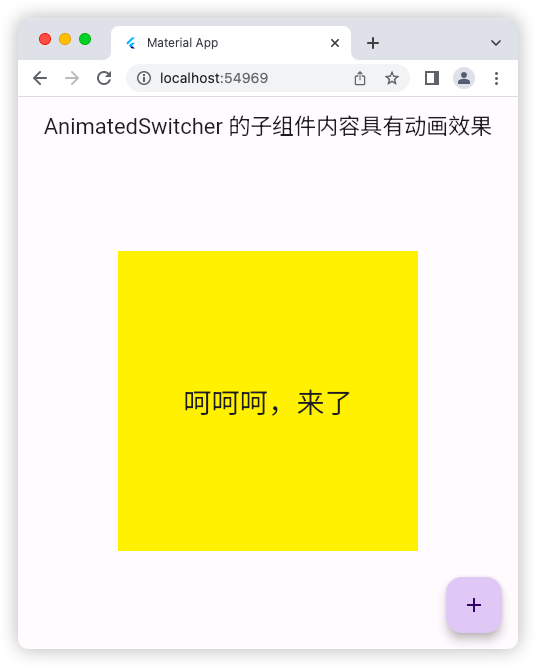

# AnimatedSwitcher 组件

## 基础用法

### 源码

```dart
import 'package:flutter/material.dart';

void main() => runApp(const MyApp());

class MyApp extends StatelessWidget {
  const MyApp({super.key});

  @override
  Widget build(BuildContext context) {
    return const MaterialApp(
      debugShowCheckedModeBanner: false,
      title: 'Material App',
      home: HomePage(),
    );
  }
}

class HomePage extends StatefulWidget {
  const HomePage({super.key});

  @override
  State<HomePage> createState() => _HomePageState();
}

class _HomePageState extends State<HomePage> {
  bool flag = true;
  @override
  Widget build(BuildContext context) {
    return Scaffold(
      appBar: AppBar(
        title: const Text('AnimatedSwitcher 组件'),
      ),
      floatingActionButton: FloatingActionButton(
        onPressed: () {
          setState(() {
            flag = !flag;
          });
        },
        child: const Icon(Icons.add),
      ),
      body: Center(
        child: Container(
          alignment: Alignment.center,
          height: 300,
          width: 300,
          color: Colors.yellow,
          child: AnimatedSwitcher( // 当子元素改变时触发动画
            duration: const Duration(milliseconds: 1200),
            child: flag
                ? const CircularProgressIndicator()
                : Image.network(
                    'https://tse1-mm.cn.bing.net/th/id/OIP-C.SvWJmJSdjZSO1P3EUFFZyQAAAA?rs=1&pid=ImgDetMain',
                    fit: BoxFit.cover,
                  ),
          ),
        ),
      ),
    );
  }
}
```

### 运行示意图




## AnimatedSwitcher transitionBuilder

### 源码

```dart
import 'package:flutter/material.dart';

void main() => runApp(const MyApp());

class MyApp extends StatelessWidget {
  const MyApp({super.key});

  @override
  Widget build(BuildContext context) {
    return const MaterialApp(
      debugShowCheckedModeBanner: false,
      title: 'Material App',
      home: HomePage(),
    );
  }
}

class HomePage extends StatefulWidget {
  const HomePage({super.key});

  @override
  State<HomePage> createState() => _HomePageState();
}

class _HomePageState extends State<HomePage> {
  bool flag = true;
  @override
  Widget build(BuildContext context) {
    return Scaffold(
      appBar: AppBar(
        title: const Text('AnimatedSwitcher transitionBuilder组件'),
      ),
      floatingActionButton: FloatingActionButton(
        onPressed: () {
          setState(() {
            flag = !flag;
          });
        },
        child: const Icon(Icons.add),
      ),
      body: Center(
        child: Container(
          alignment: Alignment.center,
          height: 300,
          width: 300,
          color: Colors.yellow,
          child: AnimatedSwitcher(
            // 当子元素改变时触发动画
            transitionBuilder: (child, animation) {
              // 可以改变动画效果
              /* return ScaleTransition(
                scale: animation,
                child: child,
              ); */
              return ScaleTransition( // 缩放动画
                scale: animation,
                child: FadeTransition( // 淡入淡出动画
                  opacity: animation,
                  child: child,
                ),
              );
            },
            duration: const Duration(milliseconds: 1200),
            child: flag
                ? const CircularProgressIndicator()
                : Image.network(
                    'https://tse1-mm.cn.bing.net/th/id/OIP-C.SvWJmJSdjZSO1P3EUFFZyQAAAA?rs=1&pid=ImgDetMain',
                    fit: BoxFit.cover,
                  ),
          ),
        ),
      ),
    );
  }
}
```

### 运行示意图




## AnimatedSwitcher 的子组件内容具有动画效果

### 源码

```dart
import 'package:flutter/material.dart';

void main() => runApp(const MyApp());

class MyApp extends StatelessWidget {
  const MyApp({super.key});

  @override
  Widget build(BuildContext context) {
    return const MaterialApp(
      debugShowCheckedModeBanner: false,
      title: 'Material App',
      home: HomePage(),
    );
  }
}

class HomePage extends StatefulWidget {
  const HomePage({super.key});

  @override
  State<HomePage> createState() => _HomePageState();
}

class _HomePageState extends State<HomePage> {
  bool flag = true;
  @override
  Widget build(BuildContext context) {
    return Scaffold(
      appBar: AppBar(
        title: const Text('AnimatedSwitcher 的子组件内容具有动画效果'),
      ),
      floatingActionButton: FloatingActionButton(
        onPressed: () {
          setState(() {
            flag = !flag;
          });
        },
        child: const Icon(Icons.add),
      ),
      body: Center(
        child: Container(
          alignment: Alignment.center,
          height: 300,
          width: 300,
          color: Colors.yellow,
          child: AnimatedSwitcher(
            // 当子元素改变时触发动画
            transitionBuilder: (child, animation) {
              // 可以改变动画效果
              return ScaleTransition(
                // 缩放动画
                scale: animation,
                child: FadeTransition(
                  // 淡入淡出动画
                  opacity: animation,
                  child: child,
                ),
              );
            },
            duration: const Duration(milliseconds: 1200),
            child: Text(
              key: UniqueKey(),
              flag ? '哈喽 flutter' : '呵呵呵，来了',
              style: const TextStyle(fontSize: 28),
            ),
          ),
        ),
      ),
    );
  }
}
```

### 运行示意图



