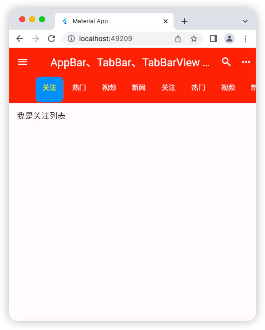
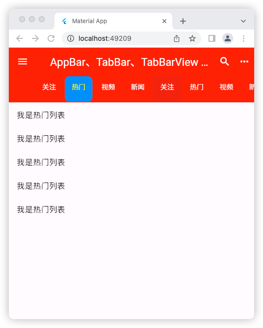

# AppBar、TabBar、TabBarView 实现类似头条顶部切换

## 源码

```dart
import 'package:flutter/material.dart';

void main() => runApp(const MyApp());

class MyApp extends StatelessWidget {
  const MyApp({super.key});

  @override
  Widget build(BuildContext context) {
    return const MaterialApp(
      debugShowCheckedModeBanner: false,
      title: 'Material App',
      home: HomePage(),
    );
  }
}

class HomePage extends StatefulWidget {
  const HomePage({super.key});

  @override
  State<HomePage> createState() => _HomePageState();
}

class _HomePageState extends State<HomePage>
    with SingleTickerProviderStateMixin {
  late TabController _tabController;

  /*
    生命周期函数，当组件初始化时触发
  */
  @override
  void initState() {
    super.initState();
    _tabController = TabController(
        length: 8, vsync: this); // 这个length值取决于下面的 TabBar/TabBarView 子元素数量
    // 当然 TabBar 子元素数量 == TabBarView 子元素数量
  }

  @override
  Widget build(BuildContext context) {
    return Scaffold(
      appBar: AppBar(
        leading: IconButton(
          // 左侧组件
          icon: const Icon(Icons.menu),
          onPressed: () {
            print('菜单被点击了');
          },
        ),
        title: const Text('AppBar、TabBar、TabBarView 实现类似头条顶部切换'), // 中间组件
        actions: [
          // 右侧组件
          IconButton(
            onPressed: () {
              print('搜索被点击了');
            },
            icon: const Icon(Icons.search),
          ),
          IconButton(
            onPressed: () {
              print('更多图标被点击了');
            },
            icon: const Icon(Icons.more_horiz),
          ),
        ],
        foregroundColor: Colors.white, // 字体颜色
        backgroundColor: Colors.red, // 背景色
        // iconTheme: , // 图标样式
        centerTitle: true, // title 属性接收的组件是否居中，默认是 true
        // centerTitle: false, // title 属性接收的组件是否居中 false
        // bottom: , // 通常放 tab 导航栏
        bottom: TabBar(
          indicatorColor: Colors.blue, // 选中的下划线颜色
          indicatorWeight: 10, // 选中的下划线粗细
          indicatorPadding: const EdgeInsets.all(2), // 选中的下划线内边距
          // indicatorSize: TabBarIndicatorSize.label, // 选中的下划线大小 默认
          indicatorSize: TabBarIndicatorSize.tab, // 选中的下划线大小
          indicator: BoxDecoration(
            // 选中的元素装饰
            color: Colors.blue,
            borderRadius: BorderRadius.circular(10),
          ),
          labelColor: Colors.yellow, // 选中颜色
          // labelPadding: const EdgeInsets.all(4), // 选中元素内边距
          // labelStyle: TextStyle(), // 选中元素样式
          unselectedLabelColor: Colors.white, // 未选中元素的颜色
          controller: _tabController,
          // isScrollable: false, // 当选项卡比较多，超出屏幕宽度时，是否可以滚动，false:不可以 默认
          isScrollable: true, // 当选项卡比较多，超出屏幕宽度时，是否可以滚动，true:可以
          tabs: const [
            Tab(
              child: Text('关注'),
            ),
            Tab(
              child: Text('热门'),
            ),
            Tab(
              child: Text('视频'),
            ),
            Tab(
              child: Text('新闻'),
            ),
            Tab(
              child: Text('关注'),
            ),
            Tab(
              child: Text('热门'),
            ),
            Tab(
              child: Text('视频'),
            ),
            Tab(
              child: Text('新闻'),
            ),
          ],
        ),
      ),
      body: TabBarView(
        controller: _tabController,
        children: [
          ListView(
            children: const [
              ListTile(title: Text('我是关注列表')),
            ],
          ),
          ListView(
            children: const [
              ListTile(title: Text('我是热门列表')),
              ListTile(title: Text('我是热门列表')),
              ListTile(title: Text('我是热门列表')),
              ListTile(title: Text('我是热门列表')),
              ListTile(title: Text('我是热门列表')),
            ],
          ),
          ListView(
            children: const [
              ListTile(title: Text('我是视频列表')),
            ],
          ),
          ListView(
            children: const [
              ListTile(title: Text('我是新闻列表')),
            ],
          ),
          ListView(
            children: const [
              ListTile(title: Text('我是关注列表')),
            ],
          ),
          ListView(
            children: const [
              ListTile(title: Text('我是热门列表')),
              ListTile(title: Text('我是热门列表')),
              ListTile(title: Text('我是热门列表')),
              ListTile(title: Text('我是热门列表')),
              ListTile(title: Text('我是热门列表')),
            ],
          ),
          ListView(
            children: const [
              ListTile(title: Text('我是视频列表')),
            ],
          ),
          ListView(
            children: const [
              ListTile(title: Text('我是新闻列表')),
            ],
          ),
        ],
      ),
    );
  }
}
```

## 运行示意图



