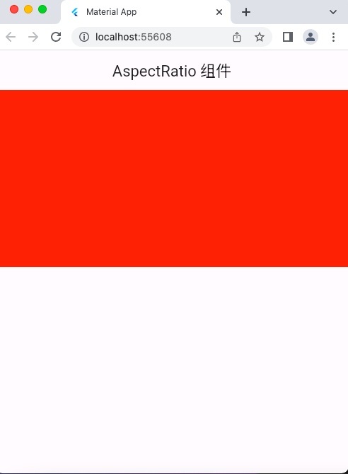

# AspectRatio 组件

```dart
import 'package:flutter/material.dart';

void main() => runApp(const MyApp());

class MyApp extends StatelessWidget {
  const MyApp({super.key});

  @override
  Widget build(BuildContext context) {
    return MaterialApp(
      debugShowCheckedModeBanner: false,
      title: 'Material App',
      home: Scaffold(
        appBar: AppBar(
          title: const Text('AspectRatio 组件'),
        ),
        body: const HomePage(),
      ),
    );
  }
}

class HomePage extends StatelessWidget {
  const HomePage({super.key});

  @override
  Widget build(BuildContext context) {
    // 需求：页面上显示一个容器，宽度是屏幕的宽度，高度是容器宽度的一半
    return AspectRatio(
      aspectRatio: 2 / 1, // 宽高比 2:1
      child: Container(
        color: Colors.red,
      ),
    );
  }
}
```

## 运行示意图


