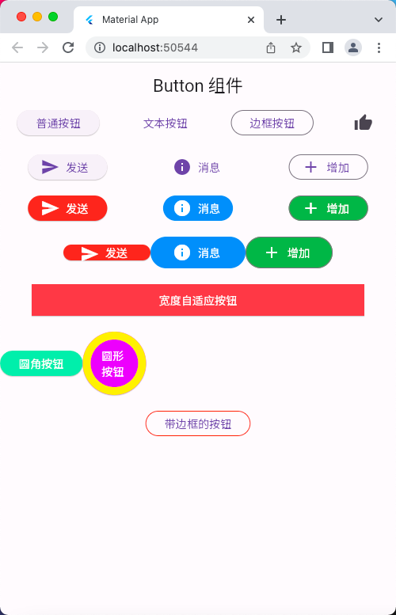

# 按钮组件

```dart
// ignore_for_file: avoid_print

import 'package:flutter/material.dart';

void main() => runApp(const MyApp());

class MyApp extends StatelessWidget {
  const MyApp({super.key});

  @override
  Widget build(BuildContext context) {
    return MaterialApp(
      debugShowCheckedModeBanner: false,
      title: 'Material App',
      home: Scaffold(
        appBar: AppBar(
          title: const Text('Button 组件'),
        ),
        body: const HomePage(),
      ),
    );
  }
}

class HomePage extends StatelessWidget {
  const HomePage({super.key});

  @override
  Widget build(BuildContext context) {
    return ListView(
      children: [
        Row(
          mainAxisAlignment: MainAxisAlignment.spaceAround,
          children: [
            ElevatedButton(
              onPressed: () {
                print('Elevated按钮被点击了');
              },
              child: const Text('普通按钮'),
            ),
            TextButton(
              onPressed: () {
                print('Text按钮被点击了');
              },
              child: const Text('文本按钮'),
            ),
            OutlinedButton(
              onPressed: () {
                print('OutlinedButton按钮被点击了');
              },
              child: const Text('边框按钮'),
            ),
            IconButton(
              onPressed: () {
                print('图标按钮');
              },
              icon: const Icon(Icons.thumb_up),
            )
          ],
        ),
        const SizedBox(
          height: 20,
        ),
        Row(
          mainAxisAlignment: MainAxisAlignment.spaceAround,
          children: [
            ElevatedButton.icon(
              onPressed: () {
                print('点击了 Elevated按钮带图标');
              },
              icon: const Icon(Icons.send),
              label: const Text('发送'),
            ),
            TextButton.icon(
              onPressed: () {},
              icon: const Icon(Icons.info),
              label: const Text('消息'),
            ),
            OutlinedButton.icon(
              onPressed: () {},
              icon: const Icon(Icons.add),
              label: const Text('增加'),
            ),
          ],
        ),
        const SizedBox(
          height: 20,
        ),
        Row(
          mainAxisAlignment: MainAxisAlignment.spaceAround,
          children: [
            ElevatedButton.icon(
              style: ButtonStyle(
                backgroundColor: MaterialStateProperty.all(Colors.red),
                foregroundColor: MaterialStateProperty.all(Colors.white),
              ),
              onPressed: () {
                print('点击了 Elevated按钮带图标');
              },
              icon: const Icon(Icons.send),
              label: const Text('发送'),
            ),
            TextButton.icon(
              style: ButtonStyle(
                backgroundColor: MaterialStateProperty.all(Colors.blue),
                foregroundColor: MaterialStateProperty.all(Colors.white),
              ),
              onPressed: () {},
              icon: const Icon(Icons.info),
              label: const Text('消息'),
            ),
            OutlinedButton.icon(
              style: ButtonStyle(
                backgroundColor: MaterialStateProperty.all(Colors.green),
                foregroundColor: MaterialStateProperty.all(Colors.white),
              ),
              onPressed: () {},
              icon: const Icon(Icons.add),
              label: const Text('增加'),
            ),
          ],
        ),
        const SizedBox(
          height: 20,
        ),
        Row(
          mainAxisAlignment: MainAxisAlignment.center,
          children: [
            SizedBox(
              height: 20,
              width: 110,
              child: ElevatedButton.icon(
                style: ButtonStyle(
                  backgroundColor: MaterialStateProperty.all(Colors.red),
                  foregroundColor: MaterialStateProperty.all(Colors.white),
                ),
                onPressed: () {
                  print('点击了 Elevated按钮带图标');
                },
                icon: const Icon(Icons.send),
                label: const Text('发送'),
              ),
            ),
            SizedBox(
              height: 40,
              width: 120,
              child: TextButton.icon(
                style: ButtonStyle(
                  backgroundColor: MaterialStateProperty.all(Colors.blue),
                  foregroundColor: MaterialStateProperty.all(Colors.white),
                ),
                onPressed: () {},
                icon: const Icon(Icons.info),
                label: const Text('消息'),
              ),
            ),
            SizedBox(
              height: 40,
              width: 110,
              child: OutlinedButton.icon(
                style: ButtonStyle(
                  backgroundColor: MaterialStateProperty.all(Colors.green),
                  foregroundColor: MaterialStateProperty.all(Colors.white),
                ),
                onPressed: () {},
                icon: const Icon(Icons.add),
                label: const Text('增加'),
              ),
            ),
          ],
        ),
        const SizedBox(
          height: 20,
        ),
        Row(
          children: [
            Expanded(
              flex: 1,
              child: Container(
                margin: const EdgeInsets.fromLTRB(40, 0, 40, 0),
                height: 40,
                child: ElevatedButton(
                  style: ButtonStyle(
                    backgroundColor:
                        MaterialStateProperty.all(Colors.redAccent),
                    foregroundColor: MaterialStateProperty.all(Colors.white),
                    shape: MaterialStateProperty.all(
                      RoundedRectangleBorder(
                        borderRadius: BorderRadius.circular(0),
                      ),
                    ),
                  ),
                  onPressed: () {},
                  child: const Text('宽度自适应按钮'),
                ),
              ),
            ),
          ],
        ),
        const SizedBox(
          height: 20,
        ),
        Row(
          children: [
            ElevatedButton(
              style: ButtonStyle(
                backgroundColor: MaterialStateProperty.all(Colors.greenAccent),
                foregroundColor: MaterialStateProperty.all(Colors.white),
                shape: MaterialStateProperty.all(
                  RoundedRectangleBorder(
                    borderRadius: BorderRadius.circular(20),
                  ),
                ),
              ),
              onPressed: () {},
              child: const Text('圆角按钮'),
            ),
            SizedBox(
              width: 80,
              height: 80,
              child: ElevatedButton(
                style: ButtonStyle(
                  backgroundColor:
                      MaterialStateProperty.all(Colors.purpleAccent),
                  foregroundColor: MaterialStateProperty.all(Colors.white),
                  shape: MaterialStateProperty.all(
                    const CircleBorder(
                      side: BorderSide(color: Colors.yellow, width: 10),
                    ),
                  ),
                ),
                onPressed: () {},
                child: const Text('圆形按钮'),
              ),
            ),
          ],
        ),
        const SizedBox(
          height: 20,
        ),
        Row(
          mainAxisAlignment: MainAxisAlignment.center,
          children: [
            OutlinedButton(
              style: ButtonStyle(
                side: MaterialStateProperty.all(
                  // 修改边框颜色
                  const BorderSide(
                    width: 1,
                    color: Colors.red,
                  ),
                ),
              ),
              onPressed: () {},
              child: const Text('带边框的按钮'),
            )
          ],
        )
      ],
    );
  }
}
```

## 运行示意图


