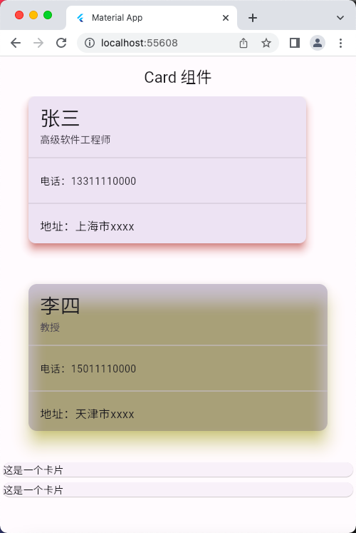
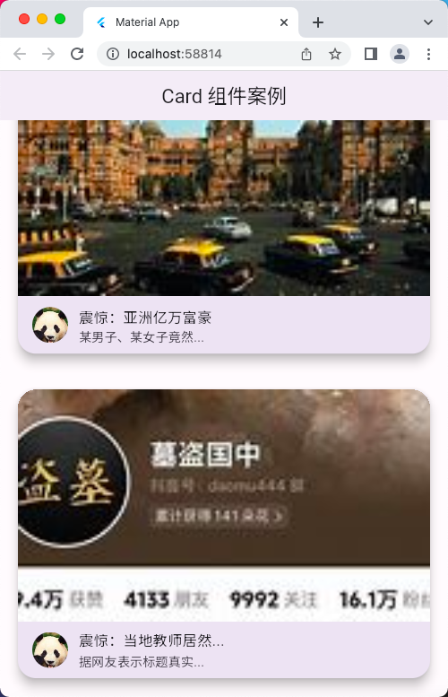
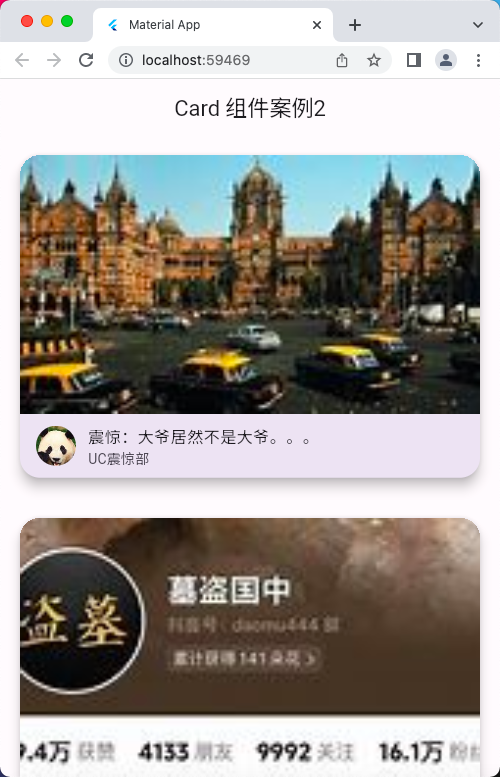

# Card 组件

## 组件基础

```dart
import 'package:flutter/material.dart';

void main() => runApp(const MyApp());

class MyApp extends StatelessWidget {
  const MyApp({super.key});

  @override
  Widget build(BuildContext context) {
    return MaterialApp(
      debugShowCheckedModeBanner: false,
      title: 'Material App',
      home: Scaffold(
        appBar: AppBar(
          title: const Text('Card 组件'),
        ),
        body: const HomePage(),
      ),
    );
  }
}

class HomePage extends StatelessWidget {
  const HomePage({super.key});

  @override
  Widget build(BuildContext context) {
    return ListView(
      children: [
        Card(
          margin: const EdgeInsets.fromLTRB(40, 0, 70, 7), // 外边距
          elevation: 10, // 阴影值的深度
          // color: Colors.black12, // 背景色
          shadowColor: Colors.red, // 阴影颜色
          // clipBehavior: Clip.none, // 裁切方式
          shape: RoundedRectangleBorder(
            borderRadius: BorderRadius.circular(10),
          ),
          child: const Column(
            children: [
              ListTile(
                title: Text(
                  '张三',
                  style: TextStyle(fontSize: 28),
                ),
                subtitle: Text('高级软件工程师'),
              ),
              Divider(),
              ListTile(
                title: Text(
                  '电话：13311110000',
                  style: TextStyle(fontSize: 14),
                ),
              ),
              Divider(),
              ListTile(
                title: Text('地址：上海市xxxx'),
              )
            ],
          ),
        ),
        const SizedBox(
          height: 10,
        ),
        const Card(
          margin: EdgeInsets.all(40), // 外边距
          color: Colors.black12, // 背景色
          elevation: 20,
          shadowColor: Colors.yellow,
          child: Column(
            children: [
              ListTile(
                title: Text(
                  '李四',
                  style: TextStyle(fontSize: 28),
                ),
                subtitle: Text('教授'),
              ),
              Divider(),
              ListTile(
                title: Text(
                  '电话：15011110000',
                  style: TextStyle(fontSize: 14),
                ),
              ),
              Divider(),
              ListTile(
                title: Text('地址：天津市xxxx'),
              )
            ],
          ),
        ),
        const Card(
          child: Text('这是一个卡片'),
        ),
        const Card(
          child: Text('这是一个卡片'),
        ),
      ],
    );
  }
}
```

## 运行示意图



## Card 组件案例1

```dart
import 'package:flutter/material.dart';

void main() => runApp(const MyApp());

class MyApp extends StatelessWidget {
  const MyApp({super.key});

  @override
  Widget build(BuildContext context) {
    return MaterialApp(
      debugShowCheckedModeBanner: false,
      title: 'Material App',
      home: Scaffold(
        appBar: AppBar(
          title: const Text('Card 组件案例'),
        ),
        body: const HomePage(),
      ),
    );
  }
}

class HomePage extends StatelessWidget {
  const HomePage({super.key});

  @override
  Widget build(BuildContext context) {
    return ListView(
      children: [
        Card(
          shape: RoundedRectangleBorder(
            borderRadius: BorderRadius.circular(20),
          ),
          elevation: 10,
          margin: const EdgeInsets.all(20),
          clipBehavior: Clip.hardEdge, // 可以将溢出卡片的图片内容裁切掉
          child: Column(
            children: [
              AspectRatio(
                aspectRatio: 16 / 9,
                child: Image.network(
                  // 浏览器中运行失败 'https://www.4kbizhi.com/d/file/2024/03/18/small171632MoNUw1710753392.jpg',
                  'https://cn.bing.com/th?id=OVFT.6WyXRQuXraqzo5sH9o-M2y&w=186&h=88&c=7&rs=2&qlt=80&pid=PopNow',
                  fit: BoxFit.cover,
                ),
              ),
              ListTile(
                leading: ClipOval(
                  child: Image.network(
                    'https://cn.bing.com/th?id=OVFT.P6Jt3kpRtFPpSsmD4RcPsy&w=186&h=88&c=7&rs=2&qlt=80&pid=PopNow',
                    fit: BoxFit.cover,
                    height: 40,
                    width: 40,
                  ),
                ),
                title: const Text('震惊：亚洲亿万富豪'),
                subtitle: const Text('某男子、某女子竟然...'),
              ),
            ],
          ),
        ),
        Card(
          shape: RoundedRectangleBorder(
            borderRadius: BorderRadius.circular(20),
            // borderRadius: BorderRadius.circular(10),
          ),
          elevation: 10,
          margin: const EdgeInsets.all(20),
          clipBehavior: Clip.hardEdge, // 可以将溢出卡片的图片内容裁切掉
          child: Column(
            children: [
              AspectRatio(
                aspectRatio: 16 / 9,
                child: Image.network(
                  'https://cn.bing.com/th?id=OVFT.DcLGH-9wDE-dV9CMgZ06Jy&w=186&h=88&c=7&rs=2&qlt=80&pid=PopNow',
                  fit: BoxFit.cover,
                ),
              ),
              const ListTile(
                leading: CircleAvatar(
                  // radius: 200, // 设置半径
                  backgroundImage: NetworkImage(
                    'https://cn.bing.com/th?id=OVFT.P6Jt3kpRtFPpSsmD4RcPsy&w=186&h=88&c=7&rs=2&qlt=80&pid=PopNow',
                  ),
                ),
                title: Text('震惊：当地教师居然...'),
                subtitle: Text('据网友表示标题真实...'),
              ),
            ],
          ),
        ),
      ],
    );
  }
}
```

## 运行示意图



## Card 组件案例2

main.dart

```dart
import 'package:flutter/material.dart';
import './res/listData.dart';

void main() => runApp(const MyApp());

class MyApp extends StatelessWidget {
  const MyApp({super.key});

  @override
  Widget build(BuildContext context) {
    return MaterialApp(
      debugShowCheckedModeBanner: false,
      title: 'Material App',
      home: Scaffold(
        appBar: AppBar(
          title: const Text('Card 组件案例2'),
        ),
        body: const HomePage(),
      ),
    );
  }
}

class HomePage extends StatelessWidget {
  /* List<Widget> _initListData() {
    List<Widget> temp = [];
    for (var i = 0; i < listData.length; i++) {
      var item = listData[i];
      String title = item["title"];
      String author = item['author'];
      String img = item['imageUrl'];
      temp.add(
        Card(
          shape: RoundedRectangleBorder(
            borderRadius: BorderRadius.circular(20),
          ),
          elevation: 10,
          margin: const EdgeInsets.all(20),
          clipBehavior: Clip.hardEdge, // 可以将溢出卡片的图片内容裁切掉
          child: Column(
            children: [
              AspectRatio(
                aspectRatio: 16 / 9,
                child: Image.network(
                  img,
                  fit: BoxFit.cover,
                ),
              ),
              ListTile(
                leading: ClipOval(
                  child: Image.network(
                    'https://cn.bing.com/th?id=OVFT.P6Jt3kpRtFPpSsmD4RcPsy&w=186&h=88&c=7&rs=2&qlt=80&pid=PopNow',
                    fit: BoxFit.cover,
                    height: 40,
                    width: 40,
                  ),
                ),
                title: Text(title),
                subtitle: Text(author),
              ),
            ],
          ),
        ),
      );
    }
    return temp;
  } */

  List<Widget> _initListData() {
    var temp = listData.map((value) {
      String title = value["title"];
      String author = value['author'];
      String img = value['imageUrl'];
      return Card(
          shape: RoundedRectangleBorder(
            borderRadius: BorderRadius.circular(20),
          ),
          elevation: 10,
          margin: const EdgeInsets.all(20),
          clipBehavior: Clip.hardEdge, // 可以将溢出卡片的图片内容裁切掉
          child: Column(
            children: [
              AspectRatio(
                aspectRatio: 16 / 9,
                child: Image.network(
                  img,
                  fit: BoxFit.cover,
                ),
              ),
              ListTile(
                leading: ClipOval(
                  child: Image.network(
                    'https://cn.bing.com/th?id=OVFT.P6Jt3kpRtFPpSsmD4RcPsy&w=186&h=88&c=7&rs=2&qlt=80&pid=PopNow',
                    fit: BoxFit.cover,
                    height: 40,
                    width: 40,
                  ),
                ),
                title: Text(title),
                subtitle: Text(author),
              ),
            ],
          ),
        );
    });
    return temp.toList();
  }

  const HomePage({super.key});

  @override
  Widget build(BuildContext context) {
    return ListView(
      children: _initListData(),
    );
  }
}
```

listData.dart

```dart
List listData = [
  {
    'title': '震惊：大爷居然不是大爷。。。',
    'author': 'UC震惊部',
    'imageUrl':
        'https://cn.bing.com/th?id=OVFT.6WyXRQuXraqzo5sH9o-M2y&w=186&h=88&c=7&rs=2&qlt=80&pid=PopNow',
  },
  {
    'title': '震惊：大妈竟然不是亲生的。。。',
    'author': '夸克震惊部',
    'imageUrl':
        'https://cn.bing.com/th?id=OVFT.DcLGH-9wDE-dV9CMgZ06Jy&w=186&h=88&c=7&rs=2&qlt=80&pid=PopNow',
  },
  {
    'title': '震惊：大爷居然不是大爷。。。',
    'author': 'UC震惊部',
    'imageUrl':
        'https://cn.bing.com/th?id=OVFT.6WyXRQuXraqzo5sH9o-M2y&w=186&h=88&c=7&rs=2&qlt=80&pid=PopNow',
  },
  {
    'title': '震惊：大妈竟然不是亲生的。。。',
    'author': '夸克震惊部',
    'imageUrl':
        'https://cn.bing.com/th?id=OVFT.DcLGH-9wDE-dV9CMgZ06Jy&w=186&h=88&c=7&rs=2&qlt=80&pid=PopNow',
  },
  {
    'title': '震惊：大爷居然不是大爷。。。',
    'author': 'UC震惊部',
    'imageUrl':
        'https://cn.bing.com/th?id=OVFT.6WyXRQuXraqzo5sH9o-M2y&w=186&h=88&c=7&rs=2&qlt=80&pid=PopNow',
  },
  {
    'title': '震惊：大妈竟然不是亲生的。。。',
    'author': '夸克震惊部',
    'imageUrl':
        'https://cn.bing.com/th?id=OVFT.DcLGH-9wDE-dV9CMgZ06Jy&w=186&h=88&c=7&rs=2&qlt=80&pid=PopNow',
  },
  {
    'title': '震惊：大爷居然不是大爷。。。',
    'author': 'UC震惊部',
    'imageUrl':
        'https://cn.bing.com/th?id=OVFT.6WyXRQuXraqzo5sH9o-M2y&w=186&h=88&c=7&rs=2&qlt=80&pid=PopNow',
  },
  {
    'title': '震惊：大妈竟然不是亲生的。。。',
    'author': '夸克震惊部',
    'imageUrl':
        'https://cn.bing.com/th?id=OVFT.DcLGH-9wDE-dV9CMgZ06Jy&w=186&h=88&c=7&rs=2&qlt=80&pid=PopNow',
  },
];
```

## 运行示意图


