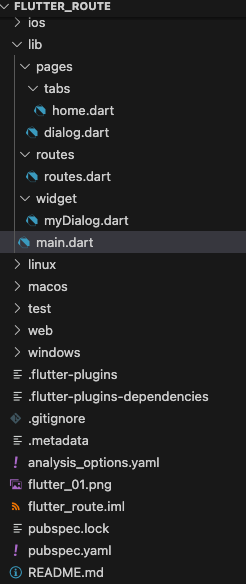
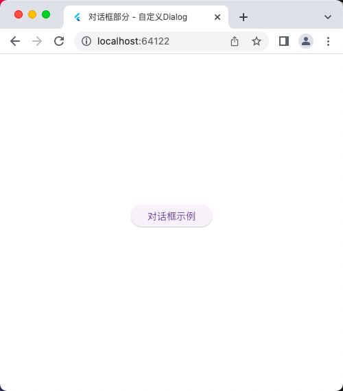
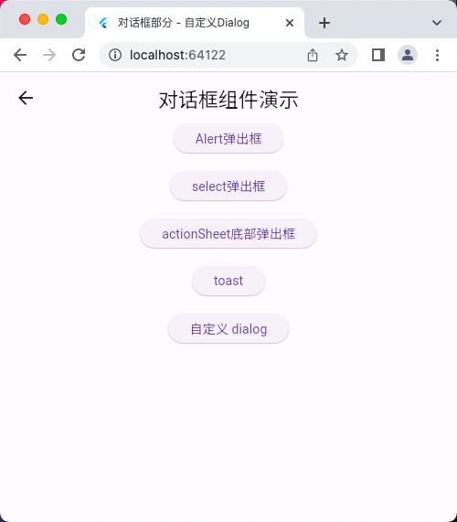
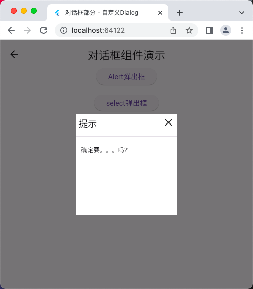

# Dialog 组件 - 自定义 Dialog

## 文件示意图



## 源码

main.dart

```dart
import 'package:flutter/material.dart';
import './routes/routes.dart';

void main() => runApp(const MyApp());

class MyApp extends StatelessWidget {
  const MyApp({super.key});

  @override
  Widget build(BuildContext context) {
    return MaterialApp(
      debugShowCheckedModeBanner: false,
      title: '对话框部分 - 自定义Dialog',
      initialRoute: '/', // 初始化当前的组件时加载的路由
      // initialRoute: '/registerfirst', // 初始化当前的组件时加载的路由
      onGenerateRoute: onGenerateRoute,
    );
  }
}
```

home.dart

```dart
import 'package:flutter/material.dart';

class HomePage extends StatefulWidget {
  const HomePage({super.key});

  @override
  State<HomePage> createState() => _HomePageState();
}

class _HomePageState extends State<HomePage> {
  @override
  Widget build(BuildContext context) {
    return Center(
      child: Column(
        mainAxisAlignment: MainAxisAlignment.center,
        children: [
          ElevatedButton(
              onPressed: () {
                Navigator.pushNamed(context, '/dialog');
              },
              child: const Text("对话框示例")),
          const SizedBox(height: 20),
        ],
      ),
    );
  }
}
```

dialog.dart

```dart
// ignore_for_file: avoid_print

import 'package:flutter/material.dart';

import 'package:flutter_route/widget/myDialog.dart';

import 'package:fluttertoast/fluttertoast.dart'; // 第三方依赖，需要在 pubspec.yaml 引入

class DialogPage extends StatefulWidget {
  const DialogPage({super.key});

  @override
  State<DialogPage> createState() => _DialogPageState();
}

class _DialogPageState extends State<DialogPage> {
  void _alertDialog() async {
    // print('alertDialog');
    var result = await showDialog(
        context: context,
        builder: (context) {
          return AlertDialog(
            icon: const Icon(Icons.warning), // 图标
            iconColor: Colors.blue, // 图标颜色
            // backgroundColor: Colors.black12, // 对话框本身的背景颜色，不是对话框之外的遮罩颜色
            title: const Text('我是 alertDialog 的标题'), // 标题
            content: const Text('成功打开了吗？'),
            actions: [
              TextButton(
                onPressed: () {
                  print('click事件触发 --> 确定按钮被点击了');
                  Navigator.of(context).pop('---> 返回消息给 result ok 消息'); // 关闭对话框
                },
                child: const Text('确定'),
              ),
              TextButton(
                  onPressed: () {
                    print('click事件触发 --> 取消按钮被点击了');
                    Navigator.of(context)
                        .pop('---> 返回消息给 result canel 消息'); // 关闭对话框
                  },
                  child: const Text('取消')),
            ],
          );
        });
    print(result);
  }

  void _simpleDialog() async {
    print('selectDialog');
    print('--------');
    var result = await showDialog(
        // barrierDismissible: false, // 不允许点击灰色遮罩层关闭对话框，默认是可以的
        context: context,
        builder: (context) {
          return SimpleDialog(
            title: const Text('请选择：'),
            children: [
              SimpleDialogOption(
                onPressed: () {
                  print('点击事件 ---> 选项1');
                  Navigator.of(context).pop('返回消息result --> 选项1');
                },
                child: const Text('选项1'),
              ),
              SimpleDialogOption(
                onPressed: () {
                  print('点击事件 ---> 选项2');
                  Navigator.of(context).pop('返回消息result --> 选项2');
                },
                child: const Text('选项2'),
              ),
              SimpleDialogOption(
                onPressed: () {
                  print('点击事件 ---> 选项3');
                  Navigator.of(context).pop('返回消息result --> 选项3');
                },
                child: const Text('选项3'),
              ),
            ],
          );
        });
    print(result);
  }

  void _modelBottomSheetDialog() async {
    print('_modelBottomSheetDialog');
    print('------------');
    var result = await showModalBottomSheet(
        context: context,
        builder: (context) {
          return SizedBox(
            // height: 300,
            child: Column(
              // mainAxisAlignment: MainAxisAlignment.spaceAround,
              // crossAxisAlignment: CrossAxisAlignment.end,
              children: [
                ListTile(
                  title: const Text('收藏'),
                  onTap: () {
                    print('"收藏"了');
                    Navigator.of(context).pop("返回的消息 --> 收藏");
                  },
                ),
                const Divider(),
                ListTile(
                  title: const Text('分享'),
                  onTap: () {
                    print('"分享"了');
                    Navigator.of(context).pop("返回的消息 --> 分享");
                  },
                ),
                const Divider(),
                ListTile(
                  title: const Text('取消'),
                  onTap: () {
                    print('"取消"了');
                    Navigator.of(context).pop("返回的消息 --> 取消");
                  },
                ),
              ],
            ),
          );
        });
    print(result);
  }

  void _toastDialog() {
    print('_toastDialog');
    print('--------');
    /* Fluttertoast.showToast(
        msg: "This is Center Short Toast",
        toastLength: Toast.LENGTH_SHORT,
        gravity: ToastGravity.CENTER,
        timeInSecForIosWeb: 1,
        backgroundColor: Colors.red,
        textColor: Colors.white,
        fontSize: 16.0); */

    Fluttertoast.showToast(
        msg: "啦啦啦，消息提示中",
        toastLength: Toast.LENGTH_LONG,
        gravity: ToastGravity.CENTER,
        timeInSecForIosWeb: 1,
        backgroundColor: Colors.red, // 这个在 Web 浏览器上无效，浏览器web的需要用其他属性去设置
        textColor: Colors.white,
        fontSize: 16.0);
  }

  void _myDialog() async {
    print('_myDialog被执行了...');
    var result = await showDialog(
        barrierDismissible: false, // 不允许点击灰色遮罩层关闭对话框，默认是可以的
        context: context,
        builder: (context) {
          return MyDialog(
            title: '提示',
            content: '确定要。。。吗？',
            onTap: () {
              print('点击了自定义对话框的x进行关闭操作。。。');
              // Navigator.pop(context);
              Navigator.of(context).pop('_myDialog传出值。。。');
            },
          );
        });
    print(result);
  }

  @override
  Widget build(BuildContext context) {
    return Scaffold(
      appBar: AppBar(
        title: const Text('对话框组件演示'),
      ),
      body: Center(
        child: Column(
          children: [
            ElevatedButton(
              onPressed: _alertDialog,
              child: const Text('Alert弹出框'),
            ),
            const SizedBox(
              height: 20,
            ),
            ElevatedButton(
              onPressed: _simpleDialog,
              child: const Text('select弹出框'),
            ),
            const SizedBox(
              height: 20,
            ),
            ElevatedButton(
                onPressed: _modelBottomSheetDialog,
                child: const Text('actionSheet底部弹出框')),
            const SizedBox(
              height: 20,
            ),
            ElevatedButton(
              onPressed: _toastDialog,
              child: const Text('toast'),
            ),
            const SizedBox(
              height: 20,
            ),
            ElevatedButton(
              // onPressed: _myDialog(), // 这里不能用这种写法，因为 _myDialog() 是调用方法
              onPressed: _myDialog, // _myDialog 是注册方法
              child: const Text('自定义 dialog'),
            ),
            const SizedBox(
              height: 20,
            ),
          ],
        ),
      ),
    );
  }
}
```

routes.dart

```dart
import 'package:flutter/material.dart';

import '../pages/tabs/home.dart';
import '../pages/dialog.dart';

// 1、定义Map类型的routes
Map routes = {
  '/': (context) => const HomePage(),
  '/dialog': (context) => const DialogPage(),
};

// 2、调用onGenerateRoute处理，下面的是固定的写法，
// 相当于一个中间件，这里也可以做权限判断
var onGenerateRoute = (RouteSettings settings) {
  // 统一处理
  final String? name = settings.name;
  final Function? pageContentBuilder = routes[name];
  if (pageContentBuilder != null) {
    if (settings.arguments != null) {
      final Route route = MaterialPageRoute(
          builder: (context) =>
              pageContentBuilder(context, arguments: settings.arguments));
      return route;
    } else {
      final Route route =
          MaterialPageRoute(builder: (context) => pageContentBuilder(context));
      return route;
    }
  }
  return null;
};
```

myDialog.dart

```dart
import 'package:flutter/material.dart';

class MyDialog extends Dialog {
  final String title;
  final String content;
  final Function()? onTap;
  const MyDialog({super.key, required this.title, required this.content, required this.onTap});

  @override
  Widget build(BuildContext context) {
    return Material(
      type: MaterialType.transparency, // 设置背景透明
      child: Center( // 注意这里用 Center 组件进行包裹，不然对话框会全屏
        child: Container(
          height: 200,
          width: 200,
          color: Colors.white,
          child: Column(
            children: [
              Padding(
                padding: const EdgeInsets.all(5),
                child: Stack(
                  children: [
                    Align(
                      alignment: Alignment.centerLeft,
                      child: Text(
                        title,
                        style: const TextStyle(
                          fontSize: 18,
                        ),
                      ),
                    ),
                    Align(
                      alignment: Alignment.centerRight,
                      // child: Icon(Icons.close),
                      /* child: IconButton(
                      icon: const Icon(Icons.close),
                      onPressed: () {
                        print('点击了自定义对话框的x进行关闭操作。。。');
                        Navigator.of(context)
                            .pop('---> 返回消息给 result canel 消息'); // 关闭对话框
                      },
                    ), */
                      child: InkWell(
                        child: const Icon(Icons.close),
                        /* onTap: () {
                          print('点击了自定义对话框的x进行关闭操作。。。');

                          Navigator.pop(context);

                          // Navigator.of(context)
                          // .pop('---> 返回消息给 result canel 消息'); // 关闭对话框
                        }, */
                        onTap: onTap,
                        onLongPress: () {
                          print('长按关闭事件...');
                        },
                      ),
                    ),
                  ],
                ),
              ),
              /* Row(  // 这个不是定位的组件，关闭x不会在右边
                children: [
                  const Align(
                    alignment: Alignment.centerLeft,
                    child: Text('提示！'),
                  ),
                  Align(
                    alignment: Alignment.centerRight,
                    // child: Icon(Icons.close),
                    child: IconButton(
                      icon: const Icon(Icons.close),
                      onPressed: () {
                        print('点击了自定义对话框的x进行关闭操作。。。');
                        Navigator.of(context)
                            .pop('---> 返回消息给 result canel 消息'); // 关闭对话框
                      },
                    ),
                  ),
                ],
              ), */
              const Divider(),
              Container(
                padding: const EdgeInsets.all(10),
                width: double.infinity,
                child: Text(
                  content,
                  style: const TextStyle(fontSize: 12),
                ),
              ),
            ],
          ),
        ),
      ),
    );
  }
}
```

pubspec.yaml 需要引入的 fluttertoast 依赖

```yaml
dependencies:
  ...
  fluttertoast: ^8.2.4
  ...
```


## 运行示意图



