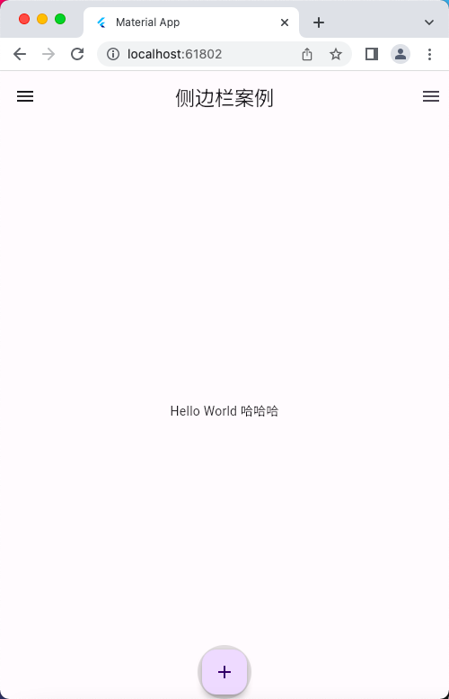
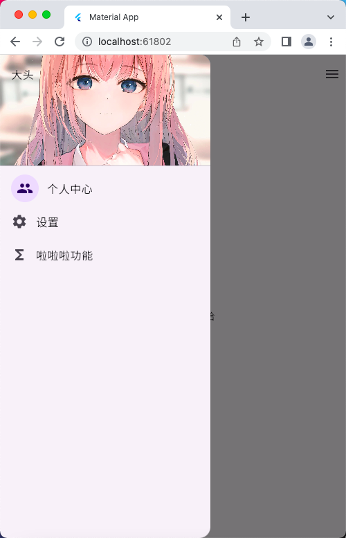
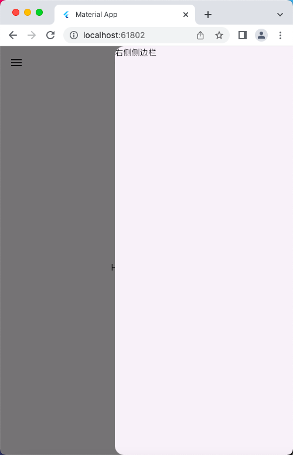

# Drawer 组件

## 侧边栏案例
```dart
import 'package:flutter/material.dart';

/// 底部导航栏

void main() => runApp(const MyApp());

class MyApp extends StatelessWidget {
  const MyApp({super.key});

  @override
  Widget build(BuildContext context) {
    return MaterialApp(
      debugShowCheckedModeBanner: false,
      title: 'Material App',
      home: Scaffold(
        appBar: AppBar(
          title: const Text('侧边栏案例'),
        ),
        drawer: const Drawer(
          child: Column(
            children: [
              Row(
                children: [
                  Expanded(
                    flex: 1,
                    child: DrawerHeader(
                      decoration: BoxDecoration(
                          color: Colors.yellow,
                          image: DecorationImage(
                            image: NetworkImage('https://ts1.cn.mm.bing.net/th/id/R-C.d134a087fe96d33aa3136d053d8a1739?rik=5l1ykcWFUmYa%2fA&riu=http%3a%2f%2fwww.sailmet.com%2fContent%2fImages%2fnews%2f202109%2f973bdd5bc42343e8a01c74e0379741c2.jpeg&ehk=Q7kbLfhIbUtgk3DM7xbzG9bN0knEOtWjZHnz%2bsC2Y5g%3d&risl=&pid=ImgRaw&r=0'),
                            fit: BoxFit.cover
                          )),
                      child: Text('大头'),
                    ),
                  )
                ],
              ),
              ListTile(
                leading: CircleAvatar(
                  child: Icon(Icons.people),
                ),
                title: Text('个人中心'),
              ),
              ListTile(
                leading: Icon(Icons.settings),
                title: Text('设置'),
              ),
              ListTile(
                leading: Icon(Icons.functions),
                title: Text('啦啦啦功能'),
              ),
            ],
          ),
        ),
        endDrawer: const Drawer(
          child: Text('右侧侧边栏'),
        ),
        body: const Center(
          child: Text('Hello World 哈哈哈'),
        ),
        /* bottomNavigationBar: BottomNavigationBar(
          items: [
            BottomNavigationBarItem(icon: Icons.add),
          ],
        ), */
        floatingActionButton: Container(
          width: 60,
          height: 60,
          padding: const EdgeInsets.all(5),
          decoration: BoxDecoration(
              color: Colors.black12, borderRadius: BorderRadius.circular(30)),
          child: FloatingActionButton(
            child: const Icon(Icons.add), // 浮动按钮图标
            onPressed: () {}, // 浮动按钮点击事件
          ),
        ),
        floatingActionButtonLocation:
            FloatingActionButtonLocation.centerDocked, //浮动按钮位置
      ),
    );
  }
}
```

## 运行示意图




