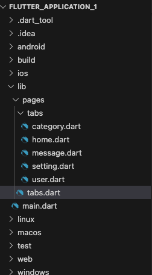
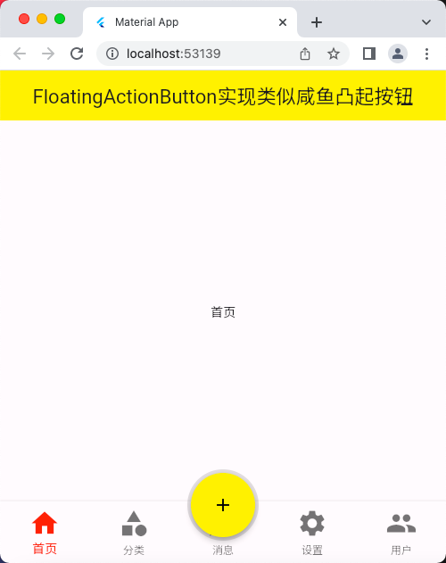
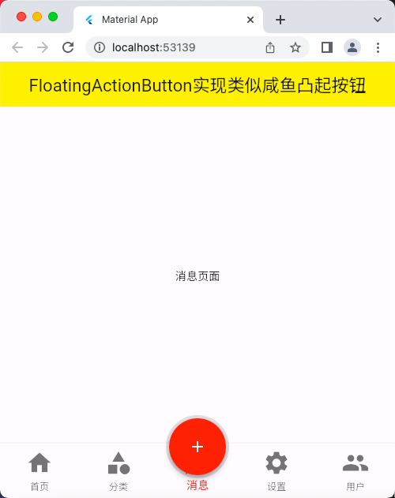

# FloatingActionButton 组件

## FloatingActionButton实现类似咸鱼凸起按钮

### 文件示意图


### 源码

main.dart

```dart
import 'package:flutter/material.dart';
import 'pages/tabs.dart';

void main() => runApp(const MyApp());

class MyApp extends StatelessWidget {
  const MyApp({super.key});

  @override
  Widget build(BuildContext context) {
    return const MaterialApp(
      debugShowCheckedModeBanner: false,
      title: 'Material App',
      home: Tabs(),
    );
  }
}
```

tabs.dart

```dart
import 'package:flutter/material.dart';
import 'tabs/home.dart';
import 'tabs/category.dart';
import 'tabs/setting.dart';
import 'tabs/user.dart';
import 'tabs/message.dart';

class Tabs extends StatefulWidget {
  const Tabs({super.key});

  @override
  State<Tabs> createState() => _TabsState();
}

class _TabsState extends State<Tabs> {
  int _index = 0; // 给个默认值
  Widget myBody = const HomePage();
  final List<Widget> _pages = const [
    HomePage(),
    CategoryPage(),
    MessagePage(),
    SettingPage(),
    UserPage(),
  ];

  @override
  Widget build(BuildContext context) {
    return Scaffold(
      appBar: AppBar(
        title: const Text('FloatingActionButton实现类似咸鱼凸起按钮'),
        backgroundColor: Colors.yellow,
      ),
      // body: myBody,
      body: _pages[_index],
      bottomNavigationBar: BottomNavigationBar(
        // 注意，里面的 items 必须要2项以上，才能正常使用
        iconSize: 35.0, // 配置底部菜单项的大小
        fixedColor: Colors.red, // 选中的颜色
        // type: BottomNavigationBarType.fixed, // 如果 2 <= items <= 3 那么可以不用管这个
        type: BottomNavigationBarType.fixed, // 如果 items > 3  那么必须设置 type
        onTap: (index) {
          // 这个是选中变化回调函数
          // 点击事件
          print('-----------------------');
          print('index => $index');
          setState(() {
            // 必须要用这个才能改遍组件的状态，用了这个，才会重新执行 build() 函数重构组件
            _index = index;
          });
          print('-----------------------');
        },
        currentIndex: _index, // 默认选中的是第几个
        items: const [
          BottomNavigationBarItem(
            icon: Icon(Icons.home),
            label: '首页',
          ),
          BottomNavigationBarItem(
            icon: Icon(Icons.category),
            label: '分类',
          ),
          BottomNavigationBarItem(
            icon: Icon(Icons.message),
            label: '消息',
          ),
          BottomNavigationBarItem(
            icon: Icon(Icons.settings),
            label: '设置',
          ),
          BottomNavigationBarItem(
            icon: Icon(Icons.people),
            label: '用户',
          ),
        ],
      ),
      floatingActionButton: Container(
        height: 80,
        width: 80,
        padding: const EdgeInsets.all(
            4), // 调整一下内边距，让 FloatingActionButton 与 Container 容器之间有些距离
        margin: const EdgeInsets.only(
            top: 8), // 这里也可以细微调整包裹的 FloatingActionButton 的位置
        decoration: BoxDecoration(
          borderRadius: BorderRadius.circular(40),
          // color: Colors.red,
          color: Colors.black12,
        ),
        child: FloatingActionButton(
          onPressed: () {
            // 点击时跳转到 消息 页面
            setState(() {
              _index = 2;
            });
          },
          shape: RoundedRectangleBorder(
            borderRadius: BorderRadius.circular(40),
          ),
          foregroundColor: _index == 2 ? Colors.white : Colors.black,
          backgroundColor: _index == 2 ? Colors.red : Colors.yellow,
          child: const Icon(Icons.add),
        ),
      ),
      // floatingActionButton 可通过 floatingActionButtonLocation 来设置位置
      floatingActionButtonLocation: FloatingActionButtonLocation.centerDocked,
    );
  }
}
```

category.dart

```dart
import 'package:flutter/material.dart';

class CategoryPage extends StatefulWidget {
  const CategoryPage({super.key});

  @override
  State<CategoryPage> createState() => _CategoryPageState();
}

class _CategoryPageState extends State<CategoryPage> {
  @override
  Widget build(BuildContext context) {
    return ListView(
      children: const [
        ListTile(
          title: Text(
            '我是一个列表',
            textAlign: TextAlign.center,
          ),
        ),
        ListTile(
          title: Text(
            '我是一个列表222',
            textAlign: TextAlign.center,
          ),
        ),
        ListTile(
          title: Text(
            '我是一个列表',
            textAlign: TextAlign.center,
          ),
        ),
        ListTile(
          title: Text(
            '我是一个列表222',
            textAlign: TextAlign.center,
          ),
        ),
        ListTile(
          title: Text(
            '我是一个列表',
            textAlign: TextAlign.center,
          ),
        ),
        ListTile(
          title: Text(
            '我是一个列表222',
            textAlign: TextAlign.center,
          ),
        ),
        ListTile(
          title: Text(
            '我是一个列表',
            textAlign: TextAlign.center,
          ),
        ),
        ListTile(
          title: Text(
            '我是一个列表222',
            textAlign: TextAlign.center,
          ),
        ),
        ListTile(
          title: Text(
            '我是一个列表',
            textAlign: TextAlign.center,
          ),
        ),
        ListTile(
          title: Text(
            '我是一个列表222',
            textAlign: TextAlign.center,
          ),
        ),
        ListTile(
          title: Text(
            '我是一个列表',
            textAlign: TextAlign.center,
          ),
        ),
        ListTile(
          title: Text(
            '我是一个列表222',
            textAlign: TextAlign.center,
          ),
        ),
        ListTile(
          title: Text(
            '我是一个列表',
            textAlign: TextAlign.center,
          ),
        ),
        ListTile(
          title: Text(
            '我是一个列表222',
            textAlign: TextAlign.center,
          ),
        ),
      ],
    );
  }
}
```

home.dart

```dart
import 'package:flutter/material.dart';

class HomePage extends StatefulWidget {
  const HomePage({super.key});

  @override
  State<HomePage> createState() => _HomePageState();
}

class _HomePageState extends State<HomePage> {
  @override
  Widget build(BuildContext context) {
    return const Center(
      child: Text('首页'),
    );
  }
}
```

message.dart

```dart
import 'package:flutter/material.dart';

class MessagePage extends StatefulWidget {
  const MessagePage({super.key});

  @override
  State<MessagePage> createState() => _MessagePageState();
}

class _MessagePageState extends State<MessagePage> {
  @override
  Widget build(BuildContext context) {
    return const Center(
      child: Text('消息页面'),
    );
  }
}
```

setting.dart

```dart
import 'package:flutter/material.dart';

class SettingPage extends StatefulWidget {
  const SettingPage({super.key});

  @override
  State<SettingPage> createState() => _SettingPageState();
}

class _SettingPageState extends State<SettingPage> {
  @override
  Widget build(BuildContext context) {
    return const Center(
      child: Text('设置'),
    );
  }
}
```

user.dart

```dart
import 'package:flutter/material.dart';

class UserPage extends StatefulWidget {
  const UserPage({super.key});

  @override
  State<UserPage> createState() => _UserPageState();
}

class _UserPageState extends State<UserPage> {
  @override
  Widget build(BuildContext context) {
    return const Center(
      child: Text('用户页面'),
    );
  }
}
```

### 运行示意图


