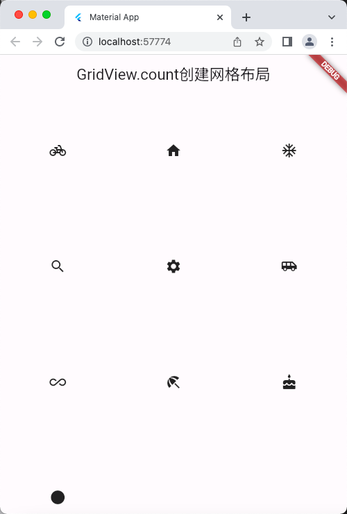
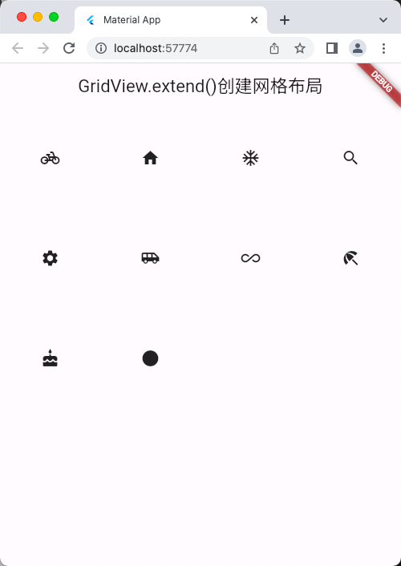
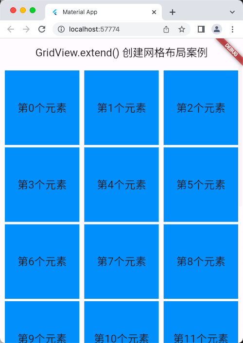
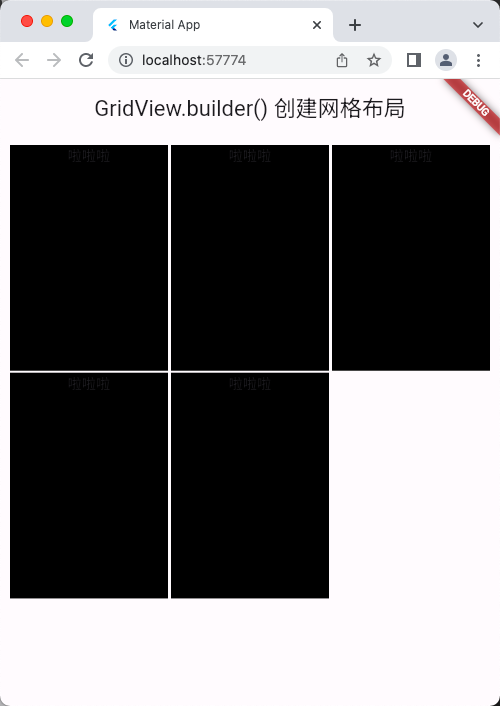
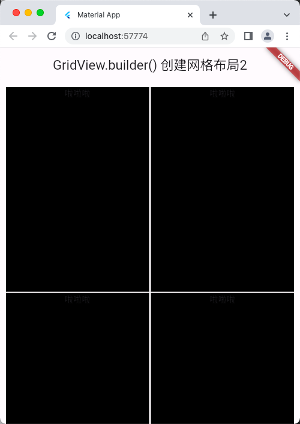

# GridView 组件

## GridView.count() 创建网格布局
```dart
import 'package:flutter/material.dart';

void main() => runApp(const MyApp());

class MyApp extends StatelessWidget {
  const MyApp({super.key});

  @override
  Widget build(BuildContext context) {
    return MaterialApp(
      title: 'Material App',
      home: Scaffold(
        appBar: AppBar(
          title: const Text('GridView.count创建网格布局'),
        ),
        body: const HomePage(),
      ),
    );
  }
}

class HomePage extends StatelessWidget {
  const HomePage({super.key});

  @override
  Widget build(BuildContext context) {
    return GridView.count(
      // scrollDirection: Axis.horizontal, // 滚动方向：水平
      // scrollDirection: Axis.vertical, // 默认 滚动方向：垂直
      // reverse: true, // 反向排列
      // crossAxisSpacing: 10.0, // 水平子组件间距
      // mainAxisSpacing: 2.0, // 垂直子组件间距
      // childAspectRatio: 2.1, // 子组件宽高比
      crossAxisCount: 3, // 一行的子组件数量
      children: const [
        Icon(Icons.pedal_bike),
        Icon(Icons.home),
        Icon(Icons.ac_unit),
        Icon(Icons.search),
        Icon(Icons.settings),
        Icon(Icons.airport_shuttle),
        Icon(Icons.all_inclusive),
        Icon(Icons.beach_access),
        Icon(Icons.cake),
        Icon(Icons.circle),
      ],
    );
  }
}
```

## 运行示意图


## GridView.extend()创建网格布局
```dart
import 'package:flutter/material.dart';

void main() => runApp(const MyApp());

class MyApp extends StatelessWidget {
  const MyApp({super.key});

  @override
  Widget build(BuildContext context) {
    return MaterialApp(
      title: 'Material App',
      home: Scaffold(
        appBar: AppBar(
          title: const Text('GridView.extend()创建网格布局'),
        ),
        body: const HomePage(),
      ),
    );
  }
}

class HomePage extends StatelessWidget {
  const HomePage({super.key});

  @override
  Widget build(BuildContext context) {
    return GridView.extent(
      // scrollDirection: Axis.horizontal, // 滚动方向：水平
      // scrollDirection: Axis.vertical, // 默认 滚动方向：垂直
      // reverse: true, // 反向排列
      // crossAxisSpacing: 10.0, // 水平子组件间距
      // mainAxisSpacing: 2.0, // 垂直子组件间距
      // childAspectRatio: 2.1, // 子组件宽高比
      maxCrossAxisExtent: 130.0, // 横轴子元素的最大长度，必须的参数
      children: const [
        Icon(Icons.pedal_bike),
        Icon(Icons.home),
        Icon(Icons.ac_unit),
        Icon(Icons.search),
        Icon(Icons.settings),
        Icon(Icons.airport_shuttle),
        Icon(Icons.all_inclusive),
        Icon(Icons.beach_access),
        Icon(Icons.cake),
        Icon(Icons.circle),
      ],
    );
  }
}
```

## 运行示意图


## GridView.count() 创建网格布局案例
```dart
import 'package:flutter/material.dart';

void main() => runApp(const MyApp());

class MyApp extends StatelessWidget {
  const MyApp({super.key});

  @override
  Widget build(BuildContext context) {
    return MaterialApp(
      title: 'Material App',
      home: Scaffold(
        appBar: AppBar(
          title: const Text('GridView.count() 创建网格布局案例'),
        ),
        body: const HomePage(),
      ),
    );
  }
}

class HomePage extends StatelessWidget {
  const HomePage({super.key});

  List<Widget> _initGridViewData() {
    List<Widget> tempList = [];
    for (var i = 0; i < 20; i++) {
      tempList.add(
        Container(
          alignment: Alignment.center,
          decoration: const BoxDecoration(
            color: Colors.blue,
          ),
          child: Text(
            '第$i个元素',
            style: const TextStyle(fontSize: 22),
          ),
        ),
      );
    }
    return tempList;
  }

  @override
  Widget build(BuildContext context) {
    return GridView.count(
      // scrollDirection: Axis.horizontal, // 滚动方向：水平
      // scrollDirection: Axis.vertical, // 默认 滚动方向：垂直
      // reverse: true, // 反向排列
      padding: const EdgeInsets.all(10),
      crossAxisSpacing: 10.0, // 水平子组件间距
      mainAxisSpacing: 5.0, // 垂直子组件间距
      childAspectRatio: 0.7, // 子组件宽高比，默认是 1.0
      crossAxisCount: 2,
      children: _initGridViewData(),
    );
  }
}
```

## 运行示意图


## GridView.extend() 创建网格布局案例
```dart
import 'package:flutter/material.dart';

void main() => runApp(const MyApp());

class MyApp extends StatelessWidget {
  const MyApp({super.key});

  @override
  Widget build(BuildContext context) {
    return MaterialApp(
      title: 'Material App',
      home: Scaffold(
        appBar: AppBar(
          title: const Text('GridView.extend() 创建网格布局案例'),
        ),
        body: const HomePage(),
      ),
    );
  }
}

class HomePage extends StatelessWidget {
  const HomePage({super.key});

  List<Widget> _initGridViewData() {
    List<Widget> tempList = [];
    for (var i = 0; i < 20; i++) {
      tempList.add(
        Container(
          alignment: Alignment.center,
          decoration: const BoxDecoration(
            color: Colors.blue,
          ),
          child: Text(
            '第$i个元素',
            style: const TextStyle(fontSize: 22),
          ),
        ),
      );
    }
    return tempList;
  }

  @override
  Widget build(BuildContext context) {
    return GridView.extent(
      // scrollDirection: Axis.horizontal, // 滚动方向：水平
      // scrollDirection: Axis.vertical, // 默认 滚动方向：垂直
      // reverse: true, // 反向排列
      padding: const EdgeInsets.all(10),
      crossAxisSpacing: 10.0, // 水平子组件间距
      mainAxisSpacing: 5.0, // 垂直子组件间距
      // childAspectRatio: 0.7, // 子组件宽高比，默认是 1.0
      maxCrossAxisExtent: 200,
      children: _initGridViewData(),
    );
  }
}
```

## 运行示意图


## GridView.builder() 创建网格布局
```dart
import 'package:flutter/material.dart';

void main() => runApp(const MyApp());

class MyApp extends StatelessWidget {
  const MyApp({super.key});

  @override
  Widget build(BuildContext context) {
    return MaterialApp(
      title: 'Material App',
      home: Scaffold(
        appBar: AppBar(
          title: const Text('GridView.builder() 创建网格布局'),
        ),
        body: const HomePage(),
      ),
    );
  }
}

class HomePage extends StatelessWidget {
  const HomePage({super.key});

  Widget _initGridViewData(context, index) {
    /* List<Widget> tempList = [];
    for (var i = 0; i < 10; i++) {
      tempList.add(
        Container(
          alignment: Alignment.center,
          decoration: const BoxDecoration(
            color: Colors.blue,
          ),
          child: Text(
            '第$i个元素',
            style: const TextStyle(fontSize: 22),
          ),
        ),
      );
    }
    Widget t = ListView(
      children: tempList,
    );
    return t; */
    return Container(
      decoration: BoxDecoration(color: Colors.black),
      child: const Column(
        children: [
          Text('啦啦啦'),
        ],
      ),
    );
  }

  @override
  Widget build(BuildContext context) {
    return GridView.builder(
      padding: const EdgeInsets.all(10),
      itemCount: 5, // 这个必须有，不然下面的 itemBuilder 会无限构建子组件
      gridDelegate: const SliverGridDelegateWithFixedCrossAxisCount(
        // 必须的参数
        crossAxisCount: 3, // 一行的子组件数量
        mainAxisSpacing: 2.0, // 垂直子组件间距
        crossAxisSpacing: 3.0, // 水平子组件间距
        childAspectRatio: 0.7, // 子组件宽高比
        // mainAxisExtent: 0.1, // 这个暂时不知道
      ),
      itemBuilder: _initGridViewData,
    );
  }
}
```

## 运行示意图


## GridView.builder() 创建网格布局2
```dart
import 'package:flutter/material.dart';

void main() => runApp(const MyApp());

class MyApp extends StatelessWidget {
  const MyApp({super.key});

  @override
  Widget build(BuildContext context) {
    return MaterialApp(
      title: 'Material App',
      home: Scaffold(
        appBar: AppBar(
          title: const Text('GridView.builder() 创建网格布局2'),
        ),
        body: const HomePage(),
      ),
    );
  }
}

class HomePage extends StatelessWidget {
  const HomePage({super.key});

  Widget _initGridViewData(context, index) {
    /* List<Widget> tempList = [];
    for (var i = 0; i < 10; i++) {
      tempList.add(
        Container(
          alignment: Alignment.center,
          decoration: const BoxDecoration(
            color: Colors.blue,
          ),
          child: Text(
            '第$i个元素',
            style: const TextStyle(fontSize: 22),
          ),
        ),
      );
    }
    Widget t = ListView(
      children: tempList,
    );
    return t; */
    return Container(
      decoration: BoxDecoration(color: Colors.black),
      child: const Column(
        children: [
          Text('啦啦啦'),
        ],
      ),
    );
  }

  @override
  Widget build(BuildContext context) {
    return GridView.builder(
      padding: const EdgeInsets.all(10),
      itemCount: 5, // 这个必须有，不然下面的 itemBuilder 会无限构建子组件
      gridDelegate: const SliverGridDelegateWithMaxCrossAxisExtent(// 必须的参数
        maxCrossAxisExtent: 300, // 一行最大长度
        mainAxisSpacing: 2.0, // 垂直子组件间距
        crossAxisSpacing: 3.0, // 水平子组件间距
        childAspectRatio: 0.7, // 子组件宽高比
        // mainAxisExtent: 0.1, // 这个暂时不知道
      ),
      itemBuilder: _initGridViewData,
    );
  }
}
```

## 运行示意图

