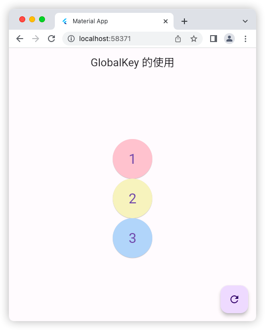

# Key

## LocalKey 的使用

### 源码

```dart
import 'package:flutter/material.dart';

void main() => runApp(const MyApp());

class MyApp extends StatelessWidget {
  const MyApp({super.key});

  @override
  Widget build(BuildContext context) {
    return const MaterialApp(
      debugShowCheckedModeBanner: false,
      title: 'Material App',
      home: HomePage(),
    );
  }
}

class HomePage extends StatefulWidget {
  const HomePage({super.key});

  @override
  State<HomePage> createState() => _HomePageState();
}

class _HomePageState extends State<HomePage> {
  // key 的类型：ValueKey UniqueKey ObjectKey
  List<Widget> list = [
    Box(
      key: const ValueKey('1'), // 传递 key 进入，值不能重复，这样打乱顺序时才会改变组件顺序
      color: Colors.red.shade100,
    ),
    Box(
      key: UniqueKey(), // 唯一值，每次运行会自动随机生成
      color: Colors.yellow.shade100,
    ),
    Box(
      key: ObjectKey(Box(color: Colors.blue.shade100)), // 传入的对象不能重复
      color: Colors.blue.shade100,
    ),
  ];
  @override
  Widget build(BuildContext context) {
    return Scaffold(
      appBar: AppBar(
        title: const Text('LocalKey 的使用'),
      ),
      body: Center(
        child: Column(
          mainAxisAlignment: MainAxisAlignment.center,
          children: list,
        ),
      ),
      floatingActionButton: FloatingActionButton(
        onPressed: () {
          setState(() {
            list.shuffle(); // 打乱 list 里面的元素顺序
          });
        },
        child: const Icon(Icons.refresh),
      ),
    );
  }
}

class Box extends StatefulWidget {
  final Color color;
  const Box({Key? key, required this.color}) : super(key: key);

  @override
  State<Box> createState() => _BoxState();
}

class _BoxState extends State<Box> {
  int _count = 0;
  @override
  Widget build(BuildContext context) {
    return SizedBox(
      height: 80,
      width: 80,
      child: ElevatedButton(
        style: ButtonStyle(
            backgroundColor: MaterialStateProperty.all(widget.color)),
        child: Text(
          '$_count',
          style: const TextStyle(fontSize: 28),
        ),
        onPressed: () {
          setState(() {
            _count++;
          });
        },
      ),
    );
  }
}
```


### 运行示意图


## GlobalKey 的使用


### 源码

```dart
import 'package:flutter/material.dart';

void main() => runApp(const MyApp());

class MyApp extends StatelessWidget {
  const MyApp({super.key});

  @override
  Widget build(BuildContext context) {
    return const MaterialApp(
      debugShowCheckedModeBanner: false,
      title: 'Material App',
      home: HomePage(),
    );
  }
}

class HomePage extends StatefulWidget {
  const HomePage({super.key});

  @override
  State<HomePage> createState() => _HomePageState();
}

class _HomePageState extends State<HomePage> {
  // 使用了 GlobalKey，旋转屏幕后，原来的组件值不会因为旋转屏幕而发生改变
  final GlobalKey _globalKey = GlobalKey();
  final GlobalKey _globalKey2 = GlobalKey();
  final GlobalKey _globalKey3 = GlobalKey();
  late List<Widget> list;
  @override
  void initState() { // 注意初始化数据要放到 initState() 里面
    super.initState();
    list = [
      Box(
        key: _globalKey,
        color: Colors.red.shade100,
      ),
      Box(
        key: _globalKey2,
        color: Colors.yellow.shade100,
      ),
      Box(
        key: _globalKey3,
        color: Colors.blue.shade100,
      ),
    ];
  }

  @override
  Widget build(BuildContext context) {
    print(MediaQuery.of(context).orientation); // 可以获取屏幕方向，从而去做一套适配横屏版的布局
    return Scaffold(
      appBar: AppBar(
        title: const Text('GlobalKey 的使用'),
      ),
      body: Center(
        child: MediaQuery.of(context).orientation == Orientation.portrait
            ? Column(
                mainAxisAlignment: MainAxisAlignment.center,
                children: list,
              )
            : Row(
                mainAxisAlignment: MainAxisAlignment.center,
                children: list,
              ),
      ),
      floatingActionButton: FloatingActionButton(
        onPressed: () {
          setState(() {
            list.shuffle(); // 打乱 list 里面的元素顺序
          });
        },
        child: const Icon(Icons.refresh),
      ),
    );
  }
}

class Box extends StatefulWidget {
  final Color color;
  const Box({Key? key, required this.color}) : super(key: key);

  @override
  State<Box> createState() => _BoxState();
}

class _BoxState extends State<Box> {
  int _count = 0;
  @override
  Widget build(BuildContext context) {
    return SizedBox(
      height: 80,
      width: 80,
      child: ElevatedButton(
        style: ButtonStyle(
            backgroundColor: MaterialStateProperty.all(widget.color)),
        child: Text(
          '$_count',
          style: const TextStyle(fontSize: 28),
        ),
        onPressed: () {
          setState(() {
            _count++;
          });
        },
      ),
    );
  }
}
```

### 运行示意图



## GlobalKey 案例：父组件获取子组件状态，并修改

### 源码

```dart
import 'package:flutter/material.dart';

void main() => runApp(const MyApp());

class MyApp extends StatelessWidget {
  const MyApp({super.key});

  @override
  Widget build(BuildContext context) {
    return const MaterialApp(
      debugShowCheckedModeBanner: false,
      title: 'Material App',
      home: HomePage(),
    );
  }
}

class HomePage extends StatefulWidget {
  const HomePage({super.key});

  @override
  State<HomePage> createState() => _HomePageState();
}

class _HomePageState extends State<HomePage> {
  final GlobalKey _globalKey = GlobalKey();

  @override
  Widget build(BuildContext context) {
    return Scaffold(
      appBar: AppBar(
        title: const Text('globalKey 案例：父组件获取子组件状态，并修改'),
      ),
      body: Center(
        child: Box(key: _globalKey, color: Colors.red),
      ),
      floatingActionButton: FloatingActionButton(
        onPressed: () {
          // 想办法获取子组件 Box 的 _count
          var boxState = _globalKey.currentState as _BoxState;
          print(boxState._count);
          setState(() {
            boxState._count++; // 让子组件的 _count 自增
          });
          boxState.run(); // 我是子组件的 run() 函数

          // 获取子组件对象
          var boxWidget = _globalKey.currentWidget as Box;
          print(boxWidget.color); // MaterialColor(primary value: Color(0xfff44336))
          boxWidget.eat(); // eat()方法被执行了

          // 获取子组件 渲染的属性
          var renderBox =
              _globalKey.currentContext!.findRenderObject() as RenderBox;
          print(renderBox.size); // Size(80.0, 80.0)
        },
        child: const Icon(Icons.add),
      ),
    );
  }
}

class Box extends StatefulWidget {
  final Color color;
  void eat() {
    print('eat()方法被执行了');
  }

  const Box({Key? key, required this.color}) : super(key: key);

  @override
  State<Box> createState() => _BoxState();
}

class _BoxState extends State<Box> {
  int _count = 0;

  void run() {
    print('我是子组件的 run() 函数');
  }

  @override
  Widget build(BuildContext context) {
    return SizedBox(
      height: 80,
      width: 80,
      child: ElevatedButton(
        style: ButtonStyle(
            backgroundColor: MaterialStateProperty.all(widget.color)),
        child: Text(
          '$_count',
          style: const TextStyle(fontSize: 28),
        ),
        onPressed: () {
          setState(() {
            _count++;
          });
        },
      ),
    );
  }
}
```

### 运行示意图


