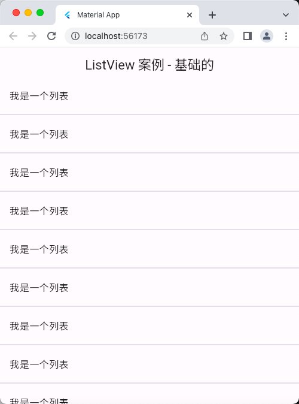
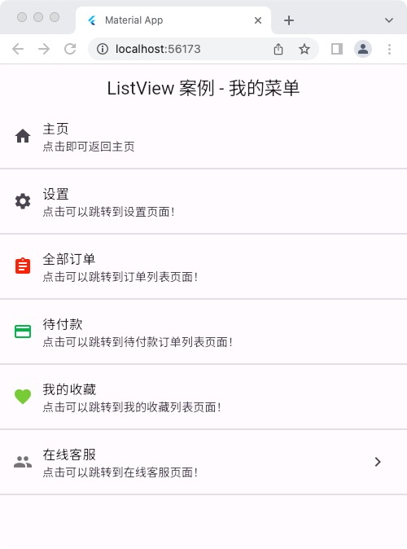
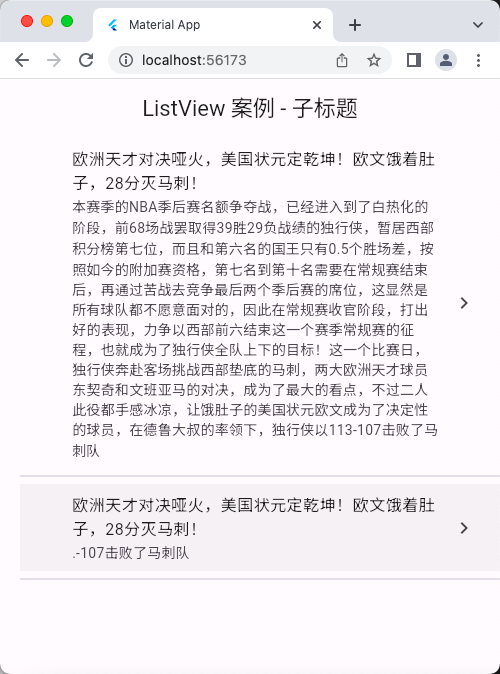
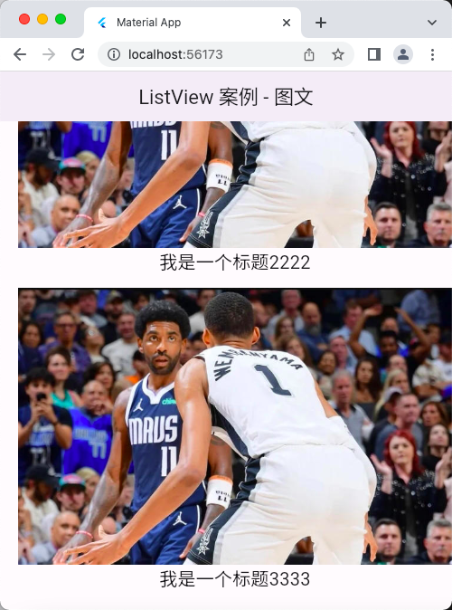
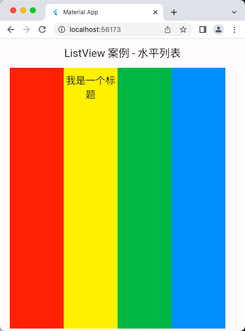
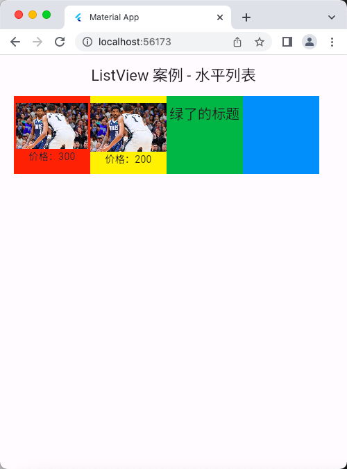
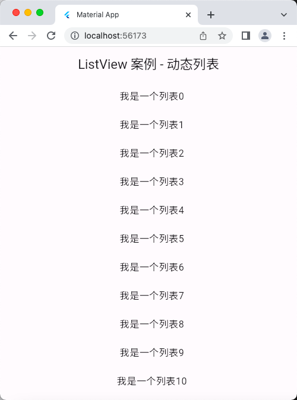

# ListView 组件

## 基础用法案例
```dart
import 'package:flutter/material.dart';

void main() => runApp(const MyApp());

class MyApp extends StatelessWidget {
  const MyApp({super.key});

  @override
  Widget build(BuildContext context) {
    return MaterialApp(
      debugShowCheckedModeBanner: false, // 移除右上角的 debug 图标
      title: 'Material App',
      theme: ThemeData(
        // primarySwatch: Colors.yellow,
        primaryColor: Colors.yellow,
      ),
      home: Scaffold(
        appBar: AppBar(
          title: const Text('ListView 案例 - 基础的'),
        ),
        body: const MyHomePage(),
      ),
    );
  }
}

class MyHomePage extends StatelessWidget {
  const MyHomePage({super.key});

  @override
  Widget build(BuildContext context) {
    return ListView(
      // scrollDirection: Axis.horizontal, // 水平列表
      scrollDirection: Axis.vertical, // 垂直列表
      // padding: EdgeInsets.all(2.0), // 内边距
      // reverse: true, // 组件反向排序
      // children: [], // 列表元素
      children: const <Widget>[
        ListTile(
          title: Text('我是一个列表'),
        ),
        Divider(), // 下划线组件
        ListTile(
          title: Text('我是一个列表'),
        ),
        Divider(),
        ListTile(
          title: Text('我是一个列表'),
        ),
        Divider(),
        ListTile(
          title: Text('我是一个列表'),
        ),
        Divider(),
        ListTile(
          title: Text('我是一个列表'),
        ),
        Divider(),
        ListTile(
          title: Text('我是一个列表'),
        ),
        Divider(),
        ListTile(
          title: Text('我是一个列表'),
        ),
        Divider(),
        ListTile(
          title: Text('我是一个列表'),
        ),
        Divider(),
        ListTile(
          title: Text('我是一个列表'),
        ),
        Divider(),
        ListTile(
          title: Text('我是一个列表'),
        ),
        Divider(),
        ListTile(
          title: Text('我是一个列表'),
        ),
        Divider(),
        ListTile(
          title: Text('我是一个列表'),
        ),
        Divider(),
        
      ],
    );
  }
}
```
## 运行示意图



## 我的菜单案例
```dart
import 'package:flutter/material.dart';

void main() => runApp(const MyApp());

class MyApp extends StatelessWidget {
  const MyApp({super.key});

  @override
  Widget build(BuildContext context) {
    return MaterialApp(
      debugShowCheckedModeBanner: false, // 移除右上角的 debug 图标
      title: 'Material App',
      theme: ThemeData(
        // primarySwatch: Colors.yellow,
        primaryColor: Colors.yellow,
      ),
      home: Scaffold(
        appBar: AppBar(
          title: const Text('ListView 案例 - 我的菜单'),
        ),
        body: const MyHomePage(),
      ),
    );
  }
}

class MyHomePage extends StatelessWidget {
  const MyHomePage({super.key});

  @override
  Widget build(BuildContext context) {
    return ListView(
      // scrollDirection: Axis.horizontal, // 水平列表
      scrollDirection: Axis.vertical, // 垂直列表
      // padding: EdgeInsets.all(2.0), // 内边距
      // reverse: true, // 组件反向排序
      // children: [], // 列表元素
      children: <Widget>[
        ListTile(
          leading: const Icon(Icons.home),
          title: const Text('主页'),
          subtitle: const Text('点击即可返回主页'),
          onTap: () {
            print('“主页”被点击了！！！');
          },
        ),
        const Divider(),
        ListTile(
          leading: const Icon(Icons.settings),
          title: const Text('设置'),
          subtitle: const Text('点击可以跳转到设置页面！'),
          onTap: (){
            print('“设置”被点击了！！！');
          },
        ),
        const Divider(),
        ListTile(
          leading: const Icon(Icons.assignment, color: Colors.red,),
          title: const Text('全部订单'),
          subtitle: const Text('点击可以跳转到订单列表页面！'),
          onTap: (){
            print('“全部订单”被点击了！！！');
          },
        ),
        const Divider(),
        ListTile(
          leading: const Icon(Icons.payment, color: Colors.green,),
          title: const Text('待付款'),
          subtitle: const Text('点击可以跳转到待付款订单列表页面！'),
          onTap: (){
            print('“待付款”被点击了！！！');
          },
        ),
        const Divider(),
        ListTile(
          leading: const Icon(Icons.favorite, color: Colors.lightGreen,),
          title: const Text('我的收藏'),
          subtitle: const Text('点击可以跳转到我的收藏列表页面！'),
          onTap: (){
            print('“我的收藏”被点击了！！！');
          },
        ),
        const Divider(),
        ListTile(
          leading: const Icon(Icons.people, color: Colors.black54,),
          title: const Text('在线客服'),
          subtitle: const Text('点击可以跳转到在线客服页面！'),
          onTap: (){
            print('“在线客服”被点击了！！！');
          },
          trailing: const Icon(Icons.chevron_right),
        ),
        const Divider(),
      ],
    );
  }
}
```

## 运行示意图


## 子标题案例

```dart
import 'package:flutter/material.dart';

void main() => runApp(const MyApp());

class MyApp extends StatelessWidget {
  const MyApp({super.key});

  @override
  Widget build(BuildContext context) {
    return MaterialApp(
      debugShowCheckedModeBanner: false, // 移除右上角的 debug 图标
      title: 'Material App',
      theme: ThemeData(
        // primarySwatch: Colors.yellow,
        primaryColor: Colors.yellow,
      ),
      home: Scaffold(
        appBar: AppBar(
          title: const Text('ListView 案例 - 子标题'),
        ),
        body: const MyHomePage(),
      ),
    );
  }
}

class MyHomePage extends StatelessWidget {
  const MyHomePage({super.key});

  @override
  Widget build(BuildContext context) {
    return ListView(
      // scrollDirection: Axis.horizontal, // 水平列表
      scrollDirection: Axis.vertical, // 垂直列表
      // padding: EdgeInsets.all(2.0), // 内边距
      padding: const EdgeInsets.fromLTRB(20, 3, 0, 5), // 内边距，4个参数分别对应 左、上、右、下 的内边距
      // reverse: true, // 组件反向排序
      // children: [], // 列表元素
      children: <Widget>[
        ListTile(
          leading: Image.network(
            'https://img-s-msn-com.akamaized.net/tenant/amp/entityid/BB1kbZ3Y.img?w=735&h=468&m=6&x=215&y=69&s=63&d=63',
            // fit: BoxFit.cover,
            fit: BoxFit.fill,
          ),
          title: const Text('欧洲天才对决哑火，美国状元定乾坤！欧文饿着肚子，28分灭马刺！'),
          subtitle: const Text(
              '本赛季的NBA季后赛名额争夺战，已经进入到了白热化的阶段，前68场战罢取得39胜29负战绩的独行侠，暂居西部积分榜第七位，而且和第六名的国王只有0.5个胜场差，按照如今的附加赛资格，第七名到第十名需要在常规赛结束后，再通过苦战去竞争最后两个季后赛的席位，这显然是所有球队都不愿意面对的，因此在常规赛收官阶段，打出好的表现，力争以西部前六结束这一个赛季常规赛的征程，也就成为了独行侠全队上下的目标！这一个比赛日，独行侠奔赴客场挑战西部垫底的马刺，两大欧洲天才球员东契奇和文班亚马的对决，成为了最大的看点，不过二人此役都手感冰凉，让饿肚子的美国状元欧文成为了决定性的球员，在德鲁大叔的率领下，独行侠以113-107击败了马刺队'),
          onTap: () {
            print('“啦啦啦”被点击了！！！');
          },
          trailing: const Icon(Icons.chevron_right),
        ),
        const Divider(),
        ListTile(
          leading: Image.network(
            'https://img-s-msn-com.akamaized.net/tenant/amp/entityid/BB1kbZ3Y.img?w=735&h=468&m=6&x=215&y=69&s=63&d=63',
            // fit: BoxFit.cover,
            fit: BoxFit.fill,
          ),
          title: const Text('欧洲天才对决哑火，美国状元定乾坤！欧文饿着肚子，28分灭马刺！'),
          subtitle: const Text('.-107击败了马刺队'),
          onTap: () {
            print('“啦啦啦”被点击了！！！');
          },
          trailing: const Icon(Icons.chevron_right),
        ),
        const Divider(),
      ],
    );
  }
}
```

## 运行示意图


## 图文列表案例
```dart
import 'package:flutter/material.dart';

void main() => runApp(const MyApp());

class MyApp extends StatelessWidget {
  const MyApp({super.key});

  @override
  Widget build(BuildContext context) {
    return MaterialApp(
      debugShowCheckedModeBanner: false, // 移除右上角的 debug 图标
      title: 'Material App',
      theme: ThemeData(
        // primarySwatch: Colors.yellow,
        primaryColor: Colors.yellow,
      ),
      home: Scaffold(
        appBar: AppBar(
          title: const Text('ListView 案例 - 图文'),
        ),
        body: const MyHomePage(),
      ),
    );
  }
}

class MyHomePage extends StatelessWidget {
  const MyHomePage({super.key});

  @override
  Widget build(BuildContext context) {
    return ListView(
      // scrollDirection: Axis.horizontal, // 水平列表
      scrollDirection: Axis.vertical, // 垂直列表
      // padding: EdgeInsets.all(2.0), // 内边距
      padding:
          const EdgeInsets.fromLTRB(20, 3, 0, 5), // 内边距，4个参数分别对应 左、上、右、下 的内边距
      // reverse: true, // 组件反向排序
      // children: [], // 列表元素
      children: <Widget>[
        Image.network(
          'https://img-s-msn-com.akamaized.net/tenant/amp/entityid/BB1kbZ3Y.img?w=735&h=468&m=6&x=215&y=69&s=63&d=63',
          // fit: BoxFit.cover,
          // fit: BoxFit.fill,
        ),
        Container(
          padding: const EdgeInsets.fromLTRB(0, 10, 0, 0), // 内边距，4个参数分别对应 左、上、右、下 的内边距
          height: 44,
          child: const Text(
            '我是一个标题',
            style: TextStyle(fontSize: 20), // 文字样式
            textAlign: TextAlign.center, // 文字居中
          ),
        ),
        // const Divider(),
        Image.network(
          'https://img-s-msn-com.akamaized.net/tenant/amp/entityid/BB1kbZ3Y.img?w=735&h=468&m=6&x=215&y=69&s=63&d=63',
          // fit: BoxFit.cover,
        ),
        Container(
          height: 44,
          child: const Text(
            '我是一个标题2222',
            style: TextStyle(fontSize: 20), // 文字样式
            textAlign: TextAlign.center, // 文字居中
          ),
        ),
        // const Divider(),
        Image.network(
          'https://img-s-msn-com.akamaized.net/tenant/amp/entityid/BB1kbZ3Y.img?w=735&h=468&m=6&x=215&y=69&s=63&d=63',
          // fit: BoxFit.cover,
        ),
        Container(
          height: 44,
          child: const Text(
            '我是一个标题3333',
            style: TextStyle(fontSize: 20), // 文字样式
            textAlign: TextAlign.center, // 文字居中
          ),
        ),
        // const Divider(),
      ],
    );
  }
}
```

## 运行示意图


## 水平列表
```dart
import 'package:flutter/material.dart';

void main() => runApp(const MyApp());

class MyApp extends StatelessWidget {
  const MyApp({super.key});

  @override
  Widget build(BuildContext context) {
    return MaterialApp(
      debugShowCheckedModeBanner: false, // 移除右上角的 debug 图标
      title: 'Material App',
      theme: ThemeData(
        // primarySwatch: Colors.yellow,
        primaryColor: Colors.yellow,
      ),
      home: Scaffold(
        appBar: AppBar(
          title: const Text('ListView 案例 - 水平列表'),
        ),
        body: const MyHomePage(),
      ),
    );
  }
}

class MyHomePage extends StatelessWidget {
  const MyHomePage({super.key});

  @override
  Widget build(BuildContext context) {
    return ListView(
      scrollDirection: Axis.horizontal, // 水平列表，子元素的高度是自适应屏幕的，子元素设置的高度不会生效
      // 如果希望调整高度或者宽度的话，需要在 ListView 外面加个 container 容器去设置宽度和高度，这样就ok了
      // scrollDirection: Axis.vertical, // 垂直列表，子元素的宽度是自适应屏幕的，子元素设置的宽度不会生效
      // padding: EdgeInsets.all(2.0), // 内边距
      padding:
          const EdgeInsets.fromLTRB(20, 3, 0, 5), // 内边距，4个参数分别对应 左、上、右、下 的内边距
      // reverse: true, // 组件反向排序
      // children: [], // 列表元素
      children: <Widget>[
        Container(
          padding: const EdgeInsets.fromLTRB(
              0, 10, 0, 0), // 内边距，4个参数分别对应 左、上、右、下 的内边距
          // height: 120,
          width: 110,
          decoration: const BoxDecoration(
            color: Colors.red,
          ),
          // child: const Text(
          //   '我是一个标题',
          //   style: TextStyle(fontSize: 20), // 文字样式
          //   textAlign: TextAlign.center, // 文字居中
          // ),
        ),
        // const Divider(),
        Container(
          padding: const EdgeInsets.fromLTRB(
              0, 10, 0, 0), // 内边距，4个参数分别对应 左、上、右、下 的内边距
          // height: 120,
          width: 110,
          decoration: const BoxDecoration(
            color: Colors.yellow,
          ),
          child: const Text(
            '我是一个标题',
            style: TextStyle(fontSize: 20), // 文字样式
            textAlign: TextAlign.center, // 文字居中
          ),
        ),
        // const Divider(),
        Container(
          padding: const EdgeInsets.fromLTRB(
              0, 10, 0, 0), // 内边距，4个参数分别对应 左、上、右、下 的内边距
          // height: 120,
          width: 110,
          decoration: const BoxDecoration(
            color: Colors.green,
          ),
          // child: const Text(
          //   '我是一个标题',
          //   style: TextStyle(fontSize: 20), // 文字样式
          //   textAlign: TextAlign.center, // 文字居中
          // ),
        ),
        // const Divider(),
        Container(
          padding: const EdgeInsets.fromLTRB(
              0, 10, 0, 0), // 内边距，4个参数分别对应 左、上、右、下 的内边距
          // height: 120,
          width: 110,
          decoration: const BoxDecoration(
            color: Colors.blue,
          ),
          // child: const Text(
          //   '我是一个标题',
          //   style: TextStyle(fontSize: 20), // 文字样式
          //   textAlign: TextAlign.center, // 文字居中
          // ),
        ),
        // const Divider(),
      ],
    );
  }
}
```

## 运行示意图


## 水平列表2
```dart
import 'package:flutter/material.dart';

void main() => runApp(const MyApp());

class MyApp extends StatelessWidget {
  const MyApp({super.key});

  @override
  Widget build(BuildContext context) {
    return MaterialApp(
      debugShowCheckedModeBanner: false, // 移除右上角的 debug 图标
      title: 'Material App',
      theme: ThemeData(
        // primarySwatch: Colors.yellow,
        primaryColor: Colors.yellow,
      ),
      home: Scaffold(
        appBar: AppBar(
          title: const Text('ListView 案例 - 水平列表2'),
        ),
        body: const MyHomePage(),
      ),
    );
  }
}

class MyHomePage extends StatelessWidget {
  const MyHomePage({super.key});

  @override
  Widget build(BuildContext context) {
    return Container(
      height: 120,
      // width: 300, // 超出这个宽度的就没有显示出来内容了，
      child: ListView(
        scrollDirection: Axis.horizontal, // 水平列表，子元素的高度是自适应屏幕的，子元素设置的高度不会生效
        // 如果希望调整高度或者宽度的话，需要在 ListView 外面加个 container 容器去设置宽度和高度，这样就ok了
        // scrollDirection: Axis.vertical, // 垂直列表，子元素的宽度是自适应屏幕的，子元素设置的宽度不会生效
        // padding: EdgeInsets.all(2.0), // 内边距
        padding:
            const EdgeInsets.fromLTRB(20, 3, 0, 5), // 内边距，4个参数分别对应 左、上、右、下 的内边距
        // reverse: true, // 组件反向排序
        // children: [], // 列表元素
        children: <Widget>[
          Container(
            padding: const EdgeInsets.fromLTRB(
                0, 10, 0, 0), // 内边距，4个参数分别对应 左、上、右、下 的内边距
            // height: 120,
            width: 110,
            decoration: const BoxDecoration(
              color: Colors.red,
            ),
            child: Column(
              children: [
                SizedBox(
                  height: 66,
                  child: Image.network(
                    'https://img-s-msn-com.akamaized.net/tenant/amp/entityid/BB1kbZ3Y.img?w=735&h=468&m=6&x=215&y=69&s=63&d=63',
                    fit: BoxFit.cover,
                  ),
                ),
                const Text('价格：300'),
              ],
            ),
          ),
          // const Divider(),
          Container(
            padding: const EdgeInsets.fromLTRB(
                0, 10, 0, 0), // 内边距，4个参数分别对应 左、上、右、下 的内边距
            // height: 120,
            width: 110,
            decoration: const BoxDecoration(
              color: Colors.yellow,
            ),
            child: Column(
              children: [
                Image.network(
                    'https://img-s-msn-com.akamaized.net/tenant/amp/entityid/BB1kbZ3Y.img?w=735&h=468&m=6&x=215&y=69&s=63&d=63'),
                const Text('价格：200'),
              ],
            ),
          ),
          // const Divider(),
          Container(
            padding: const EdgeInsets.fromLTRB(
                0, 10, 0, 0), // 内边距，4个参数分别对应 左、上、右、下 的内边距
            // height: 120,
            width: 110,
            decoration: const BoxDecoration(
              color: Colors.green,
            ),
            child: const Text(
              '绿了的标题',
              style: TextStyle(fontSize: 20), // 文字样式
              textAlign: TextAlign.center, // 文字居中
            ),
          ),
          // const Divider(),
          Container(
            padding: const EdgeInsets.fromLTRB(
                0, 10, 0, 0), // 内边距，4个参数分别对应 左、上、右、下 的内边距
            // height: 120,
            width: 110,
            decoration: const BoxDecoration(
              color: Colors.blue,
            ),
            // child: const Text(
            //   '我是一个标题',
            //   style: TextStyle(fontSize: 20), // 文字样式
            //   textAlign: TextAlign.center, // 文字居中
            // ),
          ),
          // const Divider(),
        ],
      ),
    );
  }
}
```

## 运行示意图


## 动态列表
```dart
import 'package:flutter/material.dart';

void main() => runApp(const MyApp());

class MyApp extends StatelessWidget {
  const MyApp({super.key});

  @override
  Widget build(BuildContext context) {
    return MaterialApp(
      debugShowCheckedModeBanner: false, // 移除右上角的 debug 图标
      title: 'Material App',
      theme: ThemeData(
        // primarySwatch: Colors.yellow,
        primaryColor: Colors.yellow,
      ),
      home: Scaffold(
        appBar: AppBar(
          title: const Text('ListView 案例 - 动态列表'),
        ),
        body: const MyHomePage(),
      ),
    );
  }
}

class MyHomePage extends StatelessWidget {
  const MyHomePage({super.key});

  List<Widget> _initListData() {
    List<Widget> list = [];
    for (var i = 0; i < 20; i++) {
      list.add(ListTile(
        title: Text(
          '我是一个列表$i',
          textAlign: TextAlign.center, // 让文字居中显示
        ),
      ));
    }
    return list;
  }

  @override
  Widget build(BuildContext context) {
    return ListView(
      // scrollDirection: Axis.horizontal, // 水平列表，子元素的高度是自适应屏幕的，子元素设置的高度不会生效
      // 如果希望调整高度或者宽度的话，需要在 ListView 外面加个 container 容器去设置宽度和高度，这样就ok了
      // scrollDirection: Axis.vertical, // 垂直列表，子元素的宽度是自适应屏幕的，子元素设置的宽度不会生效
      // padding: EdgeInsets.all(2.0), // 内边距
      padding:
          const EdgeInsets.fromLTRB(20, 3, 0, 5), // 内边距，4个参数分别对应 左、上、右、下 的内边距
      // reverse: true, // 组件反向排序
      // children: [], // 列表元素
      children: _initListData(),
    );
  }
}
```

## 运行示意图


