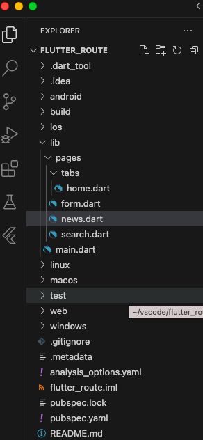
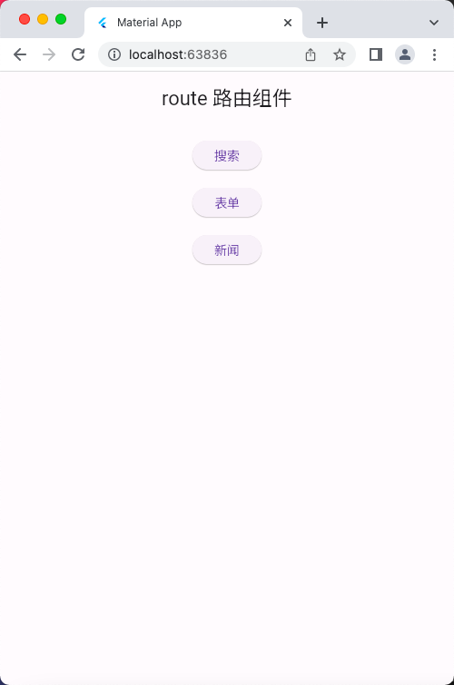
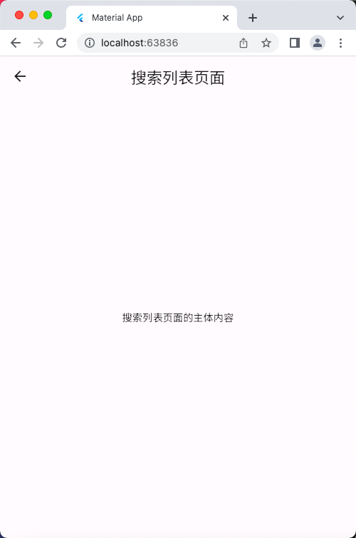
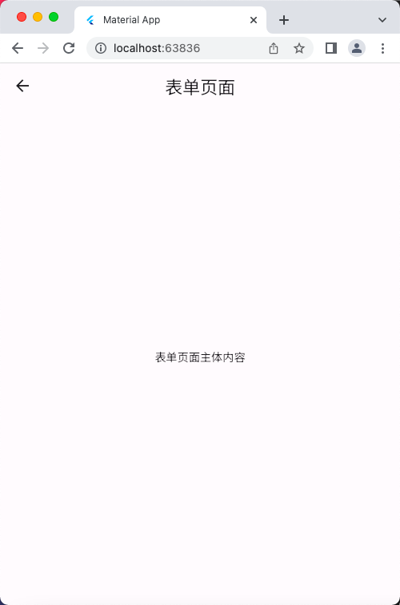
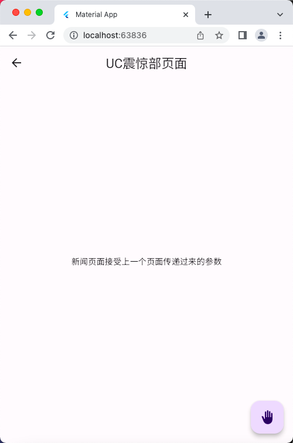

# Navigator 组件

## 普通路由案例
### 文件示意图


### 源码文件

main.dart

```dart
import 'package:flutter/material.dart';
import './pages/tabs/home.dart';

void main() => runApp(const MyApp());

class MyApp extends StatelessWidget {
  const MyApp({super.key});

  @override
  Widget build(BuildContext context) {
    return MaterialApp(
      debugShowCheckedModeBanner: false,
      title: 'Material App',
      home: Scaffold(
        appBar: AppBar(
          title: const Text('route 路由组件'),
        ),
        body: const Center(
          child: HomePage(),
        ),
      ),
    );
  }
}
```

home.dart

```dart
import 'package:flutter/material.dart';
import '../search.dart';
import '../form.dart';
import '../news.dart';

class HomePage extends StatefulWidget {
  const HomePage({super.key});

  @override
  State<HomePage> createState() => _HomePageState();
}

class _HomePageState extends State<HomePage> {
  @override
  Widget build(BuildContext context) {
    return Center(
      child: Column(
        children: [
          const SizedBox(
            height: 20,
          ),
          ElevatedButton(
            onPressed: () {
              // 点击事件触发后，跳转到搜索页面
              Navigator.of(context)
                  .push(MaterialPageRoute(builder: (BuildContext context) {
                return const SearchPage();
              }));
            },
            child: const Text('搜索'),
          ),
          const SizedBox(
            height: 20,
          ),
          ElevatedButton(
            onPressed: () {
              // 点击事件触发后，跳转到表单页面
              Navigator.of(context).push(
                  MaterialPageRoute(builder: ((context) => const FormPage())));
            },
            child: const Text('表单'),
          ),
          const SizedBox(
            height: 20,
          ),
          ElevatedButton(
            onPressed: () {
              // 点击事件触发后，跳转到表单页面
              Navigator.of(context).push(MaterialPageRoute(
                  builder: ((context) => const NewsPage(
                        title: 'UC震惊部',
                        aid: 123,
                      ))));
            },
            child: const Text('新闻'),
          ),
        ],
      ),
    );
  }
}
```

form.dart

```dart
import 'package:flutter/material.dart';

class FormPage extends StatefulWidget {
  const FormPage({super.key});

  @override
  State<FormPage> createState() => _FormPageState();
}

class _FormPageState extends State<FormPage> {
  @override
  Widget build(BuildContext context) {
    return Scaffold(
      appBar: AppBar(
        title: const Text('表单页面'),
      ),
      body: const Center(
        child: Text('表单页面主体内容'),
      ),
    );
  }
}
```

news.dart

```dart
import 'package:flutter/material.dart';

class NewsPage extends StatefulWidget {
  final String title;
  final int aid;
  const NewsPage({super.key, this.title = '新闻', required this.aid});

  @override
  State<NewsPage> createState() => _NewsPageState();
}

class _NewsPageState extends State<NewsPage> {
  @override
  void initState() {
    super.initState();
    // print(widget.aid);
  }

  @override
  Widget build(BuildContext context) {
    return Scaffold(
      floatingActionButton: FloatingActionButton(
        onPressed: () {
          // 点击返回上一个页面的按钮
          Navigator.pop(context);
        },
        child: const Icon(Icons.back_hand),
      ),
      appBar: AppBar(
        title: Text('${widget.title}页面'), // 获取 NewsPage 里面定义的 title
      ),
      body: const Center(
        child: Text('新闻页面接受上一个页面传递过来的参数'),
      ),
    );
  }
}
```

search.dart

```dart
import 'package:flutter/material.dart';

class SearchPage extends StatefulWidget {
  const SearchPage({super.key});

  @override
  State<SearchPage> createState() => _SearchPageState();
}

class _SearchPageState extends State<SearchPage> {
  @override
  Widget build(BuildContext context) {
    return Scaffold(
      appBar: AppBar(
        title: const Text('搜索列表页面'),
      ),
      body: const Center(
        child: Text('搜索列表页面的主体内容'),
      ),
    );
  }
}
```

## 运行示意图




