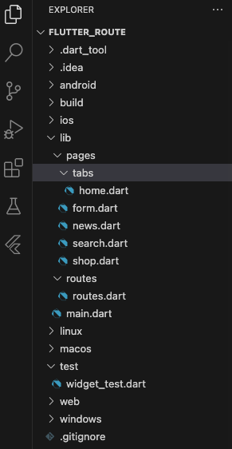
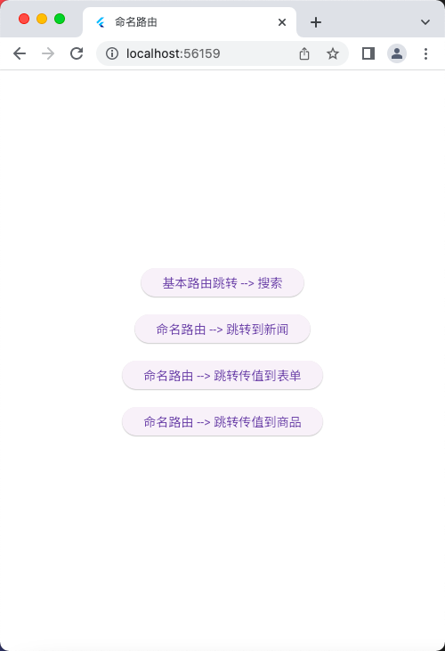
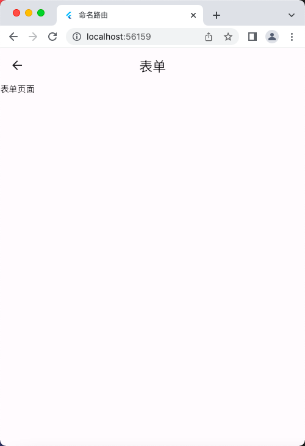

# 命名路由传值

## 文件示意图


## 文件源码

main.dart

```dart
import 'package:flutter/material.dart';
import './routes/routes.dart';

void main() => runApp(const MyApp());

class MyApp extends StatelessWidget {
  const MyApp({super.key});

  @override
  Widget build(BuildContext context) {
    return MaterialApp(
      debugShowCheckedModeBanner: false,
      title: '命名路由',
      initialRoute: '/', // 初始化当前的组件时加载的路由
      onGenerateRoute: onGenerateRoute,
    );
  }
}
```

routes.dart

```dart
import 'package:flutter/material.dart';

import '../pages/tabs/home.dart';
import '../pages/form.dart';
import '../pages/news.dart';
import '../pages/search.dart';
import '../pages/shop.dart';

// 1、定义Map类型的routes
Map routes = {
  '/': (context) => const HomePage(),
  '/news': (context) => const NewsPage(),
  '/search': (context) => const SearchPage(),
  '/form': (context, {arguments}) => FormPage(arguments: arguments),
  '/shop': (context, {arguments}) => ShopPage(arguments: arguments),
};

// 2、调用onGenerateRoute处理，下面的是固定的写法，
// 相当于一个中间件，这里也可以做权限判断
var onGenerateRoute = (RouteSettings settings) {
  // 统一处理
  final String? name = settings.name;
  final Function? pageContentBuilder = routes[name];
  if (pageContentBuilder != null) {
    if (settings.arguments != null) {
      final Route route = MaterialPageRoute(
          builder: (context) =>
              pageContentBuilder(context, arguments: settings.arguments));
      return route;
    } else {
      final Route route =
          MaterialPageRoute(builder: (context) => pageContentBuilder(context));
      return route;
    }
  }
  return null;
};
```

home.dart

```dart
import 'package:flutter/material.dart';
import '../search.dart';

class HomePage extends StatefulWidget {
  const HomePage({super.key});

  @override
  State<HomePage> createState() => _HomePageState();
}

class _HomePageState extends State<HomePage> {
  @override
  Widget build(BuildContext context) {
    return Center(
      child: Column(
        mainAxisAlignment: MainAxisAlignment.center,
        children: [
          ElevatedButton(
              onPressed: () {
                //跳转路由
                Navigator.of(context)
                    .push(MaterialPageRoute(builder: (BuildContext context) {
                  return const SearchPage();
                }));
              },
              child: const Text("基本路由跳转 --> 搜索")),
          const SizedBox(height: 20),
          ElevatedButton(
              onPressed: () {
                //跳转路由
                Navigator.pushNamed(context, '/news');
              },
              child: const Text("命名路由 --> 跳转到新闻")),
          const SizedBox(height: 20),
          ElevatedButton(
              onPressed: () {
                //跳转路由
                Navigator.pushNamed(context, '/form', arguments: {
                  'title': "我是标题",
                  'aid': 12,
                });
              },
              child: const Text("命名路由 --> 跳转传值到表单")),
          const SizedBox(height: 20),
          ElevatedButton(
              onPressed: () {
                //跳转路由
                Navigator.pushNamed(context, '/shop', arguments: {
                  'goodsId': 202403012034,
                  'goodsName': '一包辣条',
                });
              },
              child: const Text("命名路由 --> 跳转传值到商品")),
          const SizedBox(height: 20),
        ],
      ),
    );
  }
}
```

form.dart

```dart
import 'package:flutter/material.dart';

class FormPage extends StatefulWidget {
  final Map arguments;
  const FormPage({super.key, required this.arguments});

  @override
  State<FormPage> createState() => _FormPageState();
}

class _FormPageState extends State<FormPage> {
  late String title;
  late int aid;

  @override
  void initState() {
    super.initState();
    title = widget.arguments['title'];
    aid = widget.arguments['aid'];
    print(widget.arguments);
  }

  @override
  Widget build(BuildContext context) {
    return Scaffold(
      appBar: AppBar(
        title: const Text('表单'),
      ),
      body: const Text('表单页面'),
    );
  }
}
```

news.dart

```dart
import 'package:flutter/material.dart';

class NewsPage extends StatefulWidget {
  const NewsPage({super.key});

  @override
  State<NewsPage> createState() => _NewsPageState();
}

class _NewsPageState extends State<NewsPage> {
  @override
  Widget build(BuildContext context) {
    return Scaffold(
      appBar: AppBar(
        title: const Text('新闻'),
      ),
      body: const Text('新闻页面'),
    );
  }
}
```

search.dart

```dart
import 'package:flutter/material.dart';
class SearchPage extends StatefulWidget {
  const SearchPage({super.key});

  @override
  State<SearchPage> createState() => _SearchPageState();
}

class _SearchPageState extends State<SearchPage> {
  @override
  Widget build(BuildContext context) {
    return Scaffold(
      appBar: AppBar(
        title: const Text('搜索'),
      ),
      body: const Text('搜索页面'),
    );
  }
}
```

shop.dart

```dart
import 'package:flutter/material.dart';

class ShopPage extends StatefulWidget {
  final Map arguments;
  const ShopPage({super.key, required this.arguments});

  @override
  State<ShopPage> createState() => _ShopPageState();
}

class _ShopPageState extends State<ShopPage> {
  @override
  Widget build(BuildContext context) {
    return Scaffold(
      appBar: AppBar(
        title: const Text('商品'),
      ),
      body: const Text('商品页面'),
    );
  }
}
```

## 运行示意图




