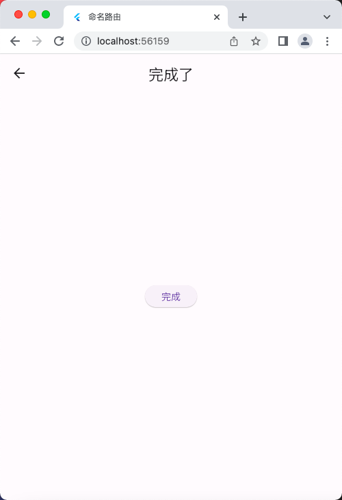

# 命名路由传参案例

## 文件示意图


## 源码

main.dart

```dart
import 'package:flutter/material.dart';
import './routes/routes.dart';

void main() => runApp(const MyApp());

class MyApp extends StatelessWidget {
  const MyApp({super.key});

  @override
  Widget build(BuildContext context) {
    return MaterialApp(
      debugShowCheckedModeBanner: false,
      title: '命名路由',
      initialRoute: '/', // 初始化当前的组件时加载的路由
      // initialRoute: '/registerfirst', // 初始化当前的组件时加载的路由
      onGenerateRoute: onGenerateRoute,
    );
  }
}
```

routes.dart

```dart
import 'package:flutter/material.dart';
// import 'package:flutter/cupertino.dart'; // 同一 安卓 / IOS 切换风格

import '../pages/tabs/home.dart';
import '../pages/user/login.dart';
import '../pages/user/registerfirst.dart';
import '../pages/user/registersecond.dart';
import '../pages/user/registerthird.dart';

// 1、定义Map类型的routes
Map routes = {
  '/': (context) => const HomePage(),
  '/login': (context) => const LoginPage(),
  '/registerfirst': (context) => const RegisterFirst(),
  '/registersecond': (context, {arguments}) =>
      RegisterSeconsd(arguments: arguments),
  '/registerthird': (context, {arguments}) =>
      RegisterThird(arguments: arguments),
};

// 2、调用onGenerateRoute处理，下面的是固定的写法，
// 相当于一个中间件，这里也可以做权限判断
var onGenerateRoute = (RouteSettings settings) {
  // 统一处理
  final String? name = settings.name;
  final Function? pageContentBuilder = routes[name];
  if (pageContentBuilder != null) {
    if (settings.arguments != null) {
      final Route route = MaterialPageRoute(
          builder: (context) =>
              pageContentBuilder(context, arguments: settings.arguments));
      return route;
    } else {
      final Route route =
          MaterialPageRoute(builder: (context) => pageContentBuilder(context));
      return route;
    }
  }
  return null;
};

/* // 2、调用onGenerateRoute处理，下面的是固定的写法，
// 相当于一个中间件，这里也可以做权限判断
var onGenerateRoute = (RouteSettings settings) {
  // 统一处理
  final String? name = settings.name;
  final Function? pageContentBuilder = routes[name];
  if (pageContentBuilder != null) {
    if (settings.arguments != null) {
      final Route route = CupertinoPageRoute(
          builder: (context) =>
              pageContentBuilder(context, arguments: settings.arguments));
      return route;
    } else {
      final Route route =
          CupertinoPageRoute(builder: (context) => pageContentBuilder(context));
      return route;
    }
  }
  return null;
}; */
```

home.dart

```dart
import 'package:flutter/material.dart';

class HomePage extends StatefulWidget {
  const HomePage({super.key});

  @override
  State<HomePage> createState() => _HomePageState();
}

class _HomePageState extends State<HomePage> {
  @override
  Widget build(BuildContext context) {
    return Center(
      child: Column(
        mainAxisAlignment: MainAxisAlignment.center,
        children: [
          ElevatedButton(
              onPressed: () {
                Navigator.pushNamed(context, '/login');
              },
              child: const Text("登录")),
          const SizedBox(height: 20),
          ElevatedButton(
              onPressed: () {
                Navigator.pushNamed(context, '/registerfirst');
              },
              child: const Text("注册")),
          const SizedBox(height: 20),
        ],
      ),
    );
  }
}
```

login.dart

```dart
import 'package:flutter/material.dart';

class LoginPage extends StatefulWidget {
  const LoginPage({super.key});

  @override
  State<LoginPage> createState() => _LoginPageState();
}

class _LoginPageState extends State<LoginPage> {
  @override
  Widget build(BuildContext context) {
    return Scaffold(
      appBar: AppBar(
        title: const Text('登录页面'),
      ),
      body: Center(
        child: Column(
          children: [
            const Text('登录页面'),
            const SizedBox(
              height: 20,
            ),
            ElevatedButton(
              onPressed: () {
                Navigator.of(context).pop(); // 返回到上一级页面
              },
              child: const Text('执行登录'),
            ),
          ],
        ),
      ),
    );
  }
}
```

registerfirst.dart

```dart
import 'package:flutter/material.dart';

class RegisterFirst extends StatefulWidget {
  const RegisterFirst({super.key});

  @override
  State<RegisterFirst> createState() => _RegisterFirstState();
}

class _RegisterFirstState extends State<RegisterFirst> {
  @override
  Widget build(BuildContext context) {
    return Scaffold(
      appBar: AppBar(
        title: const Text('注册第一步'),
      ),
      body: Center(
        child: Column(
          children: [
            const Text('注册第一步'),
            const SizedBox(
              height: 40,
            ),
            ElevatedButton(
              onPressed: () {
                Navigator.pushNamed(context, '/registersecond', arguments: {
                  'username': '章三',
                  'password': '123456',
                });
              },
              child: const Text('下一步'),
            )
          ],
        ),
      ),
    );
  }
}
```

registersecond.dart

```dart
import 'package:flutter/material.dart';

class RegisterSeconsd extends StatefulWidget {
  final Map arguments;
  const RegisterSeconsd({super.key, required this.arguments});

  @override
  State<RegisterSeconsd> createState() => _RegisterSeconsdState();
}

class _RegisterSeconsdState extends State<RegisterSeconsd> {
  late String username;

  @override
  void initState() {
    super.initState();
    setState(() {
      username = widget.arguments['username'];
    });
  }

  @override
  Widget build(BuildContext context) {
    return Scaffold(
      appBar: AppBar(
        title: const Text('注册第二步，接收上一步的参数'),
      ),
      body: Center(
        child: Column(
          children: [
            const Text('接收到的参数是'),
            ElevatedButton(
              onPressed: () {
                // 命名路由跳转
                /* Navigator.pushNamed(context, '/registerthird', arguments: {
                  'phoneNum': '手机号',
                  'sms': '短信验证码',
                }); */

                // 替换路由跳转，相当于将当前的 RegisterSeconsd 组件页面
                // 直接替换成 RegisterThird 组件页面
                Navigator.of(context)
                    .pushReplacementNamed('/registerthird', arguments: {
                  'phoneNum': '手机号',
                  'sms': '短信验证码',
                });
              },
              child: const Text('继续下一步'),
            )
          ],
        ),
      ),
    );
  }
}
```

registerthird.dart

```dart
import 'package:flutter/material.dart';

import '../tabs/home.dart';

class RegisterThird extends StatefulWidget {
  final Map arguments;
  const RegisterThird({super.key, required this.arguments});

  @override
  State<RegisterThird> createState() => _RegisterThirdState();
}

class _RegisterThirdState extends State<RegisterThird> {
  @override
  Widget build(BuildContext context) {
    return Scaffold(
      appBar: AppBar(
        title: const Text('完成了'),
      ),
      body: Center(
        child: ElevatedButton(
          onPressed: () {
            //  Navigator.pushNamed(context, '/');

            // 返回根页面
            Navigator.of(context).pushAndRemoveUntil(
                MaterialPageRoute(builder: (BuildContext context) {
              return const HomePage();
            }), (route) => false);
          },
          child: const Text('完成'),
        ),
      ),
    );
  }
}
```

## 运行示意图



