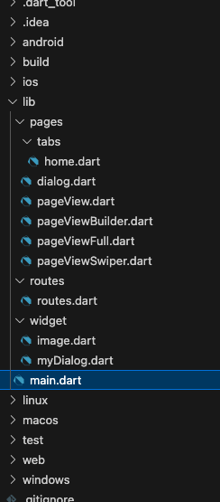
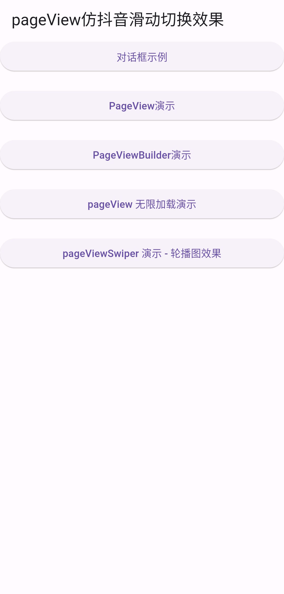
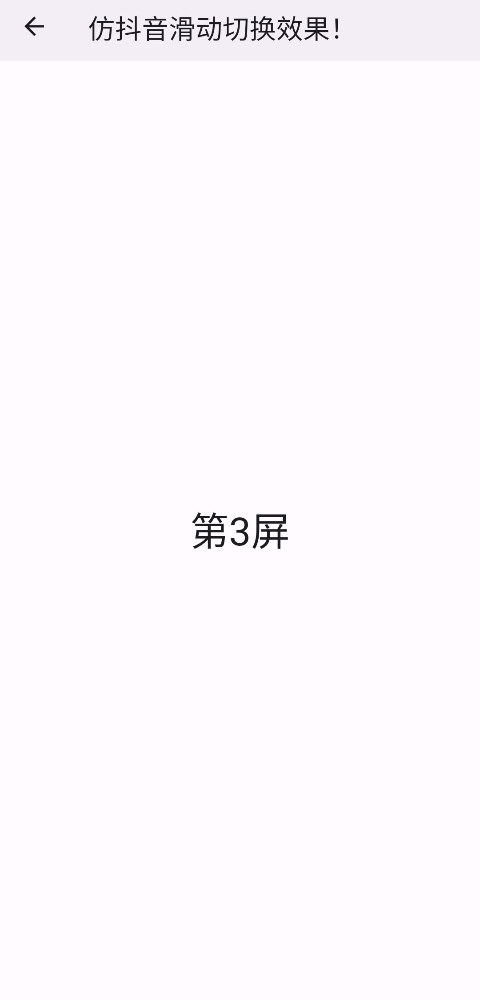
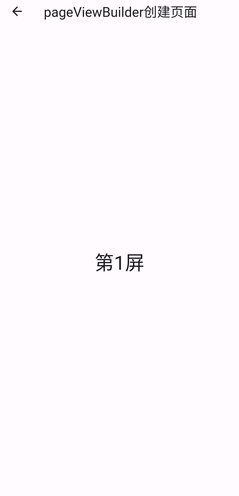
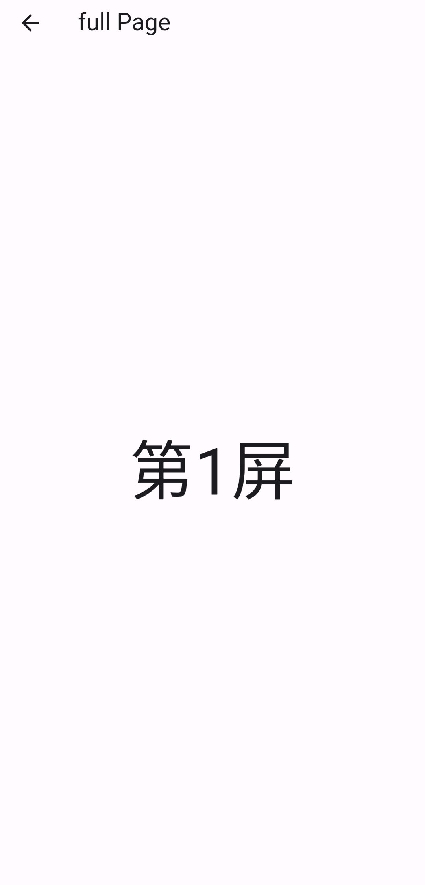
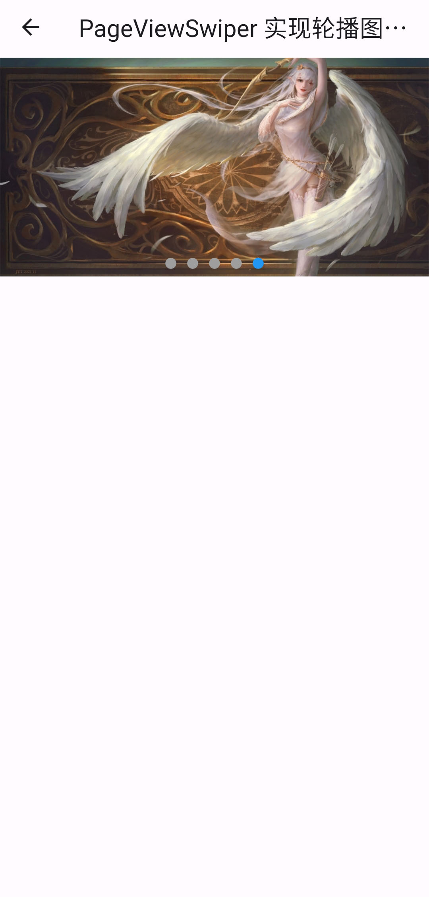

# PageView 组件

## 文件示意图



## 文件源码

main.dart

```dart
import 'package:flutter/material.dart';
import './routes/routes.dart';

void main() => runApp(const MyApp());

class MyApp extends StatelessWidget {
  const MyApp({super.key});

  @override
  Widget build(BuildContext context) {
    return MaterialApp(
      debugShowCheckedModeBanner: false,
      title: 'pageView仿抖音滑动切换效果',
      initialRoute: '/', // 初始化当前的组件时加载的路由
      // initialRoute: '/registerfirst', // 初始化当前的组件时加载的路由
      onGenerateRoute: onGenerateRoute,
    );
  }
}
```

home.dart

```dart
import 'package:flutter/material.dart';

class HomePage extends StatefulWidget {
  const HomePage({super.key});

  @override
  State<HomePage> createState() => _HomePageState();
}

class _HomePageState extends State<HomePage> {
  @override
  Widget build(BuildContext context) {
    return Scaffold(
      appBar: AppBar(
        // 需要运行在手机上面才有效果
        title: const Text('pageView仿抖音滑动切换效果'),
      ),
      body: Center(
        child: ListView(
          // mainAxisAlignment: MainAxisAlignment.center,
          children: [
            ElevatedButton(
                onPressed: () {
                  Navigator.pushNamed(context, '/dialog');
                },
                child: const Text("对话框示例")),
            const SizedBox(height: 20),
            ElevatedButton(
                onPressed: () {
                  Navigator.pushNamed(context, '/pageView');
                },
                child: const Text("PageView演示")),
            const SizedBox(height: 20),
            ElevatedButton(
                onPressed: () {
                  Navigator.pushNamed(context, '/pageViewBuilder');
                },
                child: const Text("PageViewBuilder演示")),
            const SizedBox(height: 20),
            ElevatedButton(
                onPressed: () {
                  Navigator.pushNamed(context, '/pageViewFull');
                },
                child: const Text("pageView 无限加载演示")),
            const SizedBox(height: 20),
            ElevatedButton(
                onPressed: () {
                  Navigator.pushNamed(context, '/pageViewSwiper');
                },
                child: const Text("pageViewSwiper 演示 - 轮播图效果")),
            const SizedBox(height: 20),
          ],
        ),
      ),
    );
  }
}
```


dialog.dart

```dart
// ignore_for_file: avoid_print

import 'package:flutter/material.dart';

import 'package:flutter_route/widget/myDialog.dart';

class DialogPage extends StatefulWidget {
  const DialogPage({super.key});

  @override
  State<DialogPage> createState() => _DialogPageState();
}

class _DialogPageState extends State<DialogPage> {
  void _alertDialog() async {
    // print('alertDialog');
    var result = await showDialog(
        context: context,
        builder: (context) {
          return AlertDialog(
            icon: const Icon(Icons.warning), // 图标
            iconColor: Colors.blue, // 图标颜色
            // backgroundColor: Colors.black12, // 对话框本身的背景颜色，不是对话框之外的遮罩颜色
            title: const Text('我是 alertDialog 的标题'), // 标题
            content: const Text('成功打开了吗？'),
            actions: [
              TextButton(
                onPressed: () {
                  print('click事件触发 --> 确定按钮被点击了');
                  Navigator.of(context).pop('---> 返回消息给 result ok 消息'); // 关闭对话框
                },
                child: const Text('确定'),
              ),
              TextButton(
                  onPressed: () {
                    print('click事件触发 --> 取消按钮被点击了');
                    Navigator.of(context)
                        .pop('---> 返回消息给 result canel 消息'); // 关闭对话框
                  },
                  child: const Text('取消')),
            ],
          );
        });
    print(result);
  }

  void _simpleDialog() async {
    print('selectDialog');
    print('--------');
    var result = await showDialog(
        // barrierDismissible: false, // 不允许点击灰色遮罩层关闭对话框，默认是可以的
        context: context,
        builder: (context) {
          return SimpleDialog(
            title: const Text('请选择：'),
            children: [
              SimpleDialogOption(
                onPressed: () {
                  print('点击事件 ---> 选项1');
                  Navigator.of(context).pop('返回消息result --> 选项1');
                },
                child: const Text('选项1'),
              ),
              SimpleDialogOption(
                onPressed: () {
                  print('点击事件 ---> 选项2');
                  Navigator.of(context).pop('返回消息result --> 选项2');
                },
                child: const Text('选项2'),
              ),
              SimpleDialogOption(
                onPressed: () {
                  print('点击事件 ---> 选项3');
                  Navigator.of(context).pop('返回消息result --> 选项3');
                },
                child: const Text('选项3'),
              ),
            ],
          );
        });
    print(result);
  }

  void _modelBottomSheetDialog() async {
    print('_modelBottomSheetDialog');
    print('------------');
    var result = await showModalBottomSheet(
        context: context,
        builder: (context) {
          return SizedBox(
            // height: 300,
            child: Column(
              // mainAxisAlignment: MainAxisAlignment.spaceAround,
              // crossAxisAlignment: CrossAxisAlignment.end,
              children: [
                ListTile(
                  title: const Text('收藏'),
                  onTap: () {
                    print('"收藏"了');
                    Navigator.of(context).pop("返回的消息 --> 收藏");
                  },
                ),
                const Divider(),
                ListTile(
                  title: const Text('分享'),
                  onTap: () {
                    print('"分享"了');
                    Navigator.of(context).pop("返回的消息 --> 分享");
                  },
                ),
                const Divider(),
                ListTile(
                  title: const Text('取消'),
                  onTap: () {
                    print('"取消"了');
                    Navigator.of(context).pop("返回的消息 --> 取消");
                  },
                ),
              ],
            ),
          );
        });
    print(result);
  }

  void _myDialog() async {
    print('_myDialog被执行了...');
    var result = await showDialog(
        barrierDismissible: false, // 不允许点击灰色遮罩层关闭对话框，默认是可以的
        context: context,
        builder: (context) {
          return MyDialog(
            title: '提示',
            content: '确定要。。。吗？',
            onTap: () {
              print('点击了自定义对话框的x进行关闭操作。。。');
              // Navigator.pop(context);
              Navigator.of(context).pop('_myDialog传出值。。。');
            },
          );
        });
    print(result);
  }

  @override
  Widget build(BuildContext context) {
    return Scaffold(
      appBar: AppBar(
        title: const Text('对话框组件演示'),
      ),
      body: Center(
        child: Column(
          children: [
            ElevatedButton(
              onPressed: _alertDialog,
              child: const Text('Alert弹出框'),
            ),
            const SizedBox(
              height: 20,
            ),
            ElevatedButton(
              onPressed: _simpleDialog,
              child: const Text('select弹出框'),
            ),
            const SizedBox(
              height: 20,
            ),
            ElevatedButton(
                onPressed: _modelBottomSheetDialog,
                child: const Text('actionSheet底部弹出框')),
            const SizedBox(
              height: 20,
            ),
            ElevatedButton(
              // onPressed: _myDialog(), // 这里不能用这种写法，因为 _myDialog() 是调用方法
              onPressed: _myDialog, // _myDialog 是注册方法
              child: const Text('自定义 dialog'),
            ),
            const SizedBox(
              height: 20,
            ),
          ],
        ),
      ),
    );
  }
}
```

pageView.dart

```dart
import 'package:flutter/material.dart';

class PageViewPage extends StatefulWidget {
  const PageViewPage({super.key});

  @override
  State<PageViewPage> createState() => _PageViewPageState();
}

class _PageViewPageState extends State<PageViewPage> {
  @override
  Widget build(BuildContext context) {
    return Scaffold(
      appBar: AppBar(
        title: const Text('仿抖音滑动切换效果！'),
      ),
      body: PageView(
        // scrollDirection: Axis.horizontal, // 配置 PageView 水平滚动，默认
        scrollDirection: Axis.vertical, // 垂直滚动
        children: [
          Center(
            child: Text(
              '第一屏',
              style: Theme.of(context).textTheme.headlineLarge,
            ),
          ),
          Center(
            child: Text(
              '第2屏',
              style: Theme.of(context).textTheme.headlineLarge,
            ),
          ),
          Center(
            child: Text(
              '第3屏',
              style: Theme.of(context).textTheme.headlineLarge,
            ),
          ),
          Center(
            child: Text(
              '第4屏',
              style: Theme.of(context).textTheme.headlineLarge,
            ),
          ),
          Center(
            child: Text(
              '第5屏',
              style: Theme.of(context).textTheme.headlineLarge,
            ),
          ),
          Center(
            child: Text(
              '第6屏',
              style: Theme.of(context).textTheme.headlineLarge,
            ),
          ),
          Center(
            child: Text(
              '第7屏',
              style: Theme.of(context).textTheme.headlineLarge,
            ),
          ),
        ],
      ),
    );
  }
}
```

pageViewBuilder.dart

```dart
import 'package:flutter/material.dart';

class PageViewBuilderPage extends StatefulWidget {
  const PageViewBuilderPage({super.key});

  @override
  State<PageViewBuilderPage> createState() => _PageViewBuilderPageState();
}

class _PageViewBuilderPageState extends State<PageViewBuilderPage> {
  @override
  Widget build(BuildContext context) {
    return Scaffold(
      appBar: AppBar(
        title: const Text('pageViewBuilder创建页面'),
      ),
      body: PageView.builder(
        itemCount: 5, // 这样就会从 [0, 5) 遍历 itemBuilder去创建组件
        scrollDirection: Axis.vertical, // 垂直方向滚动
        itemBuilder: (context, index) {
          return Center(
            child: Text(
              '第${index + 1}屏',
              style: Theme.of(context).textTheme.headlineLarge,
            ),
          );
        },
      ),
    );
  }
}
```

pageViewFull.dart

```dart
import 'package:flutter/material.dart';

class PageViewFullPage extends StatefulWidget {
  const PageViewFullPage({super.key});

  @override
  State<PageViewFullPage> createState() => _PageViewFullPageState();
}

class _PageViewFullPageState extends State<PageViewFullPage> {
  List<Widget> list = [];

  @override
  void initState() {
    super.initState();
    addDataIntoList(0);
  }

  void addDataIntoList(int start) {
    for (var i = 0; i < 10; i++) {
      list.add(
        Center(
          child: Text(
            '第${start + 1}屏',
            style: const TextStyle(fontSize: 60),
          ),
        ),
      );
      start = start + 1;
    }
  }

  @override
  Widget build(BuildContext context) {
    return Scaffold(
      appBar: AppBar(
        title: const Text('full Page'),
      ),
      body: PageView(
        scrollDirection: Axis.vertical,
        children: list,
        onPageChanged: (index) {
          //print(index);
          if (index + 2 == list.length) {
            print('开始往 list 里面添加数据');
            setState(() {
              addDataIntoList(list.length);
            });
          }
        },
      ),
    );
  }
}
```

pageViewSwiper.dart

```dart
import 'package:flutter/material.dart';

import '../widget/image.dart';

class PageViewSwiper extends StatefulWidget {
  const PageViewSwiper({super.key});

  @override
  State<PageViewSwiper> createState() => _PageViewSwiperState();
}

class _PageViewSwiperState extends State<PageViewSwiper> {
  List<Widget> list = [];
  int _currentIndex = 0;
  @override
  void initState() {
    super.initState();
    list.add(
      const ImagePage(
        src:
            'https://st.tencent-cloud.com/qb/tool/images/31cf4cfb-19ab-41bd-af27-fd7d198c319c.png',
      ),
    );
    list.add(
      const ImagePage(
        src:
            'https://jx.phdyw.com/player/img/bj/7.jpg',
      ),
    );
    list.add(
      const ImagePage(
        src:
            'https://jx.phdyw.com/player/img/bj/6.jpg',
      ),
    );
    list.add(
      const ImagePage(
        src:
            'https://jx.phdyw.com/player/img/bj/0.jpg',
      ),
    );
    list.add(
      const ImagePage(
        src:
            'https://jx.phdyw.com/player/img/bj/3.jpg',
      ),
    );
  }

  @override
  Widget build(BuildContext context) {
    return Scaffold(
      appBar: AppBar(
        title: const Text('PageViewSwiper 实现轮播图效果'),
      ),
      body: Stack(
        children: [
          SizedBox(
            height: 200,
            child: PageView.builder(
              itemCount: 1000,
              onPageChanged: (index) {
                // print('当前的索引值：$index');
                setState(() {
                  _currentIndex = index % list.length;
                });
              },
              itemBuilder: (context, index) {
                // index的值范围 [0, 1000)
                return list[index % list.length];
              },
            ),
          ),
          Positioned(
            left: 0,
            right: 0, // 设置 left:0 right:0 那么就会占满整行
            bottom: 2,
            child: Row(
              mainAxisAlignment: MainAxisAlignment.center,
              children: List.generate(
                list.length,
                (index) => Container(
                  margin: const EdgeInsets.all(5),
                  height: 10,
                  width: 10,
                  decoration: BoxDecoration(
                    // shape: BoxShape.circle, // 使得形状为圆形
                    borderRadius: BorderRadius.circular(5), // 这种也可以使得形状为圆形
                    color: _currentIndex == index ? Colors.blue : Colors.grey,
                  ),
                ),
              ).toList(),
            ),
          ),
        ],
      ),
    );
  }
}
```

routes.dart

```dart
import 'package:flutter/material.dart';

import '../pages/tabs/home.dart';
import '../pages/dialog.dart';
import '../pages/pageView.dart';
import '../pages/pageViewBuilder.dart';
import '../pages/pageViewFull.dart';
import '../pages/pageViewSwiper.dart';

// 1、定义Map类型的routes
Map routes = {
  '/': (context) => const HomePage(),
  '/dialog': (context) => const DialogPage(),
  '/pageView': (context) => const PageViewPage(),
  '/pageViewBuilder': (context) => const PageViewBuilderPage(),
  '/pageViewFull': (context) => const PageViewFullPage(),
  '/pageViewSwiper': (context) => const PageViewSwiper(),
};

// 2、调用onGenerateRoute处理，下面的是固定的写法，
// 相当于一个中间件，这里也可以做权限判断
var onGenerateRoute = (RouteSettings settings) {
  // 统一处理
  final String? name = settings.name;
  final Function? pageContentBuilder = routes[name];
  if (pageContentBuilder != null) {
    if (settings.arguments != null) {
      final Route route = MaterialPageRoute(
          builder: (context) =>
              pageContentBuilder(context, arguments: settings.arguments));
      return route;
    } else {
      final Route route =
          MaterialPageRoute(builder: (context) => pageContentBuilder(context));
      return route;
    }
  }
  return null;
};
```

image.dart

```dart
import 'package:flutter/material.dart';

class ImagePage extends StatelessWidget {
  final double width;
  final double height;
  final String src;
  const ImagePage({
    super.key,
    required this.src,
    this.width = double.infinity,
    this.height = 200,
  });

  @override
  Widget build(BuildContext context) {
    return SizedBox(
      width: width,
      height: height,
      child: Image.network(src, fit: BoxFit.cover),
    );
  }
}
```

myDialog.dart

```dart
import 'package:flutter/material.dart';

class MyDialog extends Dialog {
  final String title;
  final String content;
  final Function()? onTap;
  const MyDialog({super.key, required this.title, required this.content, required this.onTap});

  @override
  Widget build(BuildContext context) {
    return Material(
      type: MaterialType.transparency, // 设置背景透明
      child: Center( // 注意这里用 Center 组件进行包裹，不然对话框会全屏
        child: Container(
          height: 200,
          width: 200,
          color: Colors.white,
          child: Column(
            children: [
              Padding(
                padding: const EdgeInsets.all(5),
                child: Stack(
                  children: [
                    Align(
                      alignment: Alignment.centerLeft,
                      child: Text(
                        title,
                        style: const TextStyle(
                          fontSize: 18,
                        ),
                      ),
                    ),
                    Align(
                      alignment: Alignment.centerRight,
                      // child: Icon(Icons.close),
                      /* child: IconButton(
                      icon: const Icon(Icons.close),
                      onPressed: () {
                        print('点击了自定义对话框的x进行关闭操作。。。');
                        Navigator.of(context)
                            .pop('---> 返回消息给 result canel 消息'); // 关闭对话框
                      },
                    ), */
                      child: InkWell(
                        child: const Icon(Icons.close),
                        /* onTap: () {
                          print('点击了自定义对话框的x进行关闭操作。。。');

                          Navigator.pop(context);

                          // Navigator.of(context)
                          // .pop('---> 返回消息给 result canel 消息'); // 关闭对话框
                        }, */
                        onTap: onTap,
                        onLongPress: () {
                          print('长按关闭事件...');
                        },
                      ),
                    ),
                  ],
                ),
              ),
              /* Row(  // 这个不是定位的组件，关闭x不会在右边
                children: [
                  const Align(
                    alignment: Alignment.centerLeft,
                    child: Text('提示！'),
                  ),
                  Align(
                    alignment: Alignment.centerRight,
                    // child: Icon(Icons.close),
                    child: IconButton(
                      icon: const Icon(Icons.close),
                      onPressed: () {
                        print('点击了自定义对话框的x进行关闭操作。。。');
                        Navigator.of(context)
                            .pop('---> 返回消息给 result canel 消息'); // 关闭对话框
                      },
                    ),
                  ),
                ],
              ), */
              const Divider(),
              Container(
                padding: const EdgeInsets.all(10),
                width: double.infinity,
                child: Text(
                  content,
                  style: const TextStyle(fontSize: 12),
                ),
              ),
            ],
          ),
        ),
      ),
    );
  }
}
```


## 运行示意图








