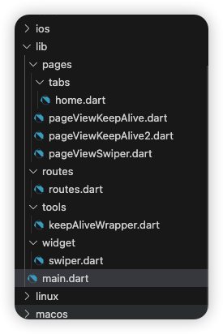
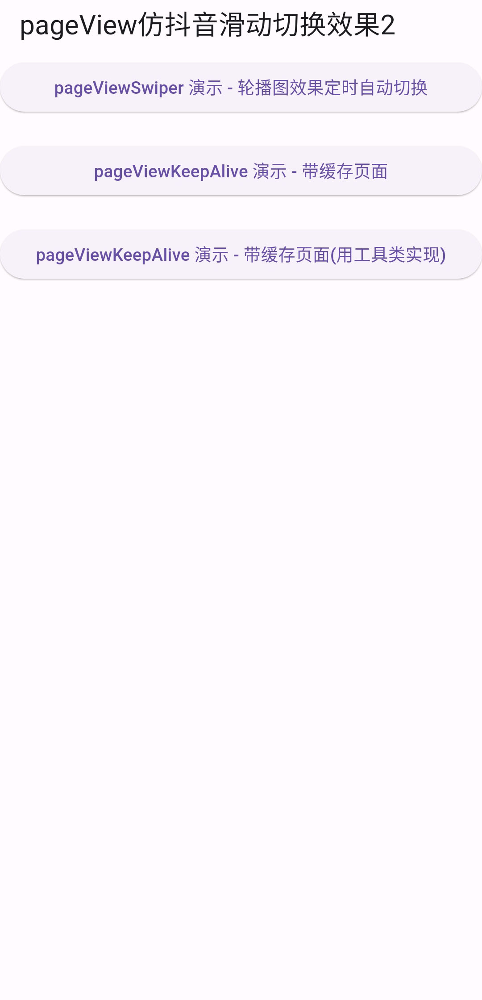
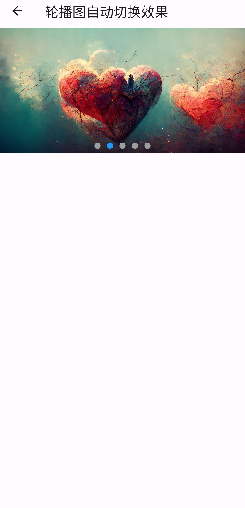
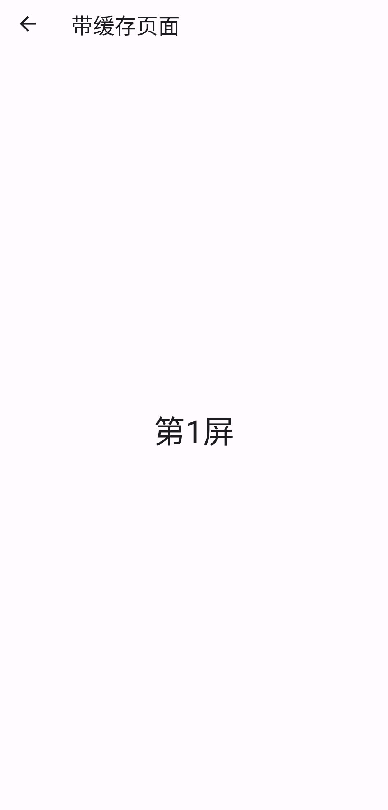
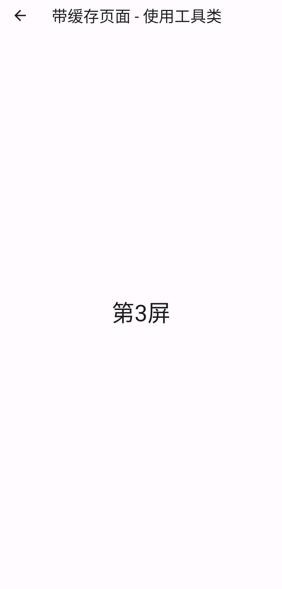

# PageView 组件 第二部分

## 文件示意图


## 源码

main.dart

```dart
import 'package:flutter/material.dart';
import './routes/routes.dart';

void main() => runApp(const MyApp());

class MyApp extends StatelessWidget {
  const MyApp({super.key});

  @override
  Widget build(BuildContext context) {
    return MaterialApp(
      debugShowCheckedModeBanner: false,
      title: 'pageView仿抖音滑动切换效果2',
      initialRoute: '/', // 初始化当前的组件时加载的路由
      // initialRoute: '/registerfirst', // 初始化当前的组件时加载的路由
      onGenerateRoute: onGenerateRoute,
    );
  }
}
```

routes.dart

```dart
import 'package:flutter/material.dart';

import '../pages/tabs/home.dart';
import '../pages/pageViewSwiper.dart';
import '../pages/pageViewKeepAlive.dart';
import '../pages/pageViewKeepAlive2.dart';

// 1、定义Map类型的routes
Map routes = {
  '/': (context) => const HomePage(),
  '/pageViewSwiper': (context) => const PageViewSwiper(),
  '/pageViewKeepAlive': (context) => const PageViewKeepAlivePage(),
  '/pageViewKeepAlive2': (context) => const PageViewKeepAlivePage2(),
};

// 2、调用onGenerateRoute处理，下面的是固定的写法，
// 相当于一个中间件，这里也可以做权限判断
var onGenerateRoute = (RouteSettings settings) {
  // 统一处理
  final String? name = settings.name;
  final Function? pageContentBuilder = routes[name];
  if (pageContentBuilder != null) {
    if (settings.arguments != null) {
      final Route route = MaterialPageRoute(
          builder: (context) =>
              pageContentBuilder(context, arguments: settings.arguments));
      return route;
    } else {
      final Route route =
          MaterialPageRoute(builder: (context) => pageContentBuilder(context));
      return route;
    }
  }
  return null;
};
```

home.dart

```dart
import 'package:flutter/material.dart';

class HomePage extends StatefulWidget {
  const HomePage({super.key});

  @override
  State<HomePage> createState() => _HomePageState();
}

class _HomePageState extends State<HomePage> {
  @override
  Widget build(BuildContext context) {
    return Scaffold(
      appBar: AppBar(
        // 需要运行在手机上面才有效果
        title: const Text('pageView仿抖音滑动切换效果2'),
      ),
      body: Center(
        child: ListView(
          // mainAxisAlignment: MainAxisAlignment.center,
          children: [
            ElevatedButton(
                onPressed: () {
                  Navigator.pushNamed(context, '/pageViewSwiper');
                },
                child: const Text("pageViewSwiper 演示 - 轮播图效果定时自动切换")),
            const SizedBox(height: 20),
            ElevatedButton(
                onPressed: () {
                  Navigator.pushNamed(context, '/pageViewKeepAlive');
                },
                child: const Text("pageViewKeepAlive 演示 - 带缓存页面")),
            const SizedBox(height: 20),
            ElevatedButton(
                onPressed: () {
                  Navigator.pushNamed(context, '/pageViewKeepAlive2');
                },
                child: const Text("pageViewKeepAlive 演示 - 带缓存页面(用工具类实现)")),
            const SizedBox(height: 20),
          ],
        ),
      ),
    );
  }
}
```

pageViewKeepAlive.dart

```dart
// ignore_for_file: avoid_print

import 'package:flutter/material.dart';

class PageViewKeepAlivePage extends StatefulWidget {
  const PageViewKeepAlivePage({super.key});

  @override
  State<PageViewKeepAlivePage> createState() => _PageViewKeepAlivePageState();
}

class _PageViewKeepAlivePageState extends State<PageViewKeepAlivePage> {
  @override
  Widget build(BuildContext context) {
    return Scaffold(
      appBar: AppBar(
        title: const Text('带缓存页面'),
      ),
      body: PageView.builder(
        itemCount: 10,
        itemBuilder: (context, index) {
          return MyContainer(num: index);
        },
      ),
    );
  }
}

class MyContainer extends StatefulWidget {
  final int num;
  const MyContainer({super.key, required this.num});

  @override
  State<MyContainer> createState() => _MyContainerState();
}

// 自定义组件
class _MyContainerState extends State<MyContainer>
    with AutomaticKeepAliveClientMixin {
  @override
  Widget build(BuildContext context) {
    super.build(context);
    print(widget.num); // 默认是没有缓存的，每次滑动都会重新 build 组件，所以每次都会打印出数字
    // 而  with AutomaticKeepAliveClientMixin 并且重写
    return Center(
      child: Text(
        '第${widget.num}屏',
        style: Theme.of(context).textTheme.headlineLarge,
      ),
    );
  }

  @override
  bool get wantKeepAlive => true; // 表示页面缓存页面
}
```

pageViewKeepAlive2.dart

```dart
import 'package:flutter/material.dart';
import '../tools/keepAliveWrapper.dart';

class PageViewKeepAlivePage2 extends StatefulWidget {
  const PageViewKeepAlivePage2({super.key});

  @override
  State<PageViewKeepAlivePage2> createState() => _PageViewKeepAlivePage2State();
}

class _PageViewKeepAlivePage2State extends State<PageViewKeepAlivePage2> {
  @override
  Widget build(BuildContext context) {
    return Scaffold(
      appBar: AppBar(
        title: const Text('带缓存页面 - 使用工具类'),
      ),
      body: PageView.builder(
        itemCount: 10,
        itemBuilder: (context, index) {
           // 注意：如果页面比较多，那么缓存会占用大量内存
          return KeepAliveWrapper(child: MyContainer(num: index));
        },
      ),
    );
  }
}

class MyContainer extends StatefulWidget {
  final int num;
  const MyContainer({super.key, required this.num});

  @override
  State<MyContainer> createState() => _MyContainerState();
}

// 自定义组件
class _MyContainerState extends State<MyContainer> {
  @override
  Widget build(BuildContext context) {
    print(widget.num);
    return Center(
      child: Text(
        '第${widget.num}屏',
        style: Theme.of(context).textTheme.headlineLarge,
      ),
    );
  }
}
```

pageViewSwiper.dart

```dart
import 'package:flutter/material.dart';

import '../widget/swiper.dart';

class PageViewSwiper extends StatefulWidget {
  const PageViewSwiper({super.key});

  @override
  State<PageViewSwiper> createState() => _PageViewSwiperState();
}

class _PageViewSwiperState extends State<PageViewSwiper> {
  List<String> list = [];
  @override
  void initState() {
    super.initState();
    list.add(
      'https://st.tencent-cloud.com/qb/tool/images/31cf4cfb-19ab-41bd-af27-fd7d198c319c.png',
    );
    list.add(
      'https://cf.enterpix.app/images/bb67c146-f756-4b10-85b5-a039a60767c7/compressed',
    );
    list.add(
      'https://cf.enterpix.app/images/b1221a3f-7d7d-4221-b837-04be68bfaf99/compressed',
    );
    list.add(
      'https://cf.enterpix.app/images/b5dc04e1-a0eb-48ce-b8a2-9a3cb3b57f45/compressed',
    );
    list.add(
      'https://cf.enterpix.app/images/8662653c-756b-4aa3-b077-9aa40e962565/compressed',
    );
  }

  @override
  Widget build(BuildContext context) {
    return Scaffold(
      appBar: AppBar(
        title: const Text('轮播图自动切换效果'),
      ),
      body: Swiper(list: list),
    );
  }
}
```

keepAliveWrapper.dart

```dart
import 'package:flutter/material.dart';

class KeepAliveWrapper extends StatefulWidget {
  const KeepAliveWrapper({
    super.key,
    required this.child,
    this.keepAlive = true,
  });

  final Widget? child;
  final bool keepAlive;

  @override
  State<KeepAliveWrapper> createState() => _KeepAliveWrapperState();
}

class _KeepAliveWrapperState extends State<KeepAliveWrapper>
    with AutomaticKeepAliveClientMixin {
  @override
  Widget build(BuildContext context) {
    super.build(context);
    return widget.child!;
  }

  @override
  bool get wantKeepAlive => widget.keepAlive;
}
```

swiper.dart

```dart
import 'dart:async';

import 'package:flutter/material.dart';

class Swiper extends StatefulWidget {
  final double width;
  final double height;
  final List<String> list;
  const Swiper({
    super.key,
    this.width = double.infinity,
    this.height = 200,
    required this.list,
  });

  @override
  State<Swiper> createState() => _SwiperState();
}

class _SwiperState extends State<Swiper> {
  int _currentIndex = 0;
  final List<Widget> _list = [];
  late PageController _pageController;
  late Timer myTimer;
  @override
  void initState() {
    super.initState();
    // 数据
    for (var i = 0; i < widget.list.length; i++) {
      String url = widget.list[i];
      _list.add(ImagePage(src: url));
    }
    // PageController
    _pageController = PageController(initialPage: 0);

    // 加入计时器
    myTimer = Timer.periodic(const Duration(seconds: 3), (t) {
      _pageController.animateToPage(
        (_currentIndex + 1) % _list.length,
        duration: const Duration(milliseconds: 200), // 动画执行时间
        curve: Curves.linear,
      );
    });
  }

  /*
    组件销毁时执行
  */
  @override
  void dispose() {
    super.dispose();
    myTimer.cancel(); // 取消计时器
    _pageController.dispose(); // 销毁
  }

  @override
  Widget build(BuildContext context) {
    return Stack(
      children: [
        SizedBox(
          height: 200,
          child: PageView.builder(
            controller: _pageController,
            itemCount: 1000,
            onPageChanged: (index) {
              // print('当前的索引值：$index');
              setState(() {
                _currentIndex = index % _list.length;
              });
            },
            itemBuilder: (context, index) {
              // index的值范围 [0, 1000)
              return _list[index % _list.length];
            },
          ),
        ),
        Positioned(
          left: 0,
          right: 0, // 设置 left:0 right:0 那么就会占满整行
          bottom: 2,
          child: Row(
            mainAxisAlignment: MainAxisAlignment.center,
            children: List.generate(
              _list.length,
              (index) => Container(
                margin: const EdgeInsets.all(5),
                height: 10,
                width: 10,
                decoration: BoxDecoration(
                  // shape: BoxShape.circle, // 使得形状为圆形
                  borderRadius: BorderRadius.circular(5), // 这种也可以使得形状为圆形
                  color: _currentIndex == index ? Colors.blue : Colors.grey,
                ),
              ),
            ).toList(),
          ),
        ),
      ],
    );
  }
}

class ImagePage extends StatelessWidget {
  final double width;
  final double height;
  final String src;
  const ImagePage({
    super.key,
    required this.src,
    this.width = double.infinity,
    this.height = 200,
  });

  @override
  Widget build(BuildContext context) {
    return SizedBox(
      width: width,
      height: height,
      child: Image.network(src, fit: BoxFit.cover),
    );
  }
}
```

## 运行示意图





