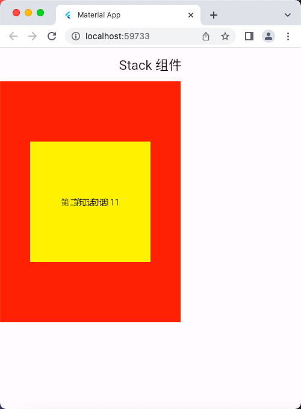
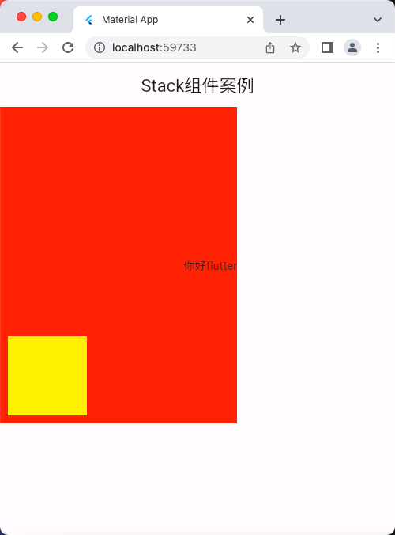
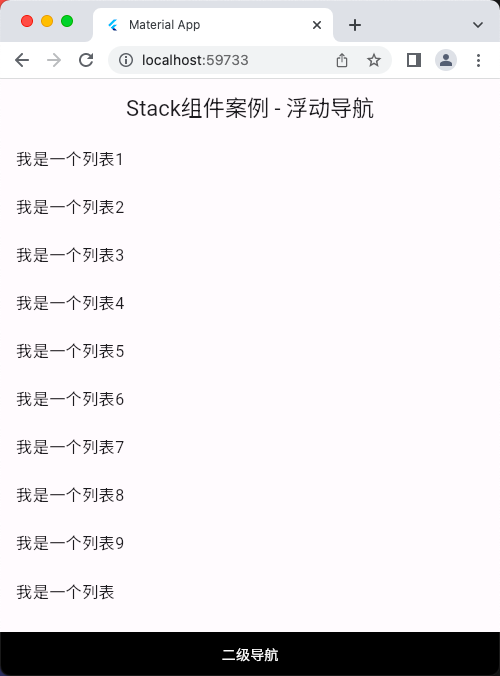
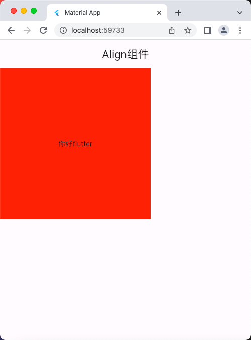
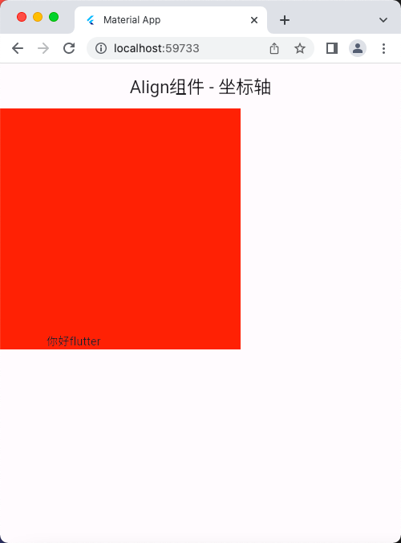
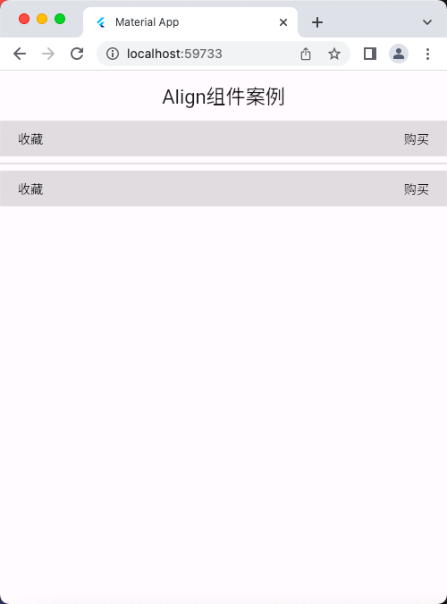

# 层叠组件 Stack、Align、Positioned

## Stack 组件
```dart
import 'package:flutter/material.dart';

void main() => runApp(const MyApp());

class MyApp extends StatelessWidget {
  const MyApp({super.key});

  @override
  Widget build(BuildContext context) {
    return MaterialApp(
      debugShowCheckedModeBanner: false,
      title: 'Material App',
      home: Scaffold(
        appBar: AppBar(
          title: const Text('Stack 组件'),
        ),
        body: const HomePage(),
      ),
    );
  }
}

class HomePage extends StatelessWidget {
  const HomePage({super.key});

  @override
  Widget build(BuildContext context) {
    return Stack(
      alignment: Alignment.center,
      children: [
        Container(
          height: 400,
          width: 300,
          color: Colors.red,
        ),
        const Text('你好 Flutter'),

        Container(
          height: 200,
          width: 200,
          color: Colors.yellow,
        ),
        const Text('第二句话'),
        const Text('第二句话11111'),
      ],
    );
  }
}
```

## 运行示意图


## Stack 组件案例

```dart
import 'package:flutter/material.dart';

void main() => runApp(const MyApp());

class MyApp extends StatelessWidget {
  const MyApp({super.key});

  @override
  Widget build(BuildContext context) {
    return MaterialApp(
      debugShowCheckedModeBanner: false,
      title: 'Material App',
      home: Scaffold(
        appBar: AppBar(
          title: const Text('Stack组件案例'),
        ),
        body: const HomePage(),
      ),
    );
  }
}

class HomePage extends StatelessWidget {
  const HomePage({super.key});

  @override
  Widget build(BuildContext context) {
    return Container(
      height: 400,
      width: 300,
      color: Colors.red,
      child: Stack(
        // 注意： Stack 组件是相对于外部的 Container 容器组件进行定位的
        // 如果没有外部容器，那么则是相对于屏幕进行定位
        children: [
          Positioned(
            left: 10,
            bottom: 10,
            child: Container(
              height: 100,
              width: 100,
              color: Colors.yellow,
            ),
          ),
          const Positioned(
            right: 0,
            top: 190,
            child: Text('你好flutter'),
          ),
        ],
      ),
    );
  }
}
```

## 运行示意图



## Stack组件案例 - 浮动导航

```dart
import 'package:flutter/material.dart';

void main() => runApp(const MyApp());

class MyApp extends StatelessWidget {
  const MyApp({super.key});

  @override
  Widget build(BuildContext context) {
    return MaterialApp(
      debugShowCheckedModeBanner: false,
      title: 'Material App',
      home: Scaffold(
        appBar: AppBar(
          title: const Text('Stack组件案例 - 浮动导航'),
        ),
        body: const HomePage(),
      ),
    );
  }
}

class HomePage extends StatelessWidget {
  const HomePage({super.key});

  @override
  Widget build(BuildContext context) {
    final size = MediaQuery.of(context).size;
    return Stack(
      children: [
        ListView(
          // padding: const EdgeInsets.fromLTRB(0, 0, 0, 40),
          padding: const EdgeInsets.only(bottom: 40),
          children: const [
            ListTile(title: Text('我是一个列表1')),
            ListTile(title: Text('我是一个列表2')),
            ListTile(title: Text('我是一个列表3')),
            ListTile(title: Text('我是一个列表4')),
            ListTile(title: Text('我是一个列表5')),
            ListTile(title: Text('我是一个列表6')),
            ListTile(title: Text('我是一个列表7')),
            ListTile(title: Text('我是一个列表8')),
            ListTile(title: Text('我是一个列表9')),
            ListTile(title: Text('我是一个列表')),
            ListTile(title: Text('我是一个列表')),
            ListTile(title: Text('我是一个列表')),
            ListTile(title: Text('我是一个列表')),
            ListTile(title: Text('我是一个列表')),
            ListTile(title: Text('我是一个列表')),
            ListTile(title: Text('我是一个列表')),
            ListTile(title: Text('我是一个列表')),
            ListTile(title: Text('我是一个列表')),
            ListTile(title: Text('我是一个列表')),
            ListTile(title: Text('我是一个列表')),
            ListTile(title: Text('我是一个列表')),
            ListTile(title: Text('我是一个列表')),
            ListTile(title: Text('我是一个列表，倒数第二')),
            ListTile(title: Text('我是一个列表，最后一个')),
          ],
        ),
        Positioned(
          // 注意：使用 Positioned 组件时，如果子元素是Row组件，
          // 需要指定子元素的宽度和高度
          left: 0, // 子组件距离左侧的距离
          bottom: 0, // 子组件距离底部侧的距离
          // top: 10, // 子组件距离顶部侧的距离
          // right: 30, // 子组件距离右侧的距离
          // width: double.infinity, // 注意：这里不能用这个，因为这样是没有确切的宽度的
          // 如果想要获取屏幕真实宽度，可以使用 final size = MediaQuery.of(context).size;
          // size.width 就是屏幕的宽度了
          // width: 300,
          width: size.width, // 配置子元素的宽度
          // height: 44, // 配置子元素的高度，这里没有指定高度也没问题
          // 用了 Positioned 组件，建议直接配置宽度和高度，
          // 因为写里面的代码时容易忘记设置子组件的宽度和高度会报错。
          child: Row(
            children: [
              Expanded(
                flex: 1,
                child: Container(
                  alignment: Alignment.center,
                  height: 44,
                  color: Colors.black,
                  child: const Text(
                    '二级导航',
                    style: TextStyle(color: Colors.white),
                  ),
                ),
              ),
            ],
          ),
        ),
      ],
    );
  }
}
```

## 运行示意图


## Align组件

```dart
import 'package:flutter/material.dart';

void main() => runApp(const MyApp());

class MyApp extends StatelessWidget {
  const MyApp({super.key});

  @override
  Widget build(BuildContext context) {
    return MaterialApp(
      debugShowCheckedModeBanner: false,
      title: 'Material App',
      home: Scaffold(
        appBar: AppBar(
          title: const Text('Align组件'),
        ),
        body: const HomePage(),
      ),
    );
  }
}

class HomePage extends StatelessWidget {
  const HomePage({super.key});

  @override
  Widget build(BuildContext context) {
    return Container(
      height: 300,
      width: 300,
      color: Colors.red,
      child: const Align(
        alignment: Alignment.center,
        child: Text('你好flutter'),
      ),
    );
  }
}
```

## 运行示意图


## Align组件 - 坐标轴

```dart
import 'package:flutter/material.dart';

void main() => runApp(const MyApp());

class MyApp extends StatelessWidget {
  const MyApp({super.key});

  @override
  Widget build(BuildContext context) {
    return MaterialApp(
      debugShowCheckedModeBanner: false,
      title: 'Material App',
      home: Scaffold(
        appBar: AppBar(
          title: const Text('Align组件 - 坐标轴'),
        ),
        body: const HomePage(),
      ),
    );
  }
}

class HomePage extends StatelessWidget {
  const HomePage({super.key});

  @override
  Widget build(BuildContext context) {
    return Container(
      height: 300,
      width: 300,
      color: Colors.red,
      child: const Align(
        // alignment: Alignment(1, 1), // 右下角
        // alignment: Alignment(-1, 1), // 左下角
        // alignment: Alignment(0, 1), // 中下角
        // alignment: Alignment(0, 0), // 正中央
        // alignment: Alignment(0, -1), // 中上角
        // alignment: Alignment(-1, -1), // 左上角
        // alignment: Alignment(-1, 0), // 左中角
        // alignment: Alignment(1, 0), // 右中角
        // alignment: Alignment(1, -1), // 右上角
        alignment: Alignment(-0.5, 1),
        child: Text('你好flutter'),
      ),
    );
  }
}
```

## 运行示意图


## Align组件案例

```dart
import 'package:flutter/material.dart';

void main() => runApp(const MyApp());

class MyApp extends StatelessWidget {
  const MyApp({super.key});

  @override
  Widget build(BuildContext context) {
    return MaterialApp(
      debugShowCheckedModeBanner: false,
      title: 'Material App',
      home: Scaffold(
        appBar: AppBar(
          title: const Text('Align组件案例'),
        ),
        body: const HomePage(),
      ),
    );
  }
}

class HomePage extends StatelessWidget {
  const HomePage({super.key});

  @override
  Widget build(BuildContext context) {
    // 注意 Row 组件里面用 Align 组件是没效果的
    return Column(
      children: [
        Container(
          height: 40,
          width: double.infinity,
          padding: const EdgeInsets.fromLTRB(20, 0, 20, 0),
          color: Colors.black12,
          child: const Stack(
            children: [
              Align(
                alignment: Alignment.centerLeft,
                child: Text('收藏'),
              ),
              Align(
                alignment: Alignment.centerRight,
                child: Text('购买'),
              )
            ],
          ),
        ),
        const Divider(),
        Container(
          height: 40,
          width: double.infinity,
          padding: const EdgeInsets.fromLTRB(20, 0, 20, 0),
          color: Colors.black12,
          child: const Stack(
            children: [
              Positioned(
                left: 0,
                top: 10,
                child: Text('收藏'),
              ),
              Positioned(
                right: 0,
                bottom: 10,
                child: Text('购买'),
              )
            ],
          ),
        ),
      ],
    );
  }
}
```

## 运行示意图


