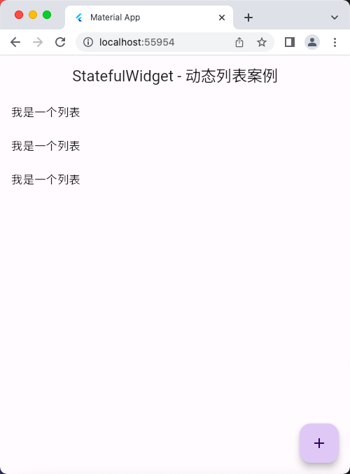

# StatefulWidget 组件

## StatefulWidget - 计数器案例

```dart
// ignore_for_file: avoid_print

import 'package:flutter/material.dart';

void main() => runApp(const MyApp());

class MyApp extends StatelessWidget {
  const MyApp({super.key});

  @override
  Widget build(BuildContext context) {
    return MaterialApp(
      debugShowCheckedModeBanner: false,
      title: 'Material App',
      home: Scaffold(
        appBar: AppBar(
          title: const Text('StatefulWidget - 计数器案例'),
        ),
        body: const HomePage(),
      ),
    );
  }
}

class HomePage extends StatefulWidget {
  const HomePage({super.key});

  @override
  State<HomePage> createState() => _HomePageState();
}

class _HomePageState extends State<HomePage> {
  int countNum = 0;

  @override
  Widget build(BuildContext context) {
    print(countNum);
    return Scaffold(
      body: Center(
        child: Column(
          children: [
            Text(
              '$countNum',
              style: const TextStyle(fontSize: 28),
            ),
            const SizedBox(
              height: 10,
            ),
            ElevatedButton(
              onPressed: () {
                setState(() {
                  // 也就是说，每次该方法执行后，
                  // 会重新执行 build(BuildContext context)方法
                  // 来重新构建当前的组件
                  countNum++;
                });
              },
              child: const Icon(Icons.add),
            )
          ],
        ),
      ),
      floatingActionButton: FloatingActionButton(
        onPressed: () {
          setState(() {
            countNum++;
          });
        },
        child: const Icon(Icons.add),
      ),
    );
  }
}
```

## 运行示意图


## StatefulWidget - 动态列表案例

```dart
// ignore_for_file: avoid_print

import 'package:flutter/material.dart';

void main() => runApp(const MyApp());

class MyApp extends StatelessWidget {
  const MyApp({super.key});

  @override
  Widget build(BuildContext context) {
    return MaterialApp(
      debugShowCheckedModeBanner: false,
      title: 'Material App',
      home: Scaffold(
        appBar: AppBar(
          title: const Text('StatefulWidget - 动态列表案例'),
        ),
        body: const HomePage(),
      ),
    );
  }
}

class HomePage extends StatefulWidget {
  const HomePage({super.key});

  @override
  State<HomePage> createState() => _HomePageState();
}

class _HomePageState extends State<HomePage> {
  List<String> list = [];
  @override
  Widget build(BuildContext context) {
    return Scaffold(
      body: ListView(
        children: list.map((value) {
          return ListTile(
            title: Text(value),
          );
        }).toList(),
      ),
      floatingActionButton: FloatingActionButton(
        onPressed: () {
          // 点击一次，增加一次数据
          setState(() {
            list.add('我是一个列表');
          });
        },
        child: const Icon(Icons.add),
      ),
    );
  }
}
```

## 运行示意图


