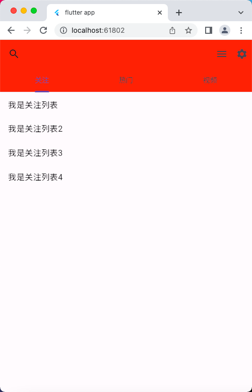
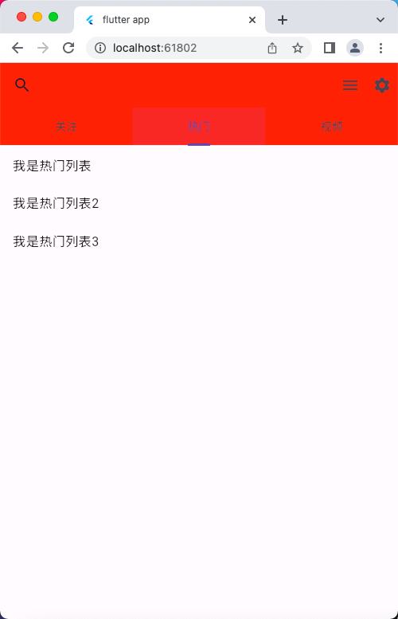
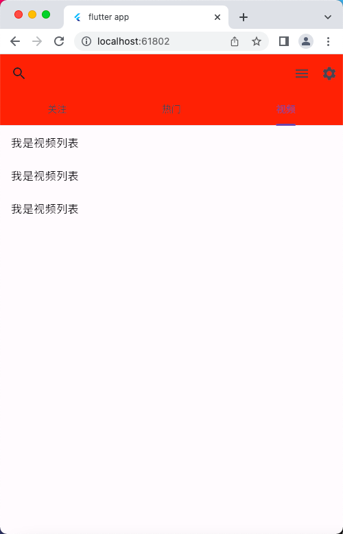

# TabBar、TabBarView 组件

## 案例
```dart
import 'package:flutter/material.dart';

void main() => runApp(const MyApp());

class MyApp extends StatelessWidget {
  const MyApp({super.key});

  @override
  Widget build(BuildContext context) {
    return MaterialApp(
      debugShowCheckedModeBanner: false, // 去掉 debug 图标
      title: 'flutter app',
      theme: ThemeData(
        primarySwatch: Colors.blue,
      ),
      home: const HomePage(),
    );
  }
}

class HomePage extends StatefulWidget {
  const HomePage({super.key});

  @override
  State<HomePage> createState() => _HomePageState();
}

class _HomePageState extends State<HomePage>
    with SingleTickerProviderStateMixin {
  late TabController _tabController;

  @override
  void initState() {
    // 生命周期函数，当组件初始化时触发
    super.initState();
    _tabController = TabController(length: 3, vsync: this);
  }

  @override
  Widget build(BuildContext context) {
    return Scaffold(
      appBar: AppBar(
        leading: IconButton(
          icon: const Icon(Icons.search),
          onPressed: () {
            print('左侧的按钮图标');
          },
        ),
        backgroundColor: Colors.red,
        actions: [
          IconButton(
            icon: const Icon(Icons.menu),
            onPressed: () {
              print('菜单');
            },
          ),
          IconButton(
            icon: const Icon(Icons.settings),
            onPressed: () {
              print('设置');
            },
          ),
        ],
        bottom: TabBar(
          controller: _tabController,
          tabs: const [
            Tab(
              child: Text('关注'),
            ),
            Tab(
              child: Text('热门'),
            ),
            Tab(
              child: Text('视频'),
            ),
          ],
        ),
      ),
      body: TabBarView(
        controller: _tabController,
        children: [
          ListView(
            children: const [
              ListTile(
                title: Text('我是关注列表'),
              ),
              ListTile(
                title: Text('我是关注列表2'),
              ),
              ListTile(
                title: Text('我是关注列表3'),
              ),
              ListTile(
                title: Text('我是关注列表4'),
              ),
            ],
          ),
          ListView(
            children: const [
              ListTile(
                title: Text('我是热门列表'),
              ),
              ListTile(
                title: Text('我是热门列表2'),
              ),
              ListTile(
                title: Text('我是热门列表3'),
              ),
            ],
          ),
          ListView(
            children: const [
              ListTile(
                title: Text('我是视频列表'),
              ),
              ListTile(
                title: Text('我是视频列表2'),
              ),
              ListTile(
                title: Text('我是视频列表3'),
              ),
            ],
          ),
        ],
      ),
    );
  }
}
```

## 运行示意图



