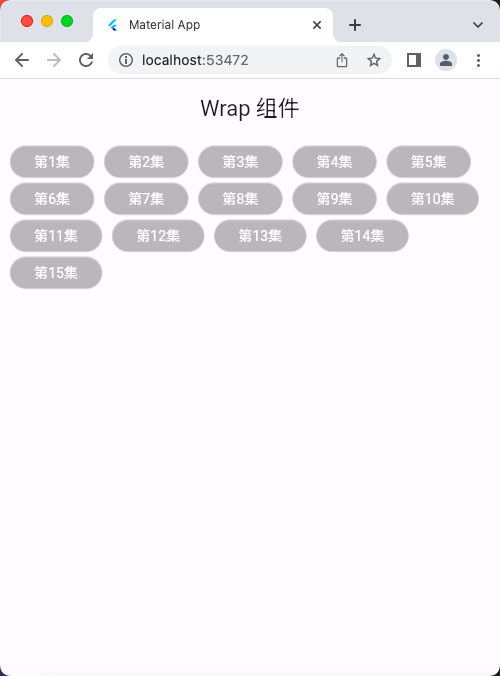
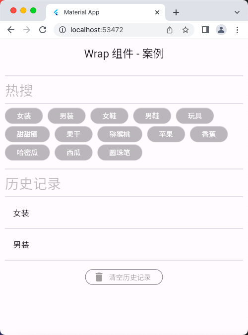

# Wrap 组件

## Wrap 组件 - 基础

```dart
// ignore_for_file: avoid_print

import 'package:flutter/material.dart';

void main() => runApp(const MyApp());

class MyApp extends StatelessWidget {
  const MyApp({super.key});

  @override
  Widget build(BuildContext context) {
    return MaterialApp(
      debugShowCheckedModeBanner: false,
      title: 'Material App',
      home: Scaffold(
        appBar: AppBar(
          title: const Text('Wrap 组件 - 基础'),
        ),
        body: const HomePage(),
      ),
    );
  }
}

class HomePage extends StatelessWidget {
  const HomePage({super.key});

  List<Widget> _initList() {
    List<Widget> list = [];
    for (var i = 0; i < 15; i++) {
      list.add(MyButton(
        '第${i + 1}集',
        onPressed: () {
          print('第${i + 1}集被点击了');
        },
      ));
    }
    return list;
  }

  @override
  Widget build(BuildContext context) {
    // Wrap组件 可以实现流布局，单行的 Wrap 几乎和 Row 表现一样
    // 好处就是相比 Row ，当行被占满后，可以向下一行去放元素
    return Padding(
      padding: const EdgeInsets.all(10),
      child: Wrap(
        spacing: 10, // 水平方向元素间距
        runSpacing: 5, // 垂直方向元素间距
        direction: Axis.horizontal, // 主轴方向：水平(默认)
        // direction: Axis.vertical, // 主轴方向：垂直
        alignment: WrapAlignment.start, // 主轴上元素对齐方式，默认左对齐
        // alignment: WrapAlignment.center, // 主轴上元素对齐方式，居中
        children: _initList(),
      ),
    );
  } 
}

// 自定义按钮组件
class MyButton extends StatelessWidget {
  final String text;
  final Color textColor;
  final Color backgroundColor;
  final Function()? onPressed;

  const MyButton(
    this.text, {
    super.key,
    required this.onPressed,
    this.textColor = Colors.white,
    this.backgroundColor = const Color.fromARGB(31, 230, 226, 226),
  });

  @override
  Widget build(BuildContext context) {
    return ElevatedButton(
      style: ButtonStyle(
        foregroundColor: MaterialStateProperty.all(textColor),
        backgroundColor: MaterialStateProperty.all(backgroundColor),
      ),
      onPressed: onPressed,
      child: Text(text),
    );
  }
}
```

## 运行示意图


## Wrap 组件 - 案例

```dart
// ignore_for_file: avoid_print

import 'package:flutter/material.dart';

void main() => runApp(const MyApp());

class MyApp extends StatelessWidget {
  const MyApp({super.key});

  @override
  Widget build(BuildContext context) {
    return MaterialApp(
      debugShowCheckedModeBanner: false,
      title: 'Material App',
      home: Scaffold(
        appBar: AppBar(
          title: const Text('Wrap 组件 - 案例'),
        ),
        body: const HomePage(),
      ),
    );
  }
}

class HomePage extends StatelessWidget {
  const HomePage({super.key});

  List<Widget> _initList() {
    List<Widget> list = [];
    list.add(MyButton(
      '女装',
      onPressed: () {},
    ));
    list.add(MyButton(
      '男装',
      onPressed: () {},
    ));
    list.add(MyButton(
      '女鞋',
      onPressed: () {},
    ));
    list.add(MyButton(
      '男鞋',
      onPressed: () {},
    ));
    list.add(MyButton(
      '玩具',
      onPressed: () {},
    ));
    list.add(MyButton('甜甜圈', onPressed: () {}));
    list.add(MyButton(
      '果干',
      onPressed: () {},
    ));
    list.add(MyButton(
      '猕猴桃',
      onPressed: () {},
    ));
    list.add(MyButton(
      '苹果',
      onPressed: () {},
    ));
    list.add(MyButton(
      '香蕉',
      onPressed: () {},
    ));
    list.add(MyButton(
      '哈密瓜',
      onPressed: () {},
    ));
    list.add(MyButton(
      '西瓜',
      onPressed: () {},
    ));
    list.add(MyButton(
      '圆珠笔',
      onPressed: () {},
    ));
    return list;
  }

  @override
  Widget build(BuildContext context) {
    // Wrap组件 可以实现流布局，单行的 Wrap 几乎和 Row 表现一样
    // 好处就是相比 Row ，当行被占满后，可以向下一行去放元素
    return ListView(
      padding: const EdgeInsets.all(10),
      children: [
        const Divider(),
        const Row(
          children: [
            Text(
              '热搜',
              style: TextStyle(
                fontSize: 28,
                color: Colors.black26,
              ),
            )
          ],
        ),
        const Divider(),
        Wrap(
          spacing: 10,
          runSpacing: 5,
          children: _initList(),
        ),
        const SizedBox(
          height: 10,
        ),
        const Divider(),
        const Row(
          children: [
            Text(
              '历史记录',
              style: TextStyle(
                fontSize: 28,
                color: Colors.black26,
              ),
            )
          ],
        ),
        const Divider(),
        const Column(
          children: [
            ListTile(
              title: Text('女装'),
            ),
            Divider(),
            ListTile(
              title: Text('男装'),
            ),
            Divider(),
          ],
        ),
        const SizedBox(
          height: 10,
        ),
        Row(
          mainAxisAlignment: MainAxisAlignment.center,
          children: [
            OutlinedButton.icon(
              onPressed: () {},
              style: ButtonStyle(
                foregroundColor: MaterialStateProperty.all(Colors.black38),
              ),
              icon: const Icon(
                Icons.delete,
              ),
              label: const Text(
                '清空历史记录',
              ),
            )
          ],
        ),
      ],
    );
  }
}

// 自定义按钮组件
class MyButton extends StatelessWidget {
  final String text;
  final Color textColor;
  final Color backgroundColor;
  final Function()? onPressed;

  const MyButton(
    this.text, {
    super.key,
    required this.onPressed,
    this.textColor = Colors.white,
    this.backgroundColor = const Color.fromARGB(31, 230, 226, 226),
  });

  @override
  Widget build(BuildContext context) {
    return ElevatedButton(
      style: ButtonStyle(
        foregroundColor: MaterialStateProperty.all(textColor),
        backgroundColor: MaterialStateProperty.all(backgroundColor),
      ),
      onPressed: onPressed,
      child: Text(text),
    );
  }
}
```

## 运行示意图


