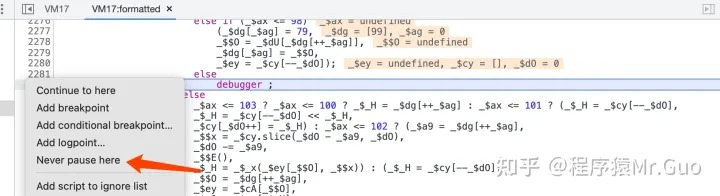
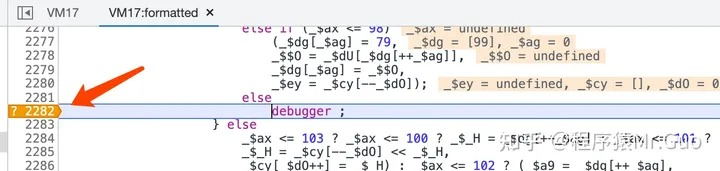
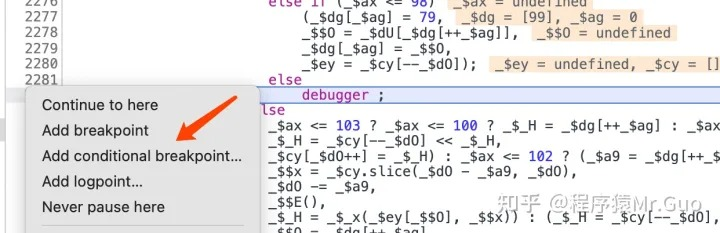
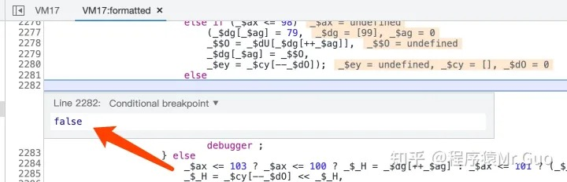
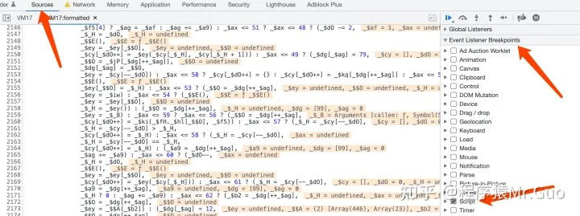

# 转载：解决浏览器调试无限debugger

## 原作者：程序猿Mr.Guo

## 原贴地址：https://zhuanlan.zhihu.com/p/584684377

## 常见debugger实现

### 1、直接使用debugger

### 2、**使用 eval() 函数**

```js
eval("debugger;")
eval('(function() {var a = new Date(); debugger; return new Date() - a > 100;}())')
```

### 3、定时器触发

```js
setInterval(function (){debugger;},1000);
```

### 4、其他方式

```text
（1）Function("debugger").call()/apply() 或赋值 bind()
（2）xxx.constructor("debugger").call("action")
（3）Fuction.constructor("debugger").call("action")
（4）(function(){return !![];}["constructor"]("debugger")["call"]("action"))
（5）eval('(function() {}["constructor"]("debugger")["call"]("action"));')
```


## 方式一：Never pause here

直接在出现debugger的位置的最左边，鼠标右键，弹出如下菜单，选择【Never pause here】，意思是永远不在这里停下来。

点完之后，就变成如下效果了，直接继续运行就不会在这里停下来了。



## 方式二：**添加条件断点**

在JS代码 debugger 行数位置的最左侧点击右键，添加条件断点（满足条件才会进入断点），将条件设置为false，就是条件永远不成立，永远不会断下来。







添加条件断点还可以监视获取一些变量信息，还是挺好用的。

如果是简单的debugger断点，直接用上边的方式就可以，如果是通过定时器触发的debugger断点，就需要进行Hook处理了。

## 方式三：Hook 无限 debugger 函数

通过定时器实现的debugger，可以在进入定时器代码之前进行hook，修改定时器的逻辑。也可以使用FD或者油猴插件进行hook。

定时器实现的debugger形式如下：

```js
setInterval(function (){
	debugger;
},1000)
//setInterval这个是JS语言中的定时器，它有两个参数，第一个是要执行的代码，第二个执行间隔时间，
// 此处就是每过1000毫秒就执行一次参数一的方法，就会一直debugger下去
```

### 1、设置 script 断点

在Sources面板设置 script 断点，这一步的目的，是为了让浏览器在刚运行时就被断下来，以方便进行 Hook




重新刷新页面，就会断下来，然后就可以进行hook了

### 2、**Hook 无限 debugger 函数**

### **2.1 Hook Function 构造器函数**

```js
Function.prototype.__constructor_back = Function.prototype.constructor;
Function.prototype.constructor = function() {
    if(arguments && typeof arguments[0]==='string'){
        //alert("new function: "+ arguments[0]);
        if("debugger" === arguments[0]){
            //arguments[0]="console.log(\"anti debugger\");";
            //arguments[0]=";";
            return
        }
    }
   return Function.prototype.__constructor_back.apply(this,arguments);
}
```

### 2.2 **Hook eval 函数**

```js
eval_ = eval;
//下面这样写，是为了过瑞数的 eval.toString 检测
eval = function(a){if(a=='debugger'){return ''}else{return eval_(a)}}    

// 或者如下：
var my_eval = eval;
eval = function (arg) {
    if (arg.indexOf('debugger') != -1) {
        return function () {
        };
    }
    return my_eval(arg);
}
var _old = Function.prototype.toString.call
Function.prototype.toString.call = function (arg) {
    if (arg === eval) {
        return "function eval() { [native code] }"
    }
    return _old(arg);
}
```

### 2.3 **Hook setInterval 函数**

### **（1）**业务代码和 setInterval 无关时

```js
setInterval = function(){}
```

### （2）业务代码和 setInterval 有关时

```js
setInterval_back = setInterval
setInterval = function(a,b){
    if(a.toString().indexOf('debugger') != -1){
      return null;
    }
    return setInterval_back(a, b);
}
```

## 方式四：**本地替换js**

直接使用浏览器开发者工具替换修改js（Sources面板 --> Overrides），或者通过FD工具替换。

这种方式的核心思路，是替换 JS 文件中的 debugger 关键字，并保存为本地文件，在请求返回的时候、通过正则匹配等方式、拦截并替换返回的 JS 代码，以达到绕过 debugger 的目的。也可以直接删掉相关的debugger代码。

## 方式五：**使用FD、油猴等插件Hook**

使用这种方法，就不需要再打 `script` 断点。

注意：如果 `script` 断点无法在 debugger 函数之前断下来，那就只能用这种方式进行拦截 Hook，才能过掉 debugger。


